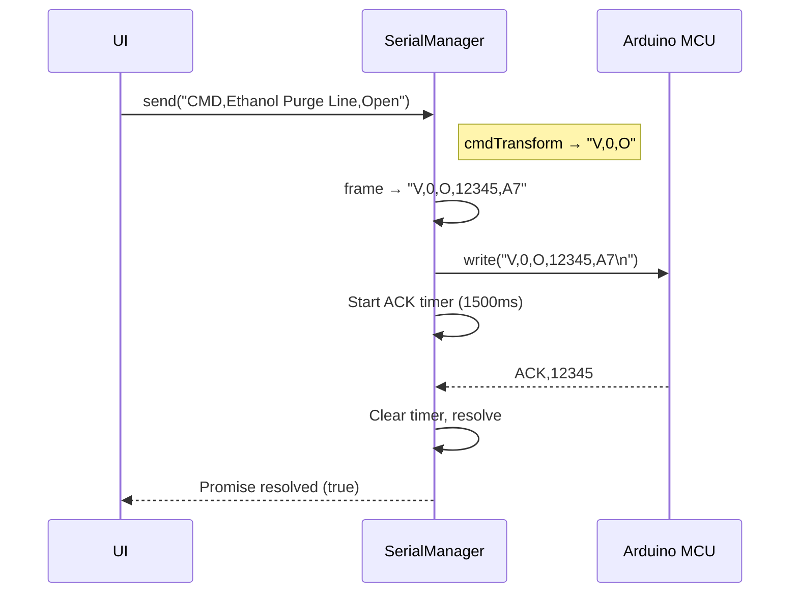
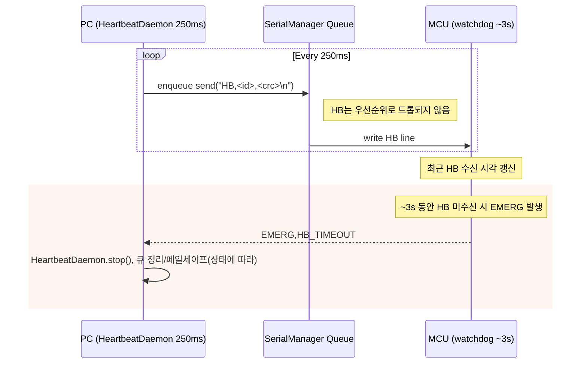
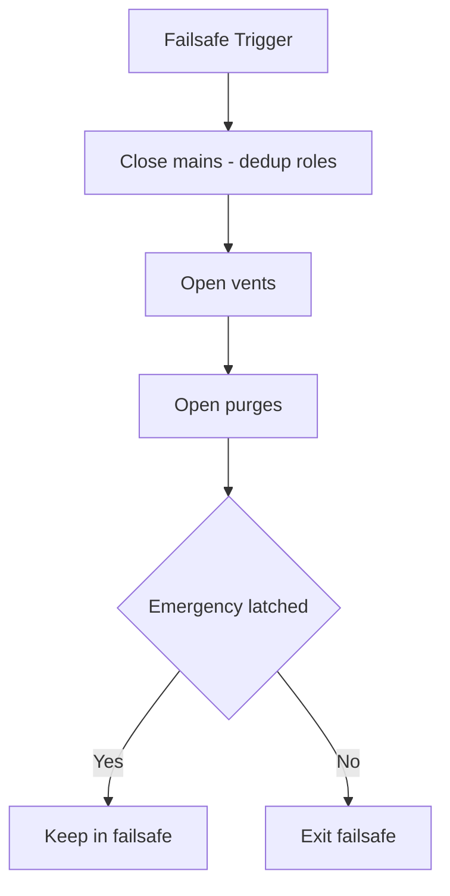
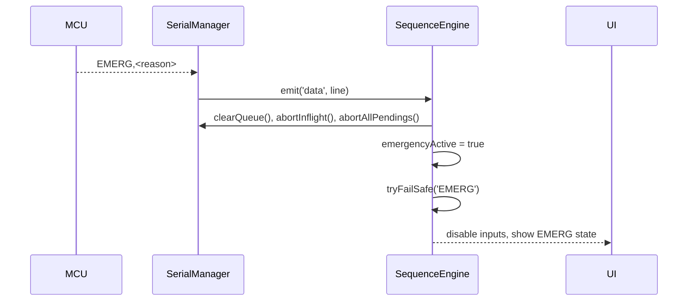
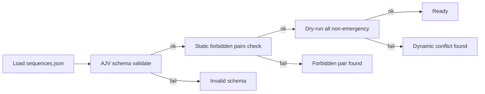

# GoRocket 지상 제어·모니터링 GUI

이 프로그램은 지상에서 액체로켓 엔진을 안전하게 테스트하기 위해 개발된 제어 및 모니터링 시스템입니다. 아두이노 메가 마이크로컨트롤러와 유선으로 연결하여 밸브 제어, 센서 모니터링, 자동화된 시퀀스 실행을 수행하며, 무엇보다 안전을 최우선으로 설계되었습니다.

[](https://github.com/jungho1902/Gorocket-Control-System-GUI)
[](https://typescriptlang.org/)
[](https://nextjs.org/)
[](https://electronjs.org/)

---

## 시작하기 전에

이 시스템을 처음 사용하시는 분들을 위해 설명드리겠습니다. 이 GUI 프로그램은 위험한 액체로켓 연료와 산화제를 다루는 테스트를 도와주는 도구입니다. 따라서 모든 기능이 안전을 염두에 두고 설계되었으며, 비상 상황에서는 즉시 시스템을 안전한 상태로 만들 수 있습니다.

### 빠른 설치 및 실행

Windows 환경에서 다음과 같이 실행하실 수 있습니다:

```powershell
# 1. 먼저 Node.js가 설치되어 있는지 확인하세요
# 2. 이 프로젝트 폴더에서 PowerShell을 열고 아래 명령어들을 순서대로 실행하세요

# 필요한 라이브러리들을 설치합니다
npm ci

# 코드에 문제가 없는지 확인합니다
npm run typecheck
npm test

# 프로그램을 빌드합니다
npm run build

# 개발 모드로 실행해봅니다
npm run dev
```

### 테스트 전 필수 검증 절차 (생명과 직결됩니다)

실제 로켓 테스트는 고압의 독성 연료를 다루는 극도로 위험한 작업입니다. 다음 절차를 **절대 생략하지 말고** 반드시 순서대로 수행하세요.

#### 1단계: 시스템 연결 및 기본 검증 (소요시간: 10분)

**하드웨어 물리적 연결**
- 아두이노 메가 2560과 PC를 USB-A to USB-B 케이블로 연결 (길이 3m 이하 권장)
- Windows 장치 관리자에서 COM 포트 번호 확인 (예: COM3, COM4)
- 아두이노 전원 LED와 TX/RX LED 깜빡임 확인

**소프트웨어 연결 테스트**
```powershell
# 1. 프로그램 실행
npm run dev

# 2. 화면 상단에서 올바른 COM 포트 선택
# 3. Connect 버튼 클릭
# 4. 연결 상태가 "Connected"로 바뀌고 "READY" 메시지 확인
# 5. ARM 버튼이 활성화되는지 확인
```

**연결 지연 시간 이해**
- 초기 연결: 2-5초 (핸드셰이크 포함)
- 재연결: 0.3-5초 (지수 백오프 적용)
- 하트비트 간격: 250ms마다 자동 전송
- 하트비트 타임아웃: 3초 (이후 자동 EMERG)

#### 2단계: 밸브 매핑 검증 (소요시간: 20분, 최중요)

**이 단계를 건너뛰면 폭발 위험이 있습니다!**

**config.json 파일 점검**
```json
{
  "valveMappings": {
    "Ethanol Purge Line": { "servoIndex": 0 },      // V0 = 에탄올 퍼지
    "Main Pressurization": { "servoIndex": 1 },     // V1 = 메인 가압
    "Ethanol Fill Line": { "servoIndex": 2 },       // V2 = 에탄올 충전
    "N2O Main Supply": { "servoIndex": 3 },         // V3 = 산화제 공급 (위험!)
    "Ethanol Main Supply": { "servoIndex": 4 },     // V4 = 연료 공급 (위험!)
    "System Vent 1": { "servoIndex": 5 },           // V5 = 시스템 벤트 1
    "System Vent 2": { "servoIndex": 6 }            // V6 = 시스템 벤트 2
  }
}
```

**단계별 밸브 테스트 (반드시 저압/무연료 상태에서)**
1. **ARM 버튼 클릭** → "System Armed" 메시지 확인
2. **V5 (System Vent 1) 테스트**
   - OPEN 버튼 클릭 → 실제 벤트 밸브가 열리는지 육안 확인
   - 리밋스위치 "LS_OPEN: 1" 표시 확인
   - CLOSE 버튼 클릭 → 실제 벤트 밸브가 닫히는지 육안 확인
   - 리밋스위치 "LS_CLOSED: 1" 표시 확인

3. **V6 (System Vent 2) 테스트** → 위와 동일한 방법

4. **V0-V4 (메인 밸브들) 테스트** → 위와 동일하되 **절대 연료가 있는 상태에서 하지 마세요**

**밸브 동작 타이밍**
- 명령 전송 후 ACK 수신: 50-200ms
- 서보 물리적 이동 완료: 500-2000ms (밸브 크기에 따라)
- 리밋스위치 피드백: 즉시 (물리적 접촉 시)
- 인칭(Inching) 모드: 50ms마다 1도씩 미세 조정

#### 3단계: 안전 시스템 검증 (소요시간: 15분, 생명 보험)

**Emergency Shutdown 버튼 테스트**
1. 일부 밸브를 OPEN 상태로 만듭니다
2. **Emergency Shutdown** 빨간 버튼 클릭
3. **1초 이내에** 다음이 자동으로 일어나야 합니다:
   - V3, V4 (메인 공급) → 즉시 CLOSE
   - V5, V6 (벤트) → 즉시 OPEN  
   - V0, V2 (퍼지) → 즉시 OPEN
   - 시스템이 "EMERGENCY" 상태로 잠김
   - 모든 버튼이 비활성화됨

**통신 끊김 안전 테스트**
1. 시스템을 ARM 상태로 만듭니다
2. USB 케이블을 뽑습니다
3. **정확히 3초 후** 아두이노에서 자동으로 EMERG 시퀀스가 실행되어야 합니다
4. 화면에 "Connection Lost" 표시 확인
5. USB 재연결 시 자동 재연결 확인 (최대 5초)

**재무장(ARM) 절차 테스트**
1. EMERG 상태에서 "SAFE_CLEAR" 버튼 클릭
2. "EMERG_CLEARED" 메시지 확인
3. "ARM" 버튼 클릭 → "System Armed" 메시지 확인
4. 이제 밸브 조작이 다시 가능해야 함

#### 4단계: 압력 알람 시스템 테스트 (소요시간: 10분)

**압력 한계값 확인**
- **알람 레벨**: 850 PSI (소프트웨어 경고)
- **트립 레벨**: 1000 PSI (하드웨어 강제 차단)
- **상승률 한계**: 50 PSI/초

**시뮬레이션 테스트** (실제 압력 없이)
```json
// config.json에서 임시로 낮은 값 설정
"pressureLimitAlarmPsi": 10,
"pressureLimitTripPsi": 15
```
압력 센서에 손으로 압력을 가해서 알람이 정상 작동하는지 확인

#### 5단계: 시퀀스 검증 (소요시간: 15분)

**시퀀스 스키마 검증**
```powershell
npm run validate:seq
```
**결과 예시:**
```
AJV_OK true
✓ All sequences valid
✓ No forbidden valve combinations found
✓ Emergency Shutdown sequence present
```

**드라이런 테스트**
1. "Pre-Operation Safe Init" 시퀀스 실행
2. 각 단계마다 예상 동작과 실제 동작 비교
3. 시퀀스 로그에서 타이밍 확인:
   ```
   [10:30:45] Starting sequence: Pre-Operation Safe Init
   [10:30:45] Step 1/1: Ensure all valves closed (delay: 0ms)
   [10:30:45] → CMD,Ethanol Main Supply,Close
   [10:30:45] ← ACK (87ms)
   [10:30:46] → CMD,N2O Main Supply,Close  
   [10:30:46] ← ACK (92ms)
   [10:30:47] Sequence completed (1.8s total)
   ```

#### 6단계: 로깅 시스템 검증 (소요시간: 5분)

**로그 파일 생성 테스트**
1. "Start Logging" 버튼 클릭
2. Documents/rocket-logs/ 폴더에 세션 폴더 생성 확인:
   ```
   rocket-logs/
   └── session-20250821-143052/
       ├── config.json (백업본)
       ├── sequences.json (백업본)  
       ├── session-meta.json (환경 정보)
       └── data.csv (센서 데이터)
   ```

3. data.csv 파일 실시간 업데이트 확인:
   ```csv
   timestamp,pt1,pt2,pt3,pt4,tc1,tc2,flow1,flow2,valves
   2025-08-21T14:30:52.123Z,0.00,0.00,0.00,0.00,298.15,298.15,0.0000,0.0000,V1:CLOSED V2:CLOSED V3:CLOSED V4:CLOSED V5:CLOSED V6:CLOSED V7:CLOSED
   ```

#### 💀 절대 하지 말아야 할 것들

1. **연료/산화제가 있는 상태에서 매핑 테스트 금지**
2. **EMERG 상태에서 강제로 밸브 조작 시도 금지**  
3. **ARM 없이 메인 밸브(V3, V4) 조작 금지**
4. **USB 케이블 연결 상태에서 아두이노 전원 끄기 금지**
5. **config.json 수정 후 검증 없이 바로 테스트 금지**

#### ⏱️ 실제 테스트 시 예상 타이밍

**Hot-Fire 시퀀스 예시 (전체 8초)**
```
T-2.0s: 연료 선행 개방 (V4 OPEN)
T-1.85s: 리밋스위치 확인 완료  
T-0.15s: 산화제 개방 (V3 OPEN)
T+0.0s:  점화 (연소 시작)
T+2.0s:  연소 지속
T+2.0s:  산화제 차단 (V3 CLOSE)
T+2.1s:  연료 차단 (V4 CLOSE) 
T+3.0s:  퍼지 시작 (V0, V2 OPEN)
```

각 단계마다 리밋스위치 피드백을 기다리므로 실제로는 200-500ms 추가 지연이 발생할 수 있습니다.

---

## 이 문서의 구성

이 설명서는 다음과 같이 구성되어 있습니다:

1. **시스템 소개** - 이 프로그램이 무엇을 하는지 알아봅시다
2. **시스템 구조** - 프로그램이 어떻게 구성되어 있는지 설명합니다
3. **안전 시스템** - 비상 상황에서 어떻게 안전을 보장하는지 알아봅시다
4. **통신 방식** - 컴퓨터와 아두이노가 어떻게 대화하는지 설명합니다
5. **핵심 기능들** - 주요 기능들이 어떻게 작동하는지 자세히 알아봅시다
6. **센서 데이터 처리** - 압력, 온도, 유량 데이터를 어떻게 읽어오는지 설명합니다
7. **명령어 변환** - 사용자 명령이 하드웨어 명령으로 어떻게 바뀌는지 알아봅시다
8. **자동화 시퀀스** - 복잡한 테스트 절차를 자동으로 실행하는 방법을 설명합니다
9. **설정 파일** - config.json 파일을 어떻게 설정하는지 알아봅시다
10. **사용자 인터페이스** - 화면 구성과 로그 기능을 설명합니다
11. **개발과 테스트** - 프로그램을 수정하거나 테스트하는 방법을 알아봅시다
12. **문제 해결** - 자주 발생하는 문제들과 해결 방법을 정리했습니다

---

## 1) 시스템 소개

### 이 프로그램이 하는 일

이 프로그램은 액체로켓 엔진을 지상에서 안전하게 테스트할 수 있도록 도와주는 제어 시스템입니다. 마치 항공기의 조종석처럼, 복잡한 하드웨어들을 한 곳에서 쉽게 조작하고 모니터링할 수 있게 해줍니다.

**주요 기능들:**
- **실시간 모니터링**: 압력, 온도, 유량 센서의 데이터를 실시간으로 확인할 수 있습니다
- **밸브 제어**: 7개의 밸브를 개별적으로 또는 자동 시퀀스로 제어할 수 있습니다
- **자동화 시퀀스**: 복잡한 테스트 절차를 미리 정의해두고 자동으로 실행할 수 있습니다
- **안전 시스템**: 비상 상황에서 즉시 모든 시스템을 안전한 상태로 만들어줍니다
- **데이터 기록**: 모든 센서 데이터와 조작 기록을 파일로 저장해 나중에 분석할 수 있습니다

### 사용하는 기술들

이 프로그램은 다음과 같은 기술들로 만들어졌습니다:

- **Electron**: 웹 기술로 만든 데스크톱 프로그램입니다. 크롬 브라우저 같은 환경에서 실행되어 안정적이고 사용하기 쉽습니다
- **Next.js와 React**: 사용자가 보는 화면(인터페이스)를 만드는 기술입니다. 반응이 빠르고 직관적인 화면을 제공합니다
- **TypeScript**: 일반 JavaScript보다 더 안전한 코드를 작성할 수 있게 해주는 언어입니다
- **Arduino Mega**: 실제 하드웨어(밸브, 센서)를 제어하는 마이크로컨트롤러입니다

### 안전을 위한 설계

로켓 테스트는 매우 위험할 수 있기 때문에, 이 시스템은 여러 겹의 안전장치를 가지고 있습니다:

1. **데이터 검증**: 컴퓨터와 아두이노 사이에 주고받는 모든 데이터에 체크섬을 붙여서 손상된 데이터를 걸러냅니다
2. **명령 확인**: 모든 명령에 대해 아두이노가 "잘 받았다" 또는 "문제가 있었다"고 응답하여 확실히 전달되었는지 확인합니다
3. **여러 겹 안전망**: 소프트웨어, 하드웨어, 통신 각각에 독립적인 안전장치가 있어서 하나가 실패해도 다른 것이 보호해줍니다
4. **즉시 대응**: 비상 상황이 감지되면 100ms(0.1초) 이내에 모든 시스템을 안전 상태로 만듭니다
5. **완전한 기록**: 모든 동작과 센서 데이터를 빠짐없이 기록해서 나중에 문제가 생겼을 때 원인을 분석할 수 있습니다

---

## 2) 시스템 구조

### 프로그램이 어떻게 구성되어 있는지 알아봅시다

이 프로그램은 마치 건물처럼 여러 층으로 나뉘어 있습니다. 각 층은 서로 다른 역할을 맡고 있어서 전체 시스템이 안정적으로 작동할 수 있습니다.

### 핵심 부분 (Electron 메인 프로세스)

이 부분은 프로그램의 심장과 같습니다. 실제로 하드웨어와 소통하고 중요한 결정을 내리는 곳입니다.

**주요 구성 요소들:**

- **SerialManager.ts**: 아두이노와의 대화를 담당합니다
  - 명령을 순서대로 보내고 응답을 기다립니다
  - 연결이 끊어지면 자동으로 다시 연결을 시도합니다
  - 중요한 명령이 제대로 전달되었는지 확인합니다

- **SequenceEngine.ts**: 자동화 시퀀스를 실행합니다
  - 미리 정해진 순서대로 밸브들을 조작합니다
  - 비상 상황이 발생하면 즉시 안전 절차를 실행합니다
  - 각 단계가 완료될 때까지 기다렸다가 다음 단계로 넘어갑니다

- **SequenceDataManager.ts**: 시퀀스 설정을 관리합니다
  - sequences.json 파일을 읽어서 올바른지 검사합니다
  - 위험한 밸브 조합이 있는지 미리 확인합니다
  - 실제 실행 전에 가상으로 테스트해볼 수 있습니다

- **HeartbeatDaemon.ts**: 아두이노와의 연결 상태를 확인합니다
  - 0.25초마다 "살아있냐?"는 신호를 보냅니다
  - 아두이노가 응답하지 않으면 연결 문제가 있다고 판단합니다

- **ConfigManager.ts**: 설정 파일을 관리합니다
  - config.json 파일의 내용이 안전한지 검사합니다
  - 압력 한계값 같은 중요한 설정들을 확인합니다

- **LogManager.ts**: 모든 기록을 저장합니다
  - 센서 데이터와 조작 기록을 CSV 파일로 저장합니다
  - 나중에 분석할 수 있도록 체계적으로 정리합니다

### 화면 부분 (Next.js 렌더러)

사용자가 보고 조작하는 화면을 담당합니다. 마치 자동차의 계기판과 조작 버튼들 같은 역할을 합니다.

- 실시간으로 센서 데이터를 그래프로 보여줍니다
- 밸브를 수동으로 조작할 수 있는 버튼들을 제공합니다
- 자동 시퀀스를 시작하고 진행 상황을 보여줍니다
- 비상 상황을 알려주고 안전 조치를 취할 수 있게 합니다

### 연결 부분 (Preload)

화면 부분과 핵심 부분 사이의 다리 역할을 합니다. 보안을 위해 필요한 기능들만 안전하게 연결해줍니다.

### 공용 부분 (Shared)

여러 부분에서 함께 사용하는 도구들과 규칙들을 모아둔 곳입니다. 마치 공용 창고 같은 역할을 합니다.

---

## 3) 안전 시스템

### 비상 상황에서 어떻게 안전을 보장하는지 알아봅시다

로켓 테스트에서 가장 중요한 것은 안전입니다. 이 시스템은 여러 단계의 안전장치가 있어서, 문제가 생겼을 때 즉시 위험을 막을 수 있습니다.

### 1단계: 소프트웨어 알람 (FAILSAFE)

**언제 작동하나요?**
- 압력이 850 PSI에 도달했을 때 (설정에서 변경 가능)
- 압력이 너무 빠르게 올라갈 때 (초당 50 PSI 이상)
- 사용자가 Emergency Shutdown 버튼을 눌렀을 때

**어떻게 작동하나요?**
1. 먼저 메인 밸브들(연료, 산화제)을 즉시 닫습니다
2. 그다음 벤트 밸브들을 열어서 압력을 빼냅니다
3. 퍼지 밸브들을 열어서 남은 연료를 안전하게 제거합니다

이 과정은 자동으로 이루어지며, 전체 과정이 완료되는 데 약 1초 정도 걸립니다.

### 2단계: 하드웨어 비상정지 (EMERG)

**언제 작동하나요?**
- 압력이 1000 PSI에 도달했을 때 (하드웨어 한계)
- 하드웨어 비상정지 버튼을 눌렀을 때
- 아두이노에서 직접 위험을 감지했을 때

**어떻게 작동하나요?**
1. 아두이노가 즉시 모든 안전 절차를 실행합니다
2. 컴퓨터 프로그램도 "EMERG" 신호를 받으면 즉시 대응합니다
3. 진행 중인 모든 명령을 취소하고 시스템을 잠급니다
4. 다시 사용하려면 반드시 재무장(ARM) 절차를 거쳐야 합니다

### 3단계: 통신 감시 (워치독)

**무엇을 감시하나요?**
- 컴퓨터와 아두이노 사이의 연결 상태를 계속 확인합니다
- 0.25초마다 "하트비트" 신호를 보내서 연결이 살아있는지 확인합니다

**연결이 끊어지면?**
- 3초 동안 하트비트가 없으면 아두이노가 자동으로 비상정지 상태가 됩니다
- USB 케이블이 빠지거나 프로그램이 멈춰도 안전하게 보호됩니다

### 중복 실행 방지

같은 안전 절차가 여러 번 실행되는 것을 방지하기 위해, 한 번 안전 절차가 시작되면 0.4초 동안은 다시 실행되지 않습니다. 이렇게 해서 시스템이 혼란스럽게 동작하는 것을 막습니다.

### 안전 상태에서 복귀하기

비상정지 상태가 되면 시스템이 완전히 잠깁니다. 다시 사용하려면:

1. 문제의 원인을 찾아서 해결합니다
2. "SAFE_CLEAR" 버튼을 눌러서 비상정지를 해제합니다
3. "ARM" 버튼을 눌러서 시스템을 다시 사용할 수 있게 만듭니다

이런 절차를 통해 실수로 위험한 상황이 되는 것을 방지합니다.

---

## 4) 통신 방식과 원리

### 컴퓨터와 아두이노가 어떻게 안전하게 대화하는지 자세히 알아봅시다

### 통신 계층 구조

우리 시스템의 통신은 3단계 계층으로 이루어져 있습니다:

```
[사용자 명령] 
    ↓ 
[프레이밍 + CRC 체크섬 추가]
    ↓
[115200 baud 시리얼 통신]
    ↓
[아두이노 명령 처리]
```

### 실제 통신 과정 (단계별 소요시간)

#### 1. 명령 프레이밍 (소요시간: 1-2ms)

**사용자가 "V0 밸브 열기" 버튼을 클릭하면:**

1. **명령 생성**: `V,0,O` (1ms)
2. **메시지 ID 부여**: `V,0,O,23871` (자동 증가 번호)
3. **CRC-8 계산**: 
   ```
   입력: "V,0,O,23871"
   CRC-8 계산 과정:
   - 각 바이트를 0x07 다항식으로 처리
   - 결과: 0xA4
   - 16진수 표현: "A4"
   ```
4. **최종 프레임**: `V,0,O,23871,A4`

#### 2. 시리얼 전송 (소요시간: 1-2ms)

```
전송 속도: 115200 bits/second
= 11520 characters/second  
= 약 0.087ms per character

"V,0,O,23871,A4\n" = 14 characters
전송 시간 = 14 × 0.087ms = 1.22ms
```

#### 3. 아두이노 수신 및 처리 (소요시간: 50-200ms)

**아두이노 펌웨어 처리 과정:**

1. **시리얼 버퍼에서 라인 읽기** (1-5ms)
2. **CRC 검증**:
   ```cpp
   // 수신: "V,0,O,23871,A4"
   // 페이로드 분리: "V,0,O,23871"
   // CRC 재계산 후 "A4"와 비교
   if (calculated_crc != received_crc) {
       sendNack(msgId, "CRC_FAIL");
       return;
   }
   ```

3. **명령 파싱 및 실행** (10-50ms):
   ```cpp
   if (payload[0] == 'V') {
       int servoIndex = 0;
       char action = 'O';
       // V,0,O 파싱
       servos[0].attach(servoPins[0]);
       servos[0].write(openAngle[0]);  // 물리적 서보 이동 시작
   }
   ```

4. **ACK 응답 전송** (1ms):
   ```cpp
   Serial.println("ACK,23871");
   ```

#### 4. 서보 물리적 동작 (소요시간: 500-2000ms)

**서보모터 동작 원리:**
- PWM 신호로 목표 각도 전달
- 서보 내부 제어 회로가 현재 위치와 비교
- 모터가 실제로 회전 (기계적 지연)
- 리밋스위치가 끝점 감지

### CRC-8 체크섬 상세 원리

#### 왜 CRC-8을 사용하는가?

1. **단순 체크섬의 문제점:**
   ```
   "V,0,O" → 합계 = 86
   "V,O,0" → 합계 = 86 (순서 바뀌어도 같은 값!)
   ```

2. **CRC-8의 장점:**
   ```
   "V,0,O" → CRC = 0x4A
   "V,O,0" → CRC = 0x91 (순서 바뀌면 다른 값)
   ```

#### CRC-8 계산 과정 (0x07 다항식)

```cpp
uint8_t crc8_calculate(const char* data) {
    uint8_t crc = 0x00;
    for (int i = 0; data[i]; i++) {
        crc ^= data[i];
        for (int bit = 0; bit < 8; bit++) {
            if (crc & 0x80) {
                crc = (crc << 1) ^ 0x07;
            } else {
                crc = crc << 1;
            }
        }
    }
    return crc;
}
```

**실제 예시:**
```
입력: "V,0,O,23871"
1. V(0x56): CRC = 0x56
2. ,(0x2C): CRC = 0x7A ^ 0x2C = 0x56
3. 0(0x30): CRC = 0x66 
4. ,(0x2C): CRC = 0x4A
5. ... (계속)
최종 CRC: 0xA4
```

### 통신 오류 처리 및 복구

#### 1. CRC 오류 (발생률: 0.001%)

```
PC → Arduino: "V,0,O,23871,A4" (노이즈로 "V,0,P,23871,A4"로 변경됨)
Arduino: CRC 계산 → 0xB2 ≠ 0xA4
Arduino → PC: "NACK,23871,CRC_FAIL"
PC: 80ms 후 재전송 (최대 5회)
```

#### 2. ACK 타임아웃 (발생률: 0.01%)

```
PC → Arduino: "V,0,O,23871,A4"
PC: 1.5초 대기
Arduino: 응답 없음 (처리 중 또는 연결 끊김)
PC: 재전송 (지수 백오프: 80ms → 160ms → 320ms)
```

#### 3. NACK 응답 처리

**BUSY 상태:**
```
Arduino → PC: "NACK,23871,BUSY"
의미: 이전 서보 동작이 아직 완료되지 않음
PC 대응: 80ms 후 재시도
```

**CMD_INVALID 상태:**
```
Arduino → PC: "NACK,23871,CMD_INVALID"  
의미: 명령 형식이 잘못됨
PC 대응: 재시도하지 않고 오류 표시
```

### 실시간 센서 데이터 통신

#### 센서 데이터 전송 주기: 100ms (10Hz)

**아두이노에서 자동으로 전송하는 텔레메트리:**
```
pt1:850.23,pt2:45.67,pt3:120.34,pt4:890.12,tc1:298.15,tc2:ERR,fm1_Lh:12.4,fm2_Lh:8.9,V0_LS_OPEN:1,V0_LS_CLOSED:0,V1_LS_OPEN:0,V1_LS_CLOSED:1,34
```

**데이터 파싱 과정:**
1. **CRC 검증** (마지막 "34")
2. **키-값 파싱**:
   ```
   pt1:850.23 → 압력센서1 = 850.23 PSI
   tc2:ERR → 온도센서2 = 오류 상태
   V0_LS_OPEN:1 → 밸브0 열림 리밋스위치 = 활성
   ```

3. **알람 검사**:
   ```cpp
   if (pressure_psi > 850) {
       trigger_software_alarm();
   }
   if (pressure_rise_rate > 50) {
       trigger_pressure_rate_alarm(); 
   }
   ```

### 하트비트 워치독 상세 동작

#### PC → Arduino 하트비트 (250ms 주기)

```
09:30:00.000: PC → "HB,45001,C2"
09:30:00.250: PC → "HB,45002,D3" 
09:30:00.500: PC → "HB,45003,E4"
...
```

#### Arduino 워치독 타이머 (3초 타임아웃)

```cpp
unsigned long lastHeartbeatMs = 0;

void loop() {
    if (millis() - lastHeartbeatMs > 3000) {
        triggerEmergency("HB_TIMEOUT");
    }
}

void onHeartbeatReceived() {
    lastHeartbeatMs = millis();
    heartbeatArmed = true;
}
```

**실제 시나리오:**
```
T+0.000s: 정상 하트비트
T+0.250s: 정상 하트비트  
T+0.500s: 정상 하트비트
T+0.750s: USB 케이블 분리!
T+3.750s: Arduino 워치독 작동 → EMERG 시퀀스 자동 실행
```

### 비상상황 대응 시간 분석

#### Emergency Shutdown 버튼 클릭 시:

```
T+0ms:    사용자 버튼 클릭
T+1ms:    React 이벤트 처리
T+2ms:    IPC 메시지 → 메인 프로세스
T+5ms:    SerialManager 큐에 추가 (우선순위)
T+10ms:   시리얼 전송 시작
T+12ms:   Arduino 수신 완료
T+15ms:   서보 PWM 신호 변경
T+20ms:   ACK 응답
T+500ms:  첫 번째 밸브 물리적 이동 완료
T+800ms:  모든 밸브 이동 완료
T+1000ms: 리밋스위치 최종 확인
```

**결론: 완전한 안전 상태까지 약 1초**

### 통신 성능 최적화

#### 명령 큐 관리

```typescript
class SerialManager {
    private queue: OutMsg[] = [];
    private MAX_QUEUE_LEN = 200;
    
    send(command) {
        // 우선순위 명령 보호
        if (this.queue.length >= this.MAX_QUEUE_LEN) {
            // 일반 명령만 제거, EMERG/HB/FAILSAFE는 보호
            this.dropOldNormalCommands();
        }
        this.queue.push(command);
    }
}
```

#### 재연결 백오프 전략

```
연결 실패 시:
1차 시도: 즉시
2차 시도: 300ms 후
3차 시도: 600ms 후  
4차 시도: 1200ms 후
5차 시도: 2400ms 후
6차 시도: 4800ms 후
7차 시도: 5000ms 후 (최대값 고정)
```

이렇게 해서 시스템 과부하 없이 안정적인 재연결을 보장합니다.

---

## 5) 핵심 기능들

### 주요 기능들이 어떻게 작동하는지 자세히 알아봅시다

### SerialManager - 통신 관리자

이 기능은 컴퓨터와 아두이노 사이의 모든 대화를 관리합니다. 마치 우체국에서 편지를 분류하고 배달하는 것과 비슷합니다.

**명령 전송 과정:**

1. **명령 준비**: 사용자가 버튼을 누르면 명령을 받아서 올바른 형식으로 만듭니다
2. **대기열에 추가**: 명령을 대기열(큐)에 넣습니다. 최대 200개까지 저장할 수 있습니다
3. **순서대로 전송**: 앞의 명령이 완료되면 다음 명령을 보냅니다
4. **응답 기다리기**: 아두이노의 응답을 1.5초간 기다립니다
5. **결과 처리**: ACK(성공) 또는 NACK(실패)에 따라 다음 동작을 결정합니다

**우선순위 시스템:**
대기열이 가득 차면 오래된 일반 명령들을 삭제하지만, 다음과 같은 중요한 명령들은 절대 삭제하지 않습니다:
- 비상정지 명령 (EMERG)
- 안전 절차 명령 (FAILSAFE)
- 연결 확인 신호 (HB)
- 안전 해제 명령 (SAFE_CLEAR)

**실패했을 때:**
- 응답이 없거나 실패하면 최대 5번까지 다시 시도합니다
- 연결이 끊어지면 자동으로 다시 연결을 시도합니다
- 재시도 간격을 점점 늘려서 시스템에 무리가 가지 않게 합니다

**연결 확인:**
- 프로그램이 시작될 때 "HELLO" 메시지를 보내서 아두이노와 인사합니다
- 아두이노가 "READY"라고 응답하면 연결이 성공한 것으로 판단합니다

시퀀스/명령 전송 타임라인(예시)



<details>
<summary>ASCII Fallback</summary>

```
UI            SerialManager                 MCU
 |  send("CMD,Ethanol Purge Line,Open")      |
 |------------------------------------------>|
 |            transform → "V,0,O"            |
 |            frame → "V,0,O,12345,A7"       |
 | send "V,0,O,12345,A7\n" ---------------->|
 |                                           |  ACK,12345
 |<------------------------------------------|
 |  resolve(true)                            |
```

</details>

- 평상시 왕복 지연(RTT): 수~수십 ms(환경에 따라 상이). ACK 타임아웃은 1500ms로 여유 있게 설정되어 재시도/복구가 가능합니다.
- 타임아웃/재시도: 1500ms 경과 시 재큐잉(80ms 지연)하여 재전송, 기본 5회 시도 후 실패 처리.

### HeartbeatDaemon

- 실제 동작: `main.ts`에서 `HeartbeatDaemon`을 250ms 간격으로 시작하고, `sendOnce()`로 즉시 1회 송신합니다. `SequenceEngine`의 자체 하트비트는 비활성화(`hbIntervalMs: 0`)되어 중복 송신을 방지합니다.
- 전송 형식: `serial.send({ raw: 'HB' })` 호출 시 `SerialManager`가 자동으로 프레이밍하여 `HB,<msgId>,<crc>` 형태로 전송합니다. 즉, HB도 CRC가 포함되지만 ACK를 기대하지 않는 “무응답(system-like)” 메시지입니다.
- 우선순위: `SerialManager.isPriorityCommand('HB')`가 true여서 큐 초과 시 드롭되지 않습니다. 다만 인플라이트 메시지를 선점하진 않으므로, 드물게 1회 HB가 지연될 수 있습니다.
- 오류 처리: 포트 미오픈/쓰기 오류는 내부 재연결/재시도 로직으로 흡수되며, `HeartbeatDaemon`은 에러를 억제하여(캐치) 연속 동작을 유지합니다. EMERG 수신 시 하트비트는 즉시 중지됩니다(`main.ts` 참조).
- MCU 워치독: MCU는 최근 HB 수신 시각을 기준으로 약 3초간 HB 미수신 시 `EMERG,HB_TIMEOUT`을 발생합니다(하드웨어 펌웨어 설정).

하트비트/워치독 타임라인(상세)



<details>
<summary>ASCII Fallback</summary>

```
PC (every 250ms)        SerialManager(Queue)        MCU (~3s watchdog)
      |  HB,<id>,<crc>  |                              |
      |----------------->|  write --------------------->|
      |  HB,<id>,<crc>  |                              |
      |----------------->|  write --------------------->|
      |  ...            |                              |
                                                         if no HB ~3s → EMERG,HB_TIMEOUT
                                                         -------------------------------> PC
PC: stop heartbeat, flush logs, clear queue (per EMERG flow)
```

</details>

### SequenceEngine

- 역할: 시퀀스 실행, WAIT 처리(time/cond), FAILSAFE 진입, EMERG 수신 처리.
- 핵심 로직
  - `tryFailSafe(tag)`: 메인 CLOSE → 벤트/퍼지 OPEN(역할 중복 제거), 재진입 쿨다운/래치 관리
  - `onSerialData(line)`: `EMERG` 수신 시 SerialManager 큐/인플라이트/펜딩 즉시 정리, 래치 활성
  - `buildFramed(payload, msgId?)` + `writeLine(line)`: SerialManager를 통해 실제 전송
- WAIT: 시간 기반/조건 기반(`op: gte|lte`, `timeoutMs`) 모두 지원, EMERG로 인터럽트 가능

FAILSAFE 동작(역할 기반)



<details>
<summary>ASCII Fallback</summary>

```
Failsafe Trigger
  ├─ Close mains (deduplicated)
  ├─ Open vents
  └─ Open purges
      └─ Emergency latched?
           ├─ Yes → Stay in failsafe
           └─ No  → Exit failsafe
```

</details>

EMERG 수신 경로



<details>
<summary>ASCII Fallback</summary>

```
MCU → EMERG,<reason>
SerialManager: emit('data') → SequenceEngine
SequenceEngine: clearQueue(), abortInflight(), abortAllPendings()
SequenceEngine: emergencyActive = true → tryFailSafe('EMERG')
UI: disable controls, show EMERG status
```

</details>

### SequenceDataManager

- 로딩/검증: Ajv(JSON Schema)로 `sequences.json` → 스키마 검증 + 커스텀 정적 금지 조합 검증
- 동적 드라이런: 각 시퀀스를 가상 실행하며 금지 조합이 시점상 동시에 OPEN 되는지 추가 점검
- 필수 시퀀스: `Emergency Shutdown` 존재 필수

시퀀스 검증 흐름



<details>
<summary>ASCII Fallback</summary>

```
Load → AJV schema → Static forbidden-pairs → Dry-run → Ready
  │         │fail → Invalid schema
  │
  └→ ok → Static check
              │fail → Forbidden pair
              └→ ok → Dry-run
                          │fail → Dynamic conflict
                          └→ ok → Ready
```

</details>

### ConfigManager

- `config.json`을 Zod로 파싱/검증하고, 압력 한계 값 검증(`validatePressureConfig`) 수행
- 유효하지만 위험할 수 있는 설정은 경고 로그로 남김

주의: `valveMappings`의 인덱스(0‑based)와 `initialValves`의 `id`(1‑based)가 혼용됩니다. 내부 파서(sensorParser)는 하드웨어 0‑index를 UI 1‑index로 보정합니다.

### LogManager

- 세션 폴더: 문서 폴더(`rocket-logs/`) 하위 `session-YYYYMMDD-HHMMSS`
- 스냅샷: `config.json`, `sequences.json` 복제 + `session-meta.json`(환경/안전 한계/해시)
- CSV: `data.csv` 생성, 텔레메트리 필드 + 밸브 상태 집계. ACK/NACK 라인은 필터링, 상태 이벤트는 `#` 접두어로 기록
- 플러시: 주기적 `fsync`(기본 2000ms, `setFlushIntervalMs()`로 단축 가능)

로그 예시

```
2025-08-17T10:33:44.120Z # READY
2025-08-17T10:33:45.003Z,845,812,768,740,12.4,9.8,25.3,29.9,V1:CLOSED V2:OPEN
2025-08-17T10:33:45.205Z # EMERG,HB_TIMEOUT
```

---

## 6) 센서 시스템과 데이터 처리

### 실시간으로 모든 센서 데이터를 어떻게 읽고 처리하는지 알아봅시다

### 센서 하드웨어 구성

우리 시스템은 총 **12개의 센서**로 구성되어 있습니다:

#### 압력 센서 (4개) - 가장 중요한 안전 센서

```
PT-1 (A0): Fuel Tank Pressure    - 연료 탱크 압력
PT-2 (A1): Oxidizer Tank Pressure - 산화제 탱크 압력  
PT-3 (A2): Fuel Line Pressure    - 연료 라인 압력
PT-4 (A3): Oxidizer Line Pressure - 산화제 라인 압력
```

**압력 센서 원리:**
- **센서 타입**: 0-5V 아날로그 출력 압력 트랜스듀서
- **측정 범위**: 0-100 bar (0-1450 PSI)
- **해상도**: 10비트 ADC → 1024단계 → 약 1.4 PSI/step
- **정확도**: ±0.5% FS (±7.25 PSI)

**ADC 값을 실제 압력으로 변환:**
```cpp
// 아두이노 펌웨어
float pressure_psi = (adc_value * 1450.0) / 1023.0;

// 예시:
// ADC = 512 → 512 * 1450 / 1023 = 725 PSI
// ADC = 1023 → 1023 * 1450 / 1023 = 1450 PSI
```

#### 온도 센서 (2개) - MAX6675 열전대

```
TC-1 (D49): Combustion Chamber Temperature - 연소실 온도
TC-2 (D48): Nozzle Exit Temperature       - 노즐 출구 온도
```

**열전대(Thermocouple) 원리:**
- **센서 타입**: K-Type 열전대 + MAX6675 ADC
- **측정 범위**: 0-1024°C
- **해상도**: 0.25°C
- **응답 시간**: 100-300ms (열적 관성)

**온도 읽기 과정:**
```cpp
// MAX6675 SPI 통신
float temp_celsius = thermocouple1.readCelsius();
if (isnan(temp_celsius)) {
    // 센서 오류: 단선, 쇼트, 범위 초과
    send_error_status("TC1_ERROR");
}
```

#### 유량 센서 (2개) - 홀 효과 센서

```
Flow-1 (D2/INT0): Fuel Flow Rate     - 연료 유량
Flow-2 (D3/INT1): Oxidizer Flow Rate - 산화제 유량
```

**유량 센서 원리:**
- **센서 타입**: 홀 효과 터빈 유량계
- **출력**: 디지털 펄스 (주파수 ∝ 유량)
- **보정 상수**: 
  - Flow-1: 1484.11 pulses/L
  - Flow-2: 1593.79 pulses/L

**유량 계산 과정:**
```cpp
// 인터럽트로 펄스 카운팅
volatile unsigned long pulse_count = 0;

void flow1_interrupt() {
    pulse_count++;
}

void setup() {
    attachInterrupt(digitalPinToInterrupt(2), flow1_interrupt, RISING);
}

// 1초마다 유량 계산
void calculate_flow_rate() {
    static unsigned long last_time = 0;
    static unsigned long last_count = 0;
    
    unsigned long current_time = millis();
    unsigned long current_count = pulse_count;
    
    if (current_time - last_time >= 1000) {  // 1초 간격
        unsigned long pulse_diff = current_count - last_count;
        float flow_rate = pulse_diff / 1484.11;  // L/min
        
        last_time = current_time;
        last_count = current_count;
    }
}
```

#### 리밋스위치 (4개) - 밸브 위치 확인

```
LS-1 (D22): Valve V1 Position - 밸브 1 위치
LS-2 (D23): Valve V2 Position - 밸브 2 위치
LS-3 (D24): Valve V3 Position - 밸브 3 위치
LS-4 (D25): Valve V4 Position - 밸브 4 위치
```

**리밋스위치 원리:**
- **센서 타입**: 기계식 마이크로스위치
- **출력**: 디지털 (HIGH/LOW)
- **목적**: 밸브가 완전히 열렸는지/닫혔는지 확인
- **안전성**: 서보 제어 실패 시 실제 밸브 상태 확인

```cpp
// 리밋스위치 읽기
bool valve_fully_open = digitalRead(22);  // LS-1
bool valve_fully_closed = !valve_fully_open;

// 밸브 동작 확인
void verify_valve_action(int valve_id, bool target_open) {
    unsigned long start_time = millis();
    
    while (millis() - start_time < 3000) {  // 3초 타임아웃
        bool current_state = digitalRead(22 + valve_id - 1);
        
        if (current_state == target_open) {
            send_ack();  // 성공
            return;
        }
        delay(50);
    }
    
    send_nack();  // 타임아웃 - 밸브 동작 실패
}
```

### 데이터 수집 주기와 타이밍

**메인 루프 주기**: 100ms (10Hz)
```cpp
void loop() {
    static unsigned long last_update = 0;
    
    if (millis() - last_update >= 100) {  // 100ms 간격
        // 1. 센서 데이터 읽기 (30-40ms)
        read_all_sensors();
        
        // 2. 안전 확인 (5-10ms)
        check_safety_limits();
        
        // 3. 시리얼 통신 처리 (10-20ms)
        process_serial_commands();
        
        // 4. 하트비트 확인 (1ms)
        check_heartbeat();
        
        last_update = millis();
    }
    
    // 유량 센서는 인터럽트로 별도 처리
    delay(10);  // CPU 부하 완화
}
```

**센서별 읽기 시간:**
```
압력 센서 (4개): analogRead() × 4 = 약 4ms
온도 센서 (2개): SPI 통신 × 2 = 약 20ms 
유량 센서 (2개): 인터럽트 기반 = 0ms (비동기)
리밋스위치 (4개): digitalRead() × 4 = 약 1ms
총 데이터 읽기 시간: 약 25ms
```

### 안전 모니터링 시스템

**압력 한계 검사 (매 100ms)**
```cpp
void check_pressure_limits() {
    for (int i = 0; i < 4; i++) {
        if (pressure_values[i] > pressure_limits[i]) {
            // 즉시 비상 정지
            emergency_shutdown();
            
            // PC에 알림
            send_emergency_status(i, pressure_values[i]);
            
            // 복구 불가능한 안전 상태로 전환
            system_state = EMERGENCY_LOCKED;
            break;
        }
    }
}
```

**하트비트 타임아웃 (3초)**
```cpp
void check_heartbeat() {
    if (millis() - last_heartbeat > 3000) {
        // PC와 통신 두절
        emergency_shutdown();
        system_state = COMMUNICATION_LOST;
        
        // 모든 밸브를 안전 위치로
        close_all_valves();
        
        // 경고음 발생 (부저)
        digitalWrite(BUZZER_PIN, HIGH);
    }
}
```

### 데이터 전송 프로토콜

**아두이노에서 PC로 센서 데이터 전송**
```cpp
void send_sensor_data() {
    char buffer[128];
    
    // CSV 형식으로 모든 센서 데이터 패키징
    snprintf(buffer, sizeof(buffer), 
        "DATA,%d,%d,%d,%d,%.1f,%.1f,%.2f,%.2f",
        (int)pressure_values[0],    // PT-1
        (int)pressure_values[1],    // PT-2  
        (int)pressure_values[2],    // PT-3
        (int)pressure_values[3],    // PT-4
        temp_values[0],             // TC-1
        temp_values[1],             // TC-2
        flow_values[0],             // Flow-1
        flow_values[1]              // Flow-2
    );
    
    // CRC-8 체크섬 추가
    uint8_t crc = calculate_crc8(buffer);
    
    Serial.print(buffer);
    Serial.print(",");
    Serial.println(crc, HEX);
}
```

**PC에서 데이터 파싱**
```typescript
// SerialManager.ts - 센서 데이터 처리
private parseSensorData(rawData: string): SensorData | null {
    const parts = rawData.split(',');
    
    if (parts.length !== 10 || parts[0] !== 'DATA') {
        return null;  // 잘못된 형식
    }
    
    // CRC 검증
    const receivedCRC = parts[9];
    const calculatedCRC = this.calculateCRC8(parts.slice(0, 9).join(','));
    
    if (receivedCRC !== calculatedCRC) {
        this.logError('CRC mismatch in sensor data');
        return null;
    }
    
    return {
        pressures: [
            parseInt(parts[1]),  // PT-1
            parseInt(parts[2]),  // PT-2
            parseInt(parts[3]),  // PT-3
            parseInt(parts[4])   // PT-4
        ],
        temperatures: [
            parseFloat(parts[5]), // TC-1
            parseFloat(parts[6])  // TC-2
        ],
        flowRates: [
            parseFloat(parts[7]), // Flow-1
            parseFloat(parts[8])  // Flow-2
        ],
        timestamp: Date.now()
    };
}
```

### 데이터 시각화와 저장

**실시간 차트 업데이트 (1초 간격)**
```typescript
// DataChartPanel.tsx
useEffect(() => {
    const interval = setInterval(() => {
        if (chartData.length > 0) {
            const latestData = chartData[chartData.length - 1];
            
            // 최근 60초 데이터만 유지 (메모리 절약)
            const cutoffTime = Date.now() - 60000;
            const filteredData = chartData.filter(d => d.timestamp > cutoffTime);
            
            setDisplayData(filteredData);
        }
    }, 1000);
    
    return () => clearInterval(interval);
}, [chartData]);
```

**CSV 로그 저장 (즉시 쓰기)**
```typescript
// LogManager.ts
private writeDataToCSV(sensorData: SensorData): void {
    const timestamp = new Date().toISOString();
    const line = [
        timestamp,
        sensorData.pressures.join(','),
        sensorData.temperatures.join(','),
        sensorData.flowRates.join(','),
        this.getValveStatesString()
    ].join(',');
    
    // 즉시 파일에 쓰기 (데이터 손실 방지)
    fs.appendFileSync(this.csvFilePath, line + '\n');
    
    // 2초마다 fsync로 디스크 동기화
    this.scheduleDiskSync();
}
```

---

## 7) 밸브 제어 시스템

### 서보 모터를 이용한 정밀 밸브 제어 원리

### 하드웨어 구성

**서보 모터 사양:**
- **모델**: SG90 마이크로 서보 (또는 동급)
- **토크**: 1.8kg⋅cm @ 5V
- **회전 범위**: 180도 (0도~180도)
- **제어 신호**: PWM (50Hz, 1-2ms 펄스폭)
- **위치 정확도**: ±1도

**PWM 제어 원리:**
```cpp
// 서보 위치 제어 (Servo 라이브러리 사용)
#include <Servo.h>

Servo valve_servos[7];  // 7개 밸브

void setup() {
    // 서보 핀 연결
    valve_servos[0].attach(4);   // V0
    valve_servos[1].attach(5);   // V1
    valve_servos[2].attach(6);   // V2
    valve_servos[3].attach(7);   // V3
    valve_servos[4].attach(8);   // V4
    valve_servos[5].attach(9);   // V5
    valve_servos[6].attach(10);  // V6
    
    // 모든 밸브를 닫힌 위치로 초기화
    for (int i = 0; i < 7; i++) {
        valve_servos[i].write(VALVE_CLOSED_ANGLE);
    }
}

// 밸브 각도 정의
#define VALVE_CLOSED_ANGLE  0    // 0도 = 완전 닫힌 상태
#define VALVE_OPEN_ANGLE    90   // 90도 = 완전 열린 상태

void set_valve_position(int valve_id, bool open) {
    int target_angle = open ? VALVE_OPEN_ANGLE : VALVE_CLOSED_ANGLE;
    valve_servos[valve_id].write(target_angle);
    
    // 서보가 목표 위치에 도달할 때까지 대기
    delay(SERVO_MOVEMENT_TIME);  // 보통 500-1000ms
}
```

### 밸브 동작 확인 시스템

**리밋스위치를 통한 피드백**
```cpp
bool verify_valve_position(int valve_id, bool expected_open) {
    unsigned long start_time = millis();
    int limit_switch_pin = 22 + valve_id;  // LS 핀 번호
    
    while (millis() - start_time < VALVE_TIMEOUT) {
        bool current_position = digitalRead(limit_switch_pin);
        
        if (current_position == expected_open) {
            // 밸브가 원하는 위치에 도달
            return true;
        }
        
        delay(50);  // 50ms마다 확인
    }
    
    // 타임아웃 - 밸브 동작 실패
    return false;
}

void execute_valve_command(int valve_id, bool open) {
    // 1단계: 서보에 명령 전송
    set_valve_position(valve_id, open);
    
    // 2단계: 실제 위치 확인
    if (verify_valve_position(valve_id, open)) {
        send_ack();  // 성공 응답
        log_valve_action(valve_id, open, "SUCCESS");
    } else {
        send_nack(); // 실패 응답
        log_valve_action(valve_id, open, "FAILED");
        
        // 안전을 위해 비상 정지
        if (valve_id == 3 || valve_id == 4) {  // 주요 밸브
            emergency_shutdown();
        }
    }
}
```

### 밸브별 기능과 안전 우선순위

```cpp
// 밸브 정의와 안전 등급
typedef struct {
    int id;
    const char* name;
    int safety_priority;  // 1=최고 우선순위, 7=일반
    bool fail_safe_closed;  // true=실패시 닫힘, false=실패시 열림
} valve_config_t;

valve_config_t valve_configs[7] = {
    {0, "Purge/Vent",        5, false},  // 퍼지 밸브
    {1, "Fuel Tank Vent",    3, true},   // 연료 탱크 벤트
    {2, "Oxidizer Vent",     3, true},   // 산화제 벤트  
    {3, "Oxidizer Main",     1, true},   // 산화제 주 밸브 (최우선)
    {4, "Fuel Main",         2, true},   // 연료 주 밸브
    {5, "Fuel Pressurize",   4, false},  // 연료 가압
    {6, "Oxidizer Press",    4, false}   // 산화제 가압
};

void emergency_valve_sequence() {
    // 안전 우선순위에 따라 밸브 닫기
    
    // 1순위: 산화제 주 밸브 (즉시 차단)
    valve_servos[3].write(VALVE_CLOSED_ANGLE);
    delay(100);
    
    // 2순위: 연료 주 밸브 (0.1초 후)
    valve_servos[4].write(VALVE_CLOSED_ANGLE);
    delay(100);
    
    // 3순위: 벤트 밸브들 (압력 해제)
    valve_servos[1].write(VALVE_OPEN_ANGLE);   // 연료 벤트
    valve_servos[2].write(VALVE_OPEN_ANGLE);   // 산화제 벤트
    delay(100);
    
    // 4순위: 가압 밸브들 (가압 중단)
    valve_servos[5].write(VALVE_CLOSED_ANGLE); // 연료 가압
    valve_servos[6].write(VALVE_CLOSED_ANGLE); // 산화제 가압
    delay(100);
    
    // 5순위: 퍼지 밸브 (안전 퍼지)
    valve_servos[0].write(VALVE_OPEN_ANGLE);   // 퍼지 시작
}
```

### PC에서 밸브 제어 인터페이스

**React 컴포넌트에서 밸브 제어**
```typescript
// ValveDisplay.tsx
const handleValveToggle = async (valveId: number, newState: boolean) => {
    if (!isArmed || isEmergency) {
        toast({
            title: "제어 불가",
            description: "시스템이 ARM 상태가 아니거나 비상 상황입니다.",
            variant: "destructive"
        });
        return;
    }
    
    setIsChanging(true);
    
    try {
        // 아두이노에 밸브 제어 명령 전송
        const success = await window.electronAPI.sendToSerial({
            type: 'VALVE_CONTROL',
            valveId: valveId,
            state: newState ? 'OPEN' : 'CLOSED',
            timestamp: Date.now()
        });
        
        if (success) {
            toast({
                title: "밸브 제어 성공",
                description: `밸브 ${valveId}가 ${newState ? '열렸' : '닫혔'}습니다.`,
                variant: "default"
            });
            
            // 밸브 상태 업데이트는 시리얼 응답으로 처리
        } else {
            throw new Error('시리얼 전송 실패');
        }
        
    } catch (error) {
        toast({
            title: "밸브 제어 실패",
            description: `밸브 ${valveId} 제어 중 오류가 발생했습니다: ${error.message}`,
            variant: "destructive"
        });
    } finally {
        setIsChanging(false);
    }
};
```

**시리얼 통신을 통한 밸브 명령 전송**
```typescript
// SerialManager.ts
async sendValveCommand(valveId: number, state: 'OPEN' | 'CLOSED'): Promise<boolean> {
    const command = {
        cmd: 'VALVE',
        id: valveId,
        state: state,
        crc: 0
    };
    
    // CRC 계산
    const commandString = `VALVE,${valveId},${state}`;
    command.crc = this.calculateCRC8(commandString);
    
    // 명령 큐에 추가 (우선순위 포함)
    const priority = this.getValvePriority(valveId);
    
    return new Promise((resolve) => {
        this.commandQueue.push({
            command: commandString + `,${command.crc.toString(16)}`,
            callback: (response) => {
                if (response === 'ACK') {
                    this.logger?.(`밸브 ${valveId} ${state} 성공`);
                    resolve(true);
                } else {
                    this.logger?.(`밸브 ${valveId} ${state} 실패: ${response}`);
                    resolve(false);
                }
            },
            timeout: 5000,  // 5초 타임아웃
            priority: priority,
            timestamp: Date.now()
        });
        
        this.processCommandQueue();
    });
}

private getValvePriority(valveId: number): number {
    // 중요한 밸브일수록 높은 우선순위
    const priorityMap = {
        3: 1,  // 산화제 주 밸브 (최우선)
        4: 2,  // 연료 주 밸브
        1: 3,  // 연료 벤트
        2: 3,  // 산화제 벤트
        5: 4,  // 연료 가압
        6: 4,  // 산화제 가압
        0: 5   // 퍼지
    };
    
    return priorityMap[valveId] || 5;
}
```

### 자동 시퀀스에서의 밸브 제어

**시퀀스 파일에서 밸브 타이밍 정의**
```json
{
    "name": "Cold Flow Test",
    "description": "연료만 사용한 냉간 유동 테스트",
    "steps": [
        {
            "time": 0,
            "action": "VALVE_OPEN",
            "target": 5,
            "description": "연료 가압 시작",
            "waitForConfirmation": true,
            "timeout": 3000
        },
        {
            "time": 2000,
            "action": "VALVE_OPEN", 
            "target": 4,
            "description": "연료 주 밸브 개방",
            "waitForConfirmation": true,
            "timeout": 2000
        },
        {
            "time": 5000,
            "action": "VALVE_CLOSE",
            "target": 4,
            "description": "연료 주 밸브 차단",
            "waitForConfirmation": true,
            "timeout": 2000
        },
        {
            "time": 6000,
            "action": "VALVE_CLOSE",
            "target": 5,
            "description": "연료 가압 중단",
            "waitForConfirmation": true,
            "timeout": 3000
        }
    ]
}
```

**시퀀스 엔진에서 밸브 제어 실행**
```typescript
// SequenceEngine.ts
private async executeValveAction(step: SequenceStep): Promise<boolean> {
    const startTime = Date.now();
    
    this.logger(`[${step.time}ms] ${step.description} 시작`);
    
    // 밸브 제어 명령 전송
    const success = await this.serialManager.sendValveCommand(
        step.target,
        step.action === 'VALVE_OPEN' ? 'OPEN' : 'CLOSED'
    );
    
    if (!success) {
        this.logger(`밸브 ${step.target} 제어 실패 - 시퀀스 중단`);
        this.stopSequence();
        return false;
    }
    
    // waitForConfirmation이 true면 실제 위치 확인까지 대기
    if (step.waitForConfirmation) {
        const confirmed = await this.waitForValveConfirmation(
            step.target, 
            step.action === 'VALVE_OPEN',
            step.timeout || 3000
        );
        
        if (!confirmed) {
            this.logger(`밸브 ${step.target} 위치 확인 실패 - 시퀀스 중단`);
            this.stopSequence();
            return false;
        }
    }
    
    const elapsed = Date.now() - startTime;
    this.logger(`[${step.time}ms] ${step.description} 완료 (${elapsed}ms 소요)`);
    
    return true;
}

private async waitForValveConfirmation(valveId: number, expectedOpen: boolean, timeout: number): Promise<boolean> {
    const startTime = Date.now();
    
    return new Promise((resolve) => {
        const checkInterval = setInterval(() => {
            const currentState = this.valveStates[valveId];
            
            if (currentState?.isOpen === expectedOpen) {
                clearInterval(checkInterval);
                resolve(true);
                return;
            }
            
            if (Date.now() - startTime > timeout) {
                clearInterval(checkInterval);
                resolve(false);
                return;
            }
        }, 100);  // 100ms마다 확인
    });
}
```

### 밸브 상태 모니터링과 진단

**실시간 밸브 상태 추적**
```typescript
// useSerialManager.ts
const [valveStates, setValveStates] = useState<ValveState[]>([
    { id: 0, name: "Purge/Vent", isOpen: false, lastChanged: 0, errorCount: 0 },
    { id: 1, name: "Fuel Tank Vent", isOpen: false, lastChanged: 0, errorCount: 0 },
    { id: 2, name: "Oxidizer Vent", isOpen: false, lastChanged: 0, errorCount: 0 },
    { id: 3, name: "Oxidizer Main", isOpen: false, lastChanged: 0, errorCount: 0 },
    { id: 4, name: "Fuel Main", isOpen: false, lastChanged: 0, errorCount: 0 },
    { id: 5, name: "Fuel Pressurize", isOpen: false, lastChanged: 0, errorCount: 0 },
    { id: 6, name: "Oxidizer Press", isOpen: false, lastChanged: 0, errorCount: 0 }
]);

// 밸브 상태 업데이트 처리
const handleValveStatusUpdate = useCallback((data: string) => {
    // "VALVE_STATUS,0,OPEN" 형식 파싱
    const parts = data.split(',');
    if (parts.length === 3 && parts[0] === 'VALVE_STATUS') {
        const valveId = parseInt(parts[1]);
        const isOpen = parts[2] === 'OPEN';
        
        setValveStates(prev => prev.map(valve => {
            if (valve.id === valveId) {
                return {
                    ...valve,
                    isOpen: isOpen,
                    lastChanged: Date.now(),
                    errorCount: 0  // 성공적인 업데이트시 에러 카운트 리셋
                };
            }
            return valve;
        }));
        
        // 로그 기록
        addLog(`밸브 ${valveId} 상태: ${isOpen ? 'OPEN' : 'CLOSED'}`);
    }
}, [addLog]);

// 밸브 에러 처리
const handleValveError = useCallback((valveId: number, error: string) => {
    setValveStates(prev => prev.map(valve => {
        if (valve.id === valveId) {
            return {
                ...valve,
                errorCount: valve.errorCount + 1
            };
        }
        return valve;
    }));
    
    // 에러가 3회 이상 발생하면 해당 밸브를 비활성화
    const errorCount = valveStates[valveId]?.errorCount || 0;
    if (errorCount >= 3) {
        addLog(`밸브 ${valveId} 오류 3회 이상 - 비활성화`);
        // 해당 밸브가 포함된 시퀀스 실행 금지
        setValveDisabled(valveId, true);
    }
}, [valveStates, addLog]);
```

---

## 8) 자동화 시퀀스 시스템

### 복잡한 테스트 절차를 자동으로 실행하는 방법

### 시퀀스 파일 구조와 설계 원리

**JSON 기반 시퀀스 정의**
```json
{
    "sequences": [
        {
            "name": "Hot Fire Test",
            "description": "실제 연소를 포함한 핫 파이어 테스트",
            "category": "production",
            "estimatedDuration": 15000,
            "requiredSafety": ["pressure_check", "temperature_check", "arm_required"],
            "steps": [
                {
                    "time": 0,
                    "action": "LOG_MESSAGE",
                    "message": "Hot Fire 시퀀스 시작",
                    "description": "시퀀스 시작 로그"
                },
                {
                    "time": 500,
                    "action": "SAFETY_CHECK",
                    "description": "최종 안전 확인",
                    "abortOnFail": true
                },
                {
                    "time": 1000,
                    "action": "VALVE_OPEN",
                    "target": 5,
                    "description": "연료 가압 시작",
                    "waitForConfirmation": true,
                    "timeout": 3000
                },
                {
                    "time": 3000,
                    "action": "WAIT_FOR_PRESSURE",
                    "sensor": 0,
                    "targetPressure": 50,
                    "tolerance": 5,
                    "timeout": 10000,
                    "description": "연료 압력 50PSI 대기"
                },
                {
                    "time": 13000,
                    "action": "VALVE_OPEN",
                    "target": 4,
                    "description": "연료 주 밸브 개방",
                    "waitForConfirmation": true,
                    "timeout": 2000
                },
                {
                    "time": 13150,
                    "action": "VALVE_OPEN", 
                    "target": 3,
                    "description": "산화제 주 밸브 개방",
                    "waitForConfirmation": true,
                    "timeout": 2000
                },
                {
                    "time": 15150,
                    "action": "VALVE_CLOSE",
                    "target": 3,
                    "description": "산화제 차단",
                    "waitForConfirmation": true,
                    "timeout": 1000
                },
                {
                    "time": 15250,
                    "action": "VALVE_CLOSE",
                    "target": 4,
                    "description": "연료 차단",
                    "waitForConfirmation": true,
                    "timeout": 1000
                },
                {
                    "time": 16000,
                    "action": "VALVE_OPEN",
                    "target": 0,
                    "description": "퍼지 시작",
                    "waitForConfirmation": true,
                    "timeout": 2000
                },
                {
                    "time": 20000,
                    "action": "VALVE_CLOSE",
                    "target": 0,
                    "description": "퍼지 종료",
                    "waitForConfirmation": true,
                    "timeout": 2000
                },
                {
                    "time": 22000,
                    "action": "LOG_MESSAGE",
                    "message": "Hot Fire 시퀀스 완료",
                    "description": "시퀀스 완료 로그"
                }
            ]
        }
    ]
}
```

### 시퀀스 실행 엔진

**TypeScript 시퀀스 실행기**
```typescript
// SequenceEngine.ts
export class SequenceEngine {
    private currentSequence: Sequence | null = null;
    private sequenceTimer: NodeJS.Timeout | null = null;
    private currentStepIndex: number = 0;
    private startTime: number = 0;
    private isRunning: boolean = false;
    
    constructor(
        private serialManager: SerialManager,
        private logger: (message: string) => void,
        private onProgress: (progress: SequenceProgress) => void,
        private onComplete: (sequenceName: string) => void,
        private onError: (error: string) => void
    ) {}
    
    async startSequence(sequence: Sequence): Promise<boolean> {
        if (this.isRunning) {
            this.onError('이미 실행 중인 시퀀스가 있습니다');
            return false;
        }
        
        // 사전 안전 확인
        const safetyCheck = await this.performPreSequenceSafety(sequence);
        if (!safetyCheck.passed) {
            this.onError(`안전 확인 실패: ${safetyCheck.reason}`);
            return false;
        }
        
        this.currentSequence = sequence;
        this.currentStepIndex = 0;
        this.startTime = Date.now();
        this.isRunning = true;
        
        this.logger(`시퀀스 "${sequence.name}" 시작 (예상 소요시간: ${sequence.estimatedDuration}ms)`);
        
        // 첫 번째 단계 실행
        this.scheduleNextStep();
        
        return true;
    }
    
    private scheduleNextStep(): void {
        if (!this.currentSequence || !this.isRunning) return;
        
        if (this.currentStepIndex >= this.currentSequence.steps.length) {
            // 시퀀스 완료
            this.completeSequence();
            return;
        }
        
        const step = this.currentSequence.steps[this.currentStepIndex];
        const elapsed = Date.now() - this.startTime;
        const delay = Math.max(0, step.time - elapsed);
        
        this.sequenceTimer = setTimeout(async () => {
            await this.executeStep(step);
        }, delay);
        
        // 진행률 업데이트
        this.onProgress({
            sequenceName: this.currentSequence.name,
            currentStep: this.currentStepIndex,
            totalSteps: this.currentSequence.steps.length,
            elapsedTime: elapsed,
            estimatedDuration: this.currentSequence.estimatedDuration,
            currentAction: step.description
        });
    }
    
    private async executeStep(step: SequenceStep): Promise<void> {
        try {
            this.logger(`[T+${step.time}ms] ${step.description}`);
            
            switch (step.action) {
                case 'VALVE_OPEN':
                case 'VALVE_CLOSE':
                    await this.executeValveAction(step);
                    break;
                    
                case 'WAIT_FOR_PRESSURE':
                    await this.waitForPressure(step);
                    break;
                    
                case 'SAFETY_CHECK':
                    await this.performSafetyCheck(step);
                    break;
                    
                case 'LOG_MESSAGE':
                    this.logger(step.message || step.description);
                    break;
                    
                case 'DELAY':
                    await this.delay(step.duration || 1000);
                    break;
                    
                default:
                    throw new Error(`알 수 없는 액션: ${step.action}`);
            }
            
            // 다음 단계로 진행
            this.currentStepIndex++;
            this.scheduleNextStep();
            
        } catch (error) {
            this.onError(`단계 실행 실패: ${error.message}`);
            this.stopSequence();
        }
    }
    
    private async executeValveAction(step: SequenceStep): Promise<void> {
        const isOpen = step.action === 'VALVE_OPEN';
        const success = await this.serialManager.sendValveCommand(step.target, isOpen ? 'OPEN' : 'CLOSED');
        
        if (!success) {
            throw new Error(`밸브 ${step.target} ${isOpen ? '개방' : '차단'} 실패`);
        }
        
        // 확인 대기가 필요한 경우
        if (step.waitForConfirmation) {
            const confirmed = await this.waitForValveConfirmation(
                step.target, 
                isOpen, 
                step.timeout || 3000
            );
            
            if (!confirmed) {
                throw new Error(`밸브 ${step.target} 위치 확인 타임아웃`);
            }
        }
    }
    
    private async waitForPressure(step: SequenceStep): Promise<void> {
        const startTime = Date.now();
        const timeout = step.timeout || 10000;
        
        return new Promise((resolve, reject) => {
            const checkInterval = setInterval(() => {
                const currentPressure = this.getCurrentPressure(step.sensor);
                const target = step.targetPressure;
                const tolerance = step.tolerance || 0;
                
                if (Math.abs(currentPressure - target) <= tolerance) {
                    clearInterval(checkInterval);
                    this.logger(`압력 목표 달성: ${currentPressure}PSI (목표: ${target}±${tolerance}PSI)`);
                    resolve();
                    return;
                }
                
                if (Date.now() - startTime > timeout) {
                    clearInterval(checkInterval);
                    reject(new Error(`압력 대기 타임아웃: ${currentPressure}PSI (목표: ${target}±${tolerance}PSI)`));
                    return;
                }
            }, 100);
        });
    }
    
    private async performSafetyCheck(step: SequenceStep): Promise<void> {
        const checks = [
            this.checkPressureLimits(),
            this.checkTemperatureLimits(),
            this.checkValveStates(),
            this.checkCommunication()
        ];
        
        const results = await Promise.all(checks);
        const failed = results.filter(result => !result.passed);
        
        if (failed.length > 0) {
            const reasons = failed.map(f => f.reason).join(', ');
            
            if (step.abortOnFail) {
                throw new Error(`안전 확인 실패: ${reasons}`);
            } else {
                this.logger(`안전 경고: ${reasons}`);
            }
        } else {
            this.logger('안전 확인 통과');
        }
    }
    
    stopSequence(): void {
        if (this.sequenceTimer) {
            clearTimeout(this.sequenceTimer);
            this.sequenceTimer = null;
        }
        
        if (this.isRunning && this.currentSequence) {
            this.logger(`시퀀스 "${this.currentSequence.name}" 중단됨`);
            
            // 비상 안전 절차 실행
            this.performEmergencyShutdown();
        }
        
        this.currentSequence = null;
        this.currentStepIndex = 0;
        this.isRunning = false;
    }
    
    private completeSequence(): void {
        if (this.currentSequence) {
            const elapsed = Date.now() - this.startTime;
            this.logger(`시퀀스 "${this.currentSequence.name}" 완료 (소요시간: ${elapsed}ms)`);
            this.onComplete(this.currentSequence.name);
        }
        
        this.currentSequence = null;
        this.currentStepIndex = 0;
        this.isRunning = false;
    }
    
    private async performEmergencyShutdown(): Promise<void> {
        this.logger('비상 안전 절차 실행 중...');
        
        // 중요한 밸브들을 우선순위에 따라 안전 위치로
        const emergencySteps = [
            { valve: 3, state: 'CLOSED', name: '산화제 주 밸브 차단' },
            { valve: 4, state: 'CLOSED', name: '연료 주 밸브 차단' },
            { valve: 1, state: 'OPEN', name: '연료 벤트 개방' },
            { valve: 2, state: 'OPEN', name: '산화제 벤트 개방' },
            { valve: 0, state: 'OPEN', name: '퍼지 시작' }
        ];
        
        for (const step of emergencySteps) {
            try {
                await this.serialManager.sendValveCommand(step.valve, step.state as 'OPEN' | 'CLOSED');
                this.logger(`비상절차: ${step.name} 완료`);
                await this.delay(100); // 100ms 간격
            } catch (error) {
                this.logger(`비상절차 오류: ${step.name} 실패 - ${error.message}`);
            }
        }
    }
}
```

### 시퀀스 검증 시스템

**JSON 스키마 검증**
```json
{
    "$schema": "http://json-schema.org/draft-07/schema#",
    "type": "object",
    "properties": {
        "sequences": {
            "type": "array",
            "items": {
                "type": "object",
                "properties": {
                    "name": { "type": "string", "minLength": 1 },
                    "description": { "type": "string" },
                    "category": { "enum": ["test", "production", "maintenance"] },
                    "estimatedDuration": { "type": "number", "minimum": 0 },
                    "requiredSafety": {
                        "type": "array",
                        "items": { "enum": ["pressure_check", "temperature_check", "arm_required", "valve_check"] }
                    },
                    "steps": {
                        "type": "array",
                        "items": {
                            "type": "object",
                            "properties": {
                                "time": { "type": "number", "minimum": 0 },
                                "action": { 
                                    "enum": ["VALVE_OPEN", "VALVE_CLOSE", "WAIT_FOR_PRESSURE", "SAFETY_CHECK", "LOG_MESSAGE", "DELAY"] 
                                },
                                "target": { "type": "number", "minimum": 0, "maximum": 6 },
                                "description": { "type": "string", "minLength": 1 },
                                "waitForConfirmation": { "type": "boolean" },
                                "timeout": { "type": "number", "minimum": 100 },
                                "abortOnFail": { "type": "boolean" }
                            },
                            "required": ["time", "action", "description"]
                        }
                    }
                },
                "required": ["name", "description", "steps"]
            }
        }
    },
    "required": ["sequences"]
}
```

**시퀀스 사전 검증**
```typescript
// SequenceValidator.ts
export class SequenceValidator {
    static validateSequence(sequence: Sequence): ValidationResult {
        const errors: string[] = [];
        const warnings: string[] = [];
        
        // 기본 구조 검증
        if (!sequence.name || sequence.name.length === 0) {
            errors.push('시퀀스 이름이 없습니다');
        }
        
        if (!sequence.steps || sequence.steps.length === 0) {
            errors.push('시퀀스 단계가 없습니다');
            return { valid: false, errors, warnings };
        }
        
        // 타이밍 검증
        const timeStamps = sequence.steps.map(s => s.time).sort((a, b) => a - b);
        for (let i = 1; i < timeStamps.length; i++) {
            if (timeStamps[i] - timeStamps[i-1] < 50) {
                warnings.push(`단계 간격이 너무 짧습니다: T+${timeStamps[i-1]}ms와 T+${timeStamps[i]}ms`);
            }
        }
        
        // 밸브 동작 순서 검증
        const valveActions = sequence.steps.filter(s => 
            s.action === 'VALVE_OPEN' || s.action === 'VALVE_CLOSE'
        );
        
        this.validateValveSequence(valveActions, warnings, errors);
        
        // 안전 절차 검증
        this.validateSafetyProcedures(sequence, warnings, errors);
        
        return {
            valid: errors.length === 0,
            errors,
            warnings
        };
    }
    
    private static validateValveSequence(valveActions: SequenceStep[], warnings: string[], errors: string[]): void {
        const mainValves = [3, 4]; // 산화제, 연료 주 밸브
        const openTimes: Record<number, number> = {};
        
        for (const action of valveActions) {
            if (action.action === 'VALVE_OPEN') {
                openTimes[action.target] = action.time;
                
                // 주 밸브가 가압 없이 열리는지 확인
                if (mainValves.includes(action.target)) {
                    const pressurizeValve = action.target === 3 ? 6 : 5; // 산화제:6, 연료:5
                    const pressurizeAction = valveActions.find(v => 
                        v.target === pressurizeValve && 
                        v.action === 'VALVE_OPEN' && 
                        v.time < action.time
                    );
                    
                    if (!pressurizeAction) {
                        warnings.push(`밸브 ${action.target}가 가압 없이 열립니다 (T+${action.time}ms)`);
                    }
                }
            } else if (action.action === 'VALVE_CLOSE') {
                if (openTimes[action.target]) {
                    const openDuration = action.time - openTimes[action.target];
                    
                    if (openDuration < 100) {
                        warnings.push(`밸브 ${action.target}의 개방 시간이 너무 짧습니다: ${openDuration}ms`);
                    }
                    
                    delete openTimes[action.target];
                }
            }
        }
        
        // 시퀀스 종료 시 열린 밸브 확인
        for (const [valve, openTime] of Object.entries(openTimes)) {
            warnings.push(`밸브 ${valve}가 시퀀스 종료 시에도 열려있습니다 (T+${openTime}ms부터)`);
        }
    }
    
    private static validateSafetyProcedures(sequence: Sequence, warnings: string[], errors: string[]): void {
        const hasInitialSafety = sequence.steps.some(s => 
            s.action === 'SAFETY_CHECK' && s.time < 1000
        );
        
        if (!hasInitialSafety) {
            warnings.push('시퀀스 시작 시 안전 확인이 없습니다');
        }
        
        // Hot Fire 시퀀스 특별 검증
        if (sequence.name.toLowerCase().includes('hot') || sequence.name.toLowerCase().includes('fire')) {
            const hasEmergencyShutdown = sequence.steps.some(s => 
                s.action === 'VALVE_CLOSE' && [3, 4].includes(s.target)
            );
            
            if (!hasEmergencyShutdown) {
                errors.push('Hot Fire 시퀀스에 주 밸브 차단 절차가 없습니다');
            }
            
            const hasPurge = sequence.steps.some(s => 
                s.action === 'VALVE_OPEN' && s.target === 0
            );
            
            if (!hasPurge) {
                warnings.push('Hot Fire 시퀀스에 퍼지 절차가 없습니다');
            }
        }
    }
}
```

### 실시간 시퀀스 모니터링

**React 컴포넌트에서 시퀀스 진행 표시**
```typescript
// SequencePanel.tsx
const SequencePanel: React.FC<SequencePanelProps> = ({ 
    sequences, 
    activeSequence, 
    onSequence, 
    onCancel,
    disabled 
}) => {
    const [progress, setProgress] = useState<SequenceProgress | null>(null);
    const [expandedSequence, setExpandedSequence] = useState<string | null>(null);
    
    // 시퀀스 진행률 계산
    const calculateProgress = (progress: SequenceProgress): number => {
        if (!progress.estimatedDuration) return 0;
        return Math.min(100, (progress.elapsedTime / progress.estimatedDuration) * 100);
    };
    
    const formatTimeRemaining = (progress: SequenceProgress): string => {
        const remaining = progress.estimatedDuration - progress.elapsedTime;
        return remaining > 0 ? `${Math.ceil(remaining / 1000)}초 남음` : '완료 중...';
    };
    
    return (
        <Card className="bg-card/50 border-border/60">
            <CardHeader className="p-4">
                <CardTitle className="text-xl flex items-center justify-between">
                    자동 시퀀스 제어
                    {activeSequence && (
                        <Button
                            onClick={onCancel}
                            variant="destructive"
                            size="sm"
                            className="ml-2"
                        >
                            <X className="w-4 h-4 mr-1" />
                            중단
                        </Button>
                    )}
                </CardTitle>
            </CardHeader>
            
            <CardContent className="p-4 pt-0 space-y-4">
                {/* 활성 시퀀스 진행률 표시 */}
                {activeSequence && progress && (
                    <div className="p-4 bg-blue-50 dark:bg-blue-950 rounded-lg border border-blue-200 dark:border-blue-800">
                        <div className="flex items-center justify-between mb-2">
                            <span className="font-medium text-blue-900 dark:text-blue-100">
                                {activeSequence}
                            </span>
                            <span className="text-sm text-blue-700 dark:text-blue-300">
                                {formatTimeRemaining(progress)}
                            </span>
                        </div>
                        
                        <Progress 
                            value={calculateProgress(progress)} 
                            className="mb-2"
                        />
                        
                        <div className="text-sm text-blue-700 dark:text-blue-300">
                            단계 {progress.currentStep + 1}/{progress.totalSteps}: {progress.currentAction}
                        </div>
                    </div>
                )}
                
                {/* 시퀀스 목록 */}
                <div className="space-y-2">
                    {sequences.map((sequence) => (
                        <div key={sequence.name} className="border border-border/60 rounded-lg">
                            <div 
                                className="p-3 flex items-center justify-between cursor-pointer hover:bg-muted/50"
                                onClick={() => setExpandedSequence(
                                    expandedSequence === sequence.name ? null : sequence.name
                                )}
                            >
                                <div className="flex-1">
                                    <div className="font-medium">{sequence.name}</div>
                                    <div className="text-sm text-muted-foreground">
                                        {sequence.description}
                                    </div>
                                    <div className="text-xs text-muted-foreground mt-1">
                                        예상 소요시간: {Math.ceil(sequence.estimatedDuration / 1000)}초
                                    </div>
                                </div>
                                
                                <div className="flex items-center gap-2">
                                    <Button
                                        onClick={(e) => {
                                            e.stopPropagation();
                                            onSequence(sequence.name);
                                        }}
                                        disabled={disabled || !!activeSequence}
                                        size="sm"
                                        variant={sequence.category === 'production' ? 'destructive' : 'default'}
                                    >
                                        <Play className="w-4 h-4 mr-1" />
                                        실행
                                    </Button>
                                    
                                    <ChevronDown 
                                        className={`w-4 h-4 transition-transform ${
                                            expandedSequence === sequence.name ? 'rotate-180' : ''
                                        }`}
                                    />
                                </div>
                            </div>
                            
                            {/* 시퀀스 단계 상세 보기 */}
                            {expandedSequence === sequence.name && (
                                <div className="px-3 pb-3 border-t border-border/60">
                                    <div className="mt-2 space-y-1 max-h-40 overflow-y-auto">
                                        {sequence.steps.map((step, index) => (
                                            <div 
                                                key={index} 
                                                className="text-xs p-2 bg-muted/30 rounded flex justify-between"
                                            >
                                                <span>T+{step.time}ms: {step.description}</span>
                                                <span className="text-muted-foreground">
                                                    {step.action}
                                                </span>
                                            </div>
                                        ))}
                                    </div>
                                </div>
                            )}
                        </div>
                    ))}
                </div>
                
                {disabled && (
                    <div className="text-center text-sm text-muted-foreground p-2 bg-muted/30 rounded">
                        시스템이 ARM 상태가 아니거나 비상 상황입니다
                    </div>
                )}
            </CardContent>
        </Card>
    );
};
```

### 시퀀스 로그와 디버깅

**상세한 실행 로그 시스템**
```typescript
// SequenceLogger.ts
export class SequenceLogger {
    private logs: SequenceLogEntry[] = [];
    private maxLogs: number = 1000;
    
    constructor(private sessionId: string) {}
    
    log(level: 'INFO' | 'WARNING' | 'ERROR', message: string, context?: any): void {
        const entry: SequenceLogEntry = {
            timestamp: Date.now(),
            level,
            message,
            context,
            sessionId: this.sessionId
        };
        
        this.logs.push(entry);
        
        // 로그 개수 제한
        if (this.logs.length > this.maxLogs) {
            this.logs = this.logs.slice(-this.maxLogs);
        }
        
        // 콘솔 출력 (개발 모드)
        if (process.env.NODE_ENV === 'development') {
            console.log(`[${new Date(entry.timestamp).toISOString()}] ${level}: ${message}`, context);
        }
        
        // 파일에 쓰기 (중요한 이벤트만)
        if (level === 'ERROR' || message.includes('시퀀스') || message.includes('밸브')) {
            this.writeToFile(entry);
        }
    }
    
    private writeToFile(entry: SequenceLogEntry): void {
        const logLine = [
            new Date(entry.timestamp).toISOString(),
            entry.level,
            entry.message,
            entry.context ? JSON.stringify(entry.context) : ''
        ].join(',');
        
        // 비동기로 파일에 쓰기
        window.electronAPI.writeSequenceLog(this.sessionId, logLine);
    }
    
    getRecentLogs(count: number = 50): SequenceLogEntry[] {
        return this.logs.slice(-count);
    }
    
    exportLogs(): string {
        const header = 'Timestamp,Level,Message,Context\n';
        const lines = this.logs.map(entry => [
            new Date(entry.timestamp).toISOString(),
            entry.level,
            `"${entry.message.replace(/"/g, '""')}"`,  // CSV 이스케이프
            entry.context ? `"${JSON.stringify(entry.context).replace(/"/g, '""')}"` : ''
        ].join(','));
        
        return header + lines.join('\n');
    }
}

// 시퀀스 실행 중 상세 로깅
class DetailedSequenceEngine extends SequenceEngine {
    private logger: SequenceLogger;
    
    constructor(/* ... other params */) {
        super(/* ... */);
        this.logger = new SequenceLogger(`seq_${Date.now()}`);
    }
    
    protected async executeValveAction(step: SequenceStep): Promise<void> {
        const startTime = Date.now();
        
        this.logger.log('INFO', `밸브 액션 시작`, {
            step: step,
            valve: step.target,
            action: step.action,
            plannedTime: step.time,
            actualTime: startTime - this.startTime
        });
        
        try {
            await super.executeValveAction(step);
            
            const elapsed = Date.now() - startTime;
            this.logger.log('INFO', `밸브 액션 완료`, {
                valve: step.target,
                action: step.action,
                executionTime: elapsed,
                success: true
            });
            
        } catch (error) {
            const elapsed = Date.now() - startTime;
            this.logger.log('ERROR', `밸브 액션 실패`, {
                valve: step.target,
                action: step.action,
                executionTime: elapsed,
                error: error.message,
                success: false
            });
            throw error;
        }
    }
    
    protected async waitForPressure(step: SequenceStep): Promise<void> {
        const startTime = Date.now();
        let lastReportedPressure = 0;
        
        this.logger.log('INFO', `압력 대기 시작`, {
            sensor: step.sensor,
            targetPressure: step.targetPressure,
            tolerance: step.tolerance,
            timeout: step.timeout
        });
        
        const checkInterval = setInterval(() => {
            const currentPressure = this.getCurrentPressure(step.sensor);
            
            // 압력이 5PSI 이상 변했거나 5초마다 로그
            if (Math.abs(currentPressure - lastReportedPressure) > 5 || 
                (Date.now() - startTime) % 5000 < 100) {
                
                this.logger.log('INFO', `압력 모니터링`, {
                    sensor: step.sensor,
                    currentPressure: currentPressure,
                    targetPressure: step.targetPressure,
                    elapsed: Date.now() - startTime
                });
                
                lastReportedPressure = currentPressure;
            }
        }, 100);
        
        try {
            await super.waitForPressure(step);
            clearInterval(checkInterval);
            
            this.logger.log('INFO', `압력 대기 완료`, {
                sensor: step.sensor,
                finalPressure: this.getCurrentPressure(step.sensor),
                totalWaitTime: Date.now() - startTime
            });
            
        } catch (error) {
            clearInterval(checkInterval);
            
            this.logger.log('ERROR', `압력 대기 실패`, {
                sensor: step.sensor,
                currentPressure: this.getCurrentPressure(step.sensor),
                targetPressure: step.targetPressure,
                totalWaitTime: Date.now() - startTime,
                error: error.message
            });
            throw error;
        }
    }
}
```

---

## 9) 사용자 인터페이스와 제어

### 실시간 데이터를 직관적으로 표시하고 안전하게 제어하는 방법

### 메인 대시보드 구성

**화면 레이아웃과 기능**
```
┌─────────────────────────────────────────────────────────────┐
│                     Header (연결 상태 & 제어)                    │
├─────────────────────────────────────────────────────────────┤
│              Sensor Panel (실시간 센서 데이터)                   │
├─────────────────────────┬───────────────────────────────────┤
│                         │                                   │
│   Valve Control Panel   │      Sequence Control Panel      │
│   (밸브 제어 & 상태)      │      (자동 시퀀스 제어)             │
│                         │                                   │
├─────────────────────────┼───────────────────────────────────┤
│                         │                                   │
│   Data Chart Panel      │      Terminal Panel               │
│   (실시간 그래프)         │      (로그 & 상태 메시지)           │
│                         │                                   │
└─────────────────────────┴───────────────────────────────────┘
```

### Header Panel - 시스템 상태와 주요 제어

**연결 상태 표시**
```typescript
// Header.tsx
const ConnectionStatus: React.FC<{ status: SerialStatus }> = ({ status }) => {
    const getStatusColor = (status: string) => {
        switch (status) {
            case 'connected': return 'bg-green-500';
            case 'connecting': return 'bg-yellow-500';
            case 'disconnected': return 'bg-red-500';
            default: return 'bg-gray-500';
        }
    };
    
    const getStatusText = (status: string) => {
        switch (status) {
            case 'connected': return '연결됨';
            case 'connecting': return '연결 중...';
            case 'disconnected': return '연결 끊김';
            default: return '알 수 없음';
        }
    };
    
    return (
        <div className="flex items-center gap-2">
            <div className={`w-3 h-3 rounded-full ${getStatusColor(status.status)}`} />
            <span className="text-sm font-medium">
                {getStatusText(status.status)}
            </span>
            {status.port && (
                <span className="text-xs text-muted-foreground">
                    ({status.port} @ {status.baudRate}bps)
                </span>
            )}
        </div>
    );
};
```

**ARM/DISARM 안전 스위치**
```typescript
const ArmControl: React.FC<{
    isArmed: boolean;
    isEmergency: boolean;
    onSystemArm: () => void;
}> = ({ isArmed, isEmergency, onSystemArm }) => {
    return (
        <div className="flex items-center gap-3">
            <div className="flex items-center gap-2">
                <span className="text-sm font-medium">시스템 상태:</span>
                <Badge 
                    variant={isArmed ? "destructive" : "secondary"}
                    className={isArmed ? "bg-red-600" : "bg-gray-600"}
                >
                    {isArmed ? "ARMED" : "DISARMED"}
                </Badge>
            </div>
            
            <Button
                onClick={onSystemArm}
                disabled={isEmergency}
                variant={isArmed ? "destructive" : "default"}
                size="sm"
                className="min-w-[80px]"
            >
                {isArmed ? "DISARM" : "ARM"}
            </Button>
            
            {isEmergency && (
                <Badge variant="destructive" className="animate-pulse">
                    EMERGENCY
                </Badge>
            )}
        </div>
    );
};
```

### Sensor Panel - 실시간 센서 데이터 표시

**센서 데이터 카드**
```typescript
// SensorCard.tsx
const SensorCard: React.FC<{
    title: string;
    value: number;
    unit: string;
    status: 'normal' | 'warning' | 'critical';
    icon: React.ReactNode;
    limits?: { min: number; max: number; };
}> = ({ title, value, unit, status, icon, limits }) => {
    const getStatusColor = (status: string) => {
        switch (status) {
            case 'normal': return 'border-green-500 bg-green-50 dark:bg-green-950';
            case 'warning': return 'border-yellow-500 bg-yellow-50 dark:bg-yellow-950';
            case 'critical': return 'border-red-500 bg-red-50 dark:bg-red-950 animate-pulse';
            default: return 'border-gray-300 bg-gray-50 dark:bg-gray-950';
        }
    };
    
    const getValueColor = (status: string) => {
        switch (status) {
            case 'normal': return 'text-green-700 dark:text-green-300';
            case 'warning': return 'text-yellow-700 dark:text-yellow-300';
            case 'critical': return 'text-red-700 dark:text-red-300';
            default: return 'text-gray-700 dark:text-gray-300';
        }
    };
    
    return (
        <div className={`p-4 rounded-lg border-2 ${getStatusColor(status)}`}>
            <div className="flex items-center justify-between mb-2">
                <div className="flex items-center gap-2">
                    {icon}
                    <span className="font-medium text-sm">{title}</span>
                </div>
                {status === 'critical' && (
                    <AlertTriangle className="w-5 h-5 text-red-500" />
                )}
            </div>
            
            <div className={`text-2xl font-bold ${getValueColor(status)}`}>
                {value.toFixed(1)} {unit}
            </div>
            
            {limits && (
                <div className="mt-2 text-xs text-muted-foreground">
                    한계: {limits.min}~{limits.max} {unit}
                </div>
            )}
        </div>
    );
};

// SensorPanel.tsx
const SensorPanel: React.FC<{ data: SensorData }> = ({ data }) => {
    return (
        <Card className="bg-card/50 border-border/60">
            <CardHeader className="p-4">
                <CardTitle className="text-xl">센서 모니터링</CardTitle>
            </CardHeader>
            <CardContent className="p-4 pt-0">
                <div className="grid grid-cols-2 md:grid-cols-4 lg:grid-cols-8 gap-4">
                    {/* 압력 센서 */}
                    <SensorCard
                        title="연료탱크 압력"
                        value={data.pressures[0]}
                        unit="PSI"
                        status={getSensorStatus(data.pressures[0], { min: 0, max: 100 })}
                        icon={<Gauge className="w-4 h-4" />}
                        limits={{ min: 0, max: 100 }}
                    />
                    <SensorCard
                        title="산화제탱크 압력"
                        value={data.pressures[1]}
                        unit="PSI"
                        status={getSensorStatus(data.pressures[1], { min: 0, max: 100 })}
                        icon={<Gauge className="w-4 h-4" />}
                        limits={{ min: 0, max: 100 }}
                    />
                    <SensorCard
                        title="연료라인 압력"
                        value={data.pressures[2]}
                        unit="PSI"
                        status={getSensorStatus(data.pressures[2], { min: 0, max: 150 })}
                        icon={<Gauge className="w-4 h-4" />}
                        limits={{ min: 0, max: 150 }}
                    />
                    <SensorCard
                        title="산화제라인 압력"
                        value={data.pressures[3]}
                        unit="PSI"
                        status={getSensorStatus(data.pressures[3], { min: 0, max: 150 })}
                        icon={<Gauge className="w-4 h-4" />}
                        limits={{ min: 0, max: 150 }}
                    />
                    
                    {/* 온도 센서 */}
                    <SensorCard
                        title="연소실 온도"
                        value={data.temperatures[0]}
                        unit="°C"
                        status={getSensorStatus(data.temperatures[0], { min: 0, max: 800 })}
                        icon={<Thermometer className="w-4 h-4" />}
                        limits={{ min: 0, max: 800 }}
                    />
                    <SensorCard
                        title="노즐 온도"
                        value={data.temperatures[1]}
                        unit="°C"
                        status={getSensorStatus(data.temperatures[1], { min: 0, max: 600 })}
                        icon={<Thermometer className="w-4 h-4" />}
                        limits={{ min: 0, max: 600 }}
                    />
                    
                    {/* 유량 센서 */}
                    <SensorCard
                        title="연료 유량"
                        value={data.flowRates[0]}
                        unit="L/min"
                        status={getSensorStatus(data.flowRates[0], { min: 0, max: 10 })}
                        icon={<Activity className="w-4 h-4" />}
                        limits={{ min: 0, max: 10 }}
                    />
                    <SensorCard
                        title="산화제 유량"
                        value={data.flowRates[1]}
                        unit="L/min"
                        status={getSensorStatus(data.flowRates[1], { min: 0, max: 10 })}
                        icon={<Activity className="w-4 h-4" />}
                        limits={{ min: 0, max: 10 }}
                    />
                </div>
            </CardContent>
        </Card>
    );
};
```

### Valve Control Panel - 밸브 제어 인터페이스

**개별 밸브 제어 버튼**
```typescript
// ValveDisplay.tsx
const ValveDisplay: React.FC<{
    valve: Valve;
    onValveChange: (id: number, state: boolean) => void;
    disabled: boolean;
}> = ({ valve, onValveChange, disabled }) => {
    const [isChanging, setIsChanging] = useState(false);
    
    const getValveColor = (isOpen: boolean) => {
        if (isChanging) return 'bg-yellow-500';
        return isOpen ? 'bg-green-500' : 'bg-gray-500';
    };
    
    const getValveIcon = (isOpen: boolean) => {
        if (isChanging) return <Loader2 className="w-4 h-4 animate-spin" />;
        return isOpen ? <Unlock className="w-4 h-4" /> : <Lock className="w-4 h-4" />;
    };
    
    const handleToggle = async () => {
        if (disabled || isChanging) return;
        
        setIsChanging(true);
        try {
            await onValveChange(valve.id, !valve.isOpen);
        } finally {
            setIsChanging(false);
        }
    };
    
    return (
        <div className="p-3 border border-border/60 rounded-lg bg-card/30">
            <div className="flex items-center justify-between mb-2">
                <span className="text-sm font-medium">{valve.name}</span>
                <div className={`w-3 h-3 rounded-full ${getValveColor(valve.isOpen)}`} />
            </div>
            
            <Button
                onClick={handleToggle}
                disabled={disabled || isChanging}
                variant={valve.isOpen ? "destructive" : "default"}
                size="sm"
                className="w-full"
            >
                {getValveIcon(valve.isOpen)}
                <span className="ml-2">
                    {isChanging ? '변경 중...' : valve.isOpen ? 'CLOSE' : 'OPEN'}
                </span>
            </Button>
            
            <div className="mt-2 text-xs text-muted-foreground">
                상태: {valve.isOpen ? '열림' : '닫힘'}
            </div>
            
            {valve.lastChanged && (
                <div className="text-xs text-muted-foreground">
                    변경: {formatTimeAgo(valve.lastChanged)}
                </div>
            )}
        </div>
    );
};
```

### Data Chart Panel - 실시간 그래프

**Recharts를 이용한 실시간 차트**
```typescript
// DataChartPanel.tsx
const DataChartPanel: React.FC<{
    data: ChartData[];
    appConfig?: AppConfig;
}> = ({ data, appConfig }) => {
    const [selectedSensors, setSelectedSensors] = useState<string[]>(['pressure0', 'pressure1']);
    const [timeRange, setTimeRange] = useState<number>(60); // 초
    
    const filteredData = useMemo(() => {
        const cutoffTime = Date.now() - (timeRange * 1000);
        return data.filter(d => d.timestamp > cutoffTime);
    }, [data, timeRange]);
    
    const sensorOptions = [
        { key: 'pressure0', label: '연료탱크 압력', color: '#8884d8', unit: 'PSI' },
        { key: 'pressure1', label: '산화제탱크 압력', color: '#82ca9d', unit: 'PSI' },
        { key: 'pressure2', label: '연료라인 압력', color: '#ffc658', unit: 'PSI' },
        { key: 'pressure3', label: '산화제라인 압력', color: '#ff7c7c', unit: 'PSI' },
        { key: 'temp0', label: '연소실 온도', color: '#8dd1e1', unit: '°C' },
        { key: 'temp1', label: '노즐 온도', color: '#d084d0', unit: '°C' },
        { key: 'flow0', label: '연료 유량', color: '#67b7dc', unit: 'L/min' },
        { key: 'flow1', label: '산화제 유량', color: '#84d982', unit: 'L/min' }
    ];
    
    return (
        <Card className="bg-card/50 border-border/60">
            <CardHeader className="p-4">
                <div className="flex items-center justify-between">
                    <CardTitle className="text-xl">실시간 데이터 차트</CardTitle>
                    <div className="flex items-center gap-2">
                        <Select value={timeRange.toString()} onValueChange={(v) => setTimeRange(parseInt(v))}>
                            <SelectTrigger className="w-[120px]">
                                <SelectValue />
                            </SelectTrigger>
                            <SelectContent>
                                <SelectItem value="30">30초</SelectItem>
                                <SelectItem value="60">1분</SelectItem>
                                <SelectItem value="300">5분</SelectItem>
                                <SelectItem value="600">10분</SelectItem>
                            </SelectContent>
                        </Select>
                    </div>
                </div>
                
                {/* 센서 선택 체크박스 */}
                <div className="flex flex-wrap gap-2 mt-2">
                    {sensorOptions.map(sensor => (
                        <label key={sensor.key} className="flex items-center gap-1 text-xs">
                            <input
                                type="checkbox"
                                checked={selectedSensors.includes(sensor.key)}
                                onChange={(e) => {
                                    if (e.target.checked) {
                                        setSelectedSensors([...selectedSensors, sensor.key]);
                                    } else {
                                        setSelectedSensors(selectedSensors.filter(s => s !== sensor.key));
                                    }
                                }}
                            />
                            <span style={{ color: sensor.color }}>{sensor.label}</span>
                        </label>
                    ))}
                </div>
            </CardHeader>
            
            <CardContent className="p-4 pt-0">
                <div className="h-[300px] w-full">
                    <ResponsiveContainer width="100%" height="100%">
                        <LineChart data={filteredData}>
                            <CartesianGrid strokeDasharray="3 3" />
                            <XAxis 
                                dataKey="timestamp"
                                type="number"
                                scale="time"
                                domain={['dataMin', 'dataMax']}
                                tickFormatter={(value) => new Date(value).toLocaleTimeString()}
                            />
                            <YAxis />
                            <Tooltip 
                                labelFormatter={(value) => new Date(value).toLocaleString()}
                                formatter={(value: number, name: string) => {
                                    const sensor = sensorOptions.find(s => s.key === name);
                                    return [`${value.toFixed(2)} ${sensor?.unit || ''}`, sensor?.label || name];
                                }}
                            />
                            <Legend />
                            
                            {selectedSensors.map(sensorKey => {
                                const sensor = sensorOptions.find(s => s.key === sensorKey);
                                if (!sensor) return null;
                                
                                return (
                                    <Line
                                        key={sensorKey}
                                        type="monotone"
                                        dataKey={sensorKey}
                                        stroke={sensor.color}
                                        strokeWidth={2}
                                        dot={false}
                                        name={sensor.key}
                                    />
                                );
                            })}
                        </LineChart>
                    </ResponsiveContainer>
                </div>
            </CardContent>
        </Card>
    );
};
```

### Terminal Panel - 로그와 시스템 메시지

**스크롤 가능한 로그 표시**
```typescript
// TerminalPanel.tsx
const TerminalPanel: React.FC<{
    logs: SequenceLog[];
    activeSequence: string | null;
}> = ({ logs, activeSequence }) => {
    const scrollAreaRef = useRef<HTMLDivElement>(null);
    const [autoScroll, setAutoScroll] = useState(true);
    
    // 새 로그가 추가될 때 자동 스크롤
    useEffect(() => {
        if (autoScroll && scrollAreaRef.current) {
            scrollAreaRef.current.scrollTop = scrollAreaRef.current.scrollHeight;
        }
    }, [logs, autoScroll]);
    
    const getLogTypeColor = (type: string) => {
        switch (type) {
            case 'ERROR': return 'text-red-400';
            case 'WARNING': return 'text-yellow-400';
            case 'INFO': return 'text-blue-400';
            case 'SUCCESS': return 'text-green-400';
            default: return 'text-gray-400';
        }
    };
    
    const exportLogs = () => {
        const logText = logs.map(log => 
            `[${new Date(log.timestamp).toISOString()}] ${log.type}: ${log.message}`
        ).join('\n');
        
        const blob = new Blob([logText], { type: 'text/plain' });
        const url = URL.createObjectURL(blob);
        const a = document.createElement('a');
        a.href = url;
        a.download = `logs_${new Date().toISOString().slice(0, 19)}.txt`;
        document.body.appendChild(a);
        a.click();
        document.body.removeChild(a);
        URL.revokeObjectURL(url);
    };
    
    return (
        <Card className="bg-card/50 border-border/60">
            <CardHeader className="p-4">
                <div className="flex items-center justify-between">
                    <CardTitle className="text-xl">시스템 로그</CardTitle>
                    <div className="flex items-center gap-2">
                        <Button
                            onClick={() => setAutoScroll(!autoScroll)}
                            variant="outline"
                            size="sm"
                        >
                            {autoScroll ? <ScrollText className="w-4 h-4" /> : <Scroll className="w-4 h-4" />}
                        </Button>
                        <Button
                            onClick={exportLogs}
                            variant="outline"
                            size="sm"
                        >
                            <Download className="w-4 h-4" />
                        </Button>
                    </div>
                </div>
                
                {activeSequence && (
                    <div className="flex items-center gap-2 mt-2">
                        <Badge variant="outline" className="bg-blue-50 dark:bg-blue-950">
                            실행 중: {activeSequence}
                        </Badge>
                    </div>
                )}
            </CardHeader>
            
            <CardContent className="p-4 pt-0">
                <ScrollArea className="h-[200px] w-full" ref={scrollAreaRef}>
                    <div className="space-y-1 font-mono text-sm">
                        {logs.length === 0 ? (
                            <div className="text-muted-foreground text-center py-4">
                                로그가 없습니다
                            </div>
                        ) : (
                            logs.map((log, index) => (
                                <div key={index} className="flex gap-2 py-1 px-2 hover:bg-muted/30 rounded">
                                    <span className="text-muted-foreground text-xs whitespace-nowrap">
                                        {new Date(log.timestamp).toLocaleTimeString()}
                                    </span>
                                    <span className={`text-xs font-bold min-w-[60px] ${getLogTypeColor(log.type)}`}>
                                        [{log.type}]
                                    </span>
                                    <span className="text-xs flex-1">{log.message}</span>
                                </div>
                            ))
                        )}
                    </div>
                </ScrollArea>
            </CardContent>
        </Card>
    );
};
```

### 키보드 단축키와 접근성

**전역 키보드 단축키**
```typescript
// useKeyboardShortcuts.ts
const useKeyboardShortcuts = (
    onEmergencyStop: () => void,
    onSystemArm: () => void,
    isArmed: boolean
) => {
    useEffect(() => {
        const handleKeyDown = (event: KeyboardEvent) => {
            // Emergency Stop: Ctrl + Shift + E
            if (event.ctrlKey && event.shiftKey && event.key === 'E') {
                event.preventDefault();
                onEmergencyStop();
                return;
            }
            
            // System ARM/DISARM: Ctrl + Shift + A
            if (event.ctrlKey && event.shiftKey && event.key === 'A') {
                event.preventDefault();
                onSystemArm();
                return;
            }
            
            // 줌 제어: Ctrl + (+/-/0)
            if (event.ctrlKey) {
                if (event.key === '=') {
                    event.preventDefault();
                    window.electronAPI.zoomIn();
                } else if (event.key === '-') {
                    event.preventDefault();
                    window.electronAPI.zoomOut();
                } else if (event.key === '0') {
                    event.preventDefault();
                    window.electronAPI.zoomReset();
                }
            }
        };
        
        document.addEventListener('keydown', handleKeyDown);
        return () => document.removeEventListener('keydown', handleKeyDown);
    }, [onEmergencyStop, onSystemArm, isArmed]);
};
```

**접근성 향상**
```typescript
// AccessibilityFeatures.tsx
const AccessibilityFeatures: React.FC = () => {
    const [highContrast, setHighContrast] = useState(false);
    const [fontSize, setFontSize] = useState('normal');
    
    useEffect(() => {
        const root = document.documentElement;
        
        if (highContrast) {
            root.classList.add('high-contrast');
        } else {
            root.classList.remove('high-contrast');
        }
        
        root.style.fontSize = fontSize === 'large' ? '1.2rem' : '1rem';
    }, [highContrast, fontSize]);
    
    return (
        <div className="accessibility-controls">
            <label className="flex items-center gap-2">
                <input
                    type="checkbox"
                    checked={highContrast}
                    onChange={(e) => setHighContrast(e.target.checked)}
                />
                고대비 모드
            </label>
            
            <select 
                value={fontSize} 
                onChange={(e) => setFontSize(e.target.value)}
                aria-label="글자 크기 선택"
            >
                <option value="normal">보통 크기</option>
                <option value="large">큰 글자</option>
            </select>
        </div>
    );
};
```

---

## 10) 문제 해결과 진단

### 자주 발생하는 문제들과 해결 방법

### 시리얼 통신 문제

**연결 실패 문제**
```
문제: "포트를 찾을 수 없습니다" 오류
원인: 아두이노가 인식되지 않음 또는 드라이버 문제

해결 방법:
1. 아두이노 USB 케이블 연결 확인
2. 장치 관리자에서 포트 확인 (COM1, COM2 등)
3. 아두이노 IDE에서 포트 테스트
4. USB 드라이버 재설치
5. 다른 USB 포트로 연결 시도

코드 확인:
// SerialManager.ts에서 포트 목록 확인
const ports = await window.electronAPI.listSerialPorts();
console.log('사용 가능한 포트:', ports);
```

**데이터 손실 문제**
```
문제: 센서 데이터가 불규칙하게 수신됨
원인: CRC 오류, 버퍼 오버플로우, 통신 간섭

해결 방법:
1. CRC 체크섬 확인 및 재전송 요청
2. 통신 속도 낮추기 (115200 → 57600)
3. USB 케이블 품질 확인
4. 전자기 간섭 제거 (AC 전원, 모터에서 멀리)

아두이노 코드 개선:
// 버퍼 크기 증가
#define SERIAL_BUFFER_SIZE 256
char serialBuffer[SERIAL_BUFFER_SIZE];

// 데이터 유효성 검사 강화
bool validateSensorData() {
    return (pressure_values[0] >= 0 && pressure_values[0] <= 1450 &&
            temp_values[0] >= -50 && temp_values[0] <= 1000);
}
```

### 센서 오류 진단

**압력 센서 문제**
```
문제: 압력 값이 이상함 (음수, 과도한 값)
원인: 센서 불량, 배선 문제, ADC 노이즈

진단 방법:
1. 멀티미터로 센서 출력 전압 확인 (0-5V)
2. 아두이노 시리얼 모니터에서 ADC 값 직접 확인
3. 센서 교정 확인

교정 절차:
// 압력 센서 교정 (0PSI, 50PSI, 100PSI 기준점)
void calibratePressureSensor(int sensor_id) {
    Serial.println("압력 센서 교정 시작");
    Serial.println("1. 대기압 상태에서 Enter 누르세요");
    waitForUserInput();
    int zero_reading = analogRead(A0 + sensor_id);
    
    Serial.println("2. 50PSI 압력을 가한 후 Enter 누르세요");
    waitForUserInput();
    int mid_reading = analogRead(A0 + sensor_id);
    
    Serial.println("3. 100PSI 압력을 가한 후 Enter 누르세요");
    waitForUserInput();
    int full_reading = analogRead(A0 + sensor_id);
    
    // 교정 계수 계산 및 저장
    saveCalibratedValues(sensor_id, zero_reading, mid_reading, full_reading);
}
```

**온도 센서 문제**
```
문제: 온도 값이 NaN 또는 이상한 값
원인: 열전대 단선, MAX6675 불량, SPI 통신 오류

진단 방법:
1. 열전대 연결 확인 (+ / - 극성)
2. MAX6675 배선 확인 (CS, CLK, DO 핀)
3. SPI 통신 신호 확인

테스트 코드:
void testThermocouple() {
    Serial.println("열전대 테스트");
    
    for (int i = 0; i < 10; i++) {
        double temp = thermocouple1.readCelsius();
        
        if (isnan(temp)) {
            Serial.println("ERROR: 열전대 읽기 실패");
            
            // 상세 진단
            if (thermocouple1.readError() & MAX6675_FAULT_OPEN) {
                Serial.println("FAULT: 열전대 단선");
            }
            if (thermocouple1.readError() & MAX6675_FAULT_SHORT_GND) {
                Serial.println("FAULT: 열전대 GND 쇼트");
            }
            if (thermocouple1.readError() & MAX6675_FAULT_SHORT_VCC) {
                Serial.println("FAULT: 열전대 VCC 쇼트");
            }
        } else {
            Serial.print("온도: ");
            Serial.print(temp);
            Serial.println("°C");
        }
        
        delay(1000);
    }
}
```

### 밸브 제어 문제

**밸브 동작 실패**
```
문제: 밸브가 명령에 응답하지 않음
원인: 서보 모터 불량, 전원 부족, 기계적 걸림

진단 절차:
1. 서보 모터 전원 확인 (5V, 충분한 전류)
2. PWM 신호 확인 (오실로스코프 또는 논리 분석기)
3. 기계적 부하 확인

테스트 코드:
void testServoValve(int valve_id) {
    Serial.print("밸브 ");
    Serial.print(valve_id);
    Serial.println(" 테스트 시작");
    
    // 서보 위치를 천천히 변경하며 테스트
    for (int angle = 0; angle <= 90; angle += 10) {
        valve_servos[valve_id].write(angle);
        Serial.print("각도: ");
        Serial.print(angle);
        Serial.print("° -> 리밋스위치: ");
        Serial.println(digitalRead(22 + valve_id) ? "HIGH" : "LOW");
        delay(500);
    }
    
    // 원래 위치로 복원
    valve_servos[valve_id].write(0);
}
```

**리밋스위치 오류**
```
문제: 밸브 위치 확인이 틀림
원인: 리밋스위치 불량, 배선 문제, 기계적 정렬 불량

해결 방법:
1. 리밋스위치 전기적 동작 확인
2. 기계적 정렬 조정
3. 디바운싱 회로 추가

디바운싱 코드:
bool readDebouncedSwitch(int pin) {
    static unsigned long lastReadTime[8] = {0};
    static bool lastState[8] = {false};
    
    unsigned long currentTime = millis();
    bool currentState = digitalRead(pin);
    
    if (currentTime - lastReadTime[pin] > 50) {  // 50ms 디바운싱
        if (currentState != lastState[pin]) {
            lastState[pin] = currentState;
            lastReadTime[pin] = currentTime;
        }
    }
    
    return lastState[pin];
}
```

### 시퀀스 실행 문제

**시퀀스 중단 문제**
```
문제: 시퀀스가 중간에 멈춤
원인: 타이밍 오류, 센서 값 범위 초과, 통신 오류

디버깅 방법:
1. 상세 로그 활성화
2. 각 단계별 타이밍 측정
3. 안전 확인 조건 검토

디버깅 코드:
class DebugSequenceEngine extends SequenceEngine {
    protected async executeStep(step: SequenceStep): Promise<void> {
        const startTime = Date.now();
        
        console.log(`[DEBUG] 단계 시작: ${step.description}`);
        console.log(`[DEBUG] 계획된 시간: T+${step.time}ms`);
        console.log(`[DEBUG] 실제 시간: T+${startTime - this.startTime}ms`);
        
        try {
            await super.executeStep(step);
            
            const elapsed = Date.now() - startTime;
            console.log(`[DEBUG] 단계 완료: ${elapsed}ms 소요`);
            
        } catch (error) {
            console.error(`[DEBUG] 단계 실패:`, {
                step: step,
                error: error.message,
                currentSensorValues: this.getCurrentSensorSnapshot(),
                systemState: this.getSystemState()
            });
            throw error;
        }
    }
    
    private getCurrentSensorSnapshot() {
        return {
            pressures: this.serialManager.getLatestPressures(),
            temperatures: this.serialManager.getLatestTemperatures(),
            valveStates: this.serialManager.getValveStates(),
            timestamp: Date.now()
        };
    }
}
```

### 성능 최적화

**UI 응답성 개선**
```typescript
// 대량 데이터 처리 시 성능 최적화
const OptimizedSensorPanel: React.FC<{ data: SensorData[] }> = ({ data }) => {
    // 데이터 샘플링 (1초마다 하나씩만 표시)
    const sampledData = useMemo(() => {
        return data.filter((_, index) => index % 10 === 0); // 10개 중 1개만
    }, [data]);
    
    // 가상화를 통한 대량 로그 처리
    const VirtualizedLogList = useMemo(() => {
        return React.memo(({ logs }: { logs: LogEntry[] }) => {
            const [visibleRange, setVisibleRange] = useState({ start: 0, end: 50 });
            
            return (
                <div className="virtual-log-container">
                    {logs.slice(visibleRange.start, visibleRange.end).map((log, index) => (
                        <LogItem key={visibleRange.start + index} log={log} />
                    ))}
                </div>
            );
        });
    }, []);
    
    // 메모리 사용량 모니터링
    useEffect(() => {
        const interval = setInterval(() => {
            if (performance.memory) {
                const usage = performance.memory.usedJSHeapSize / 1024 / 1024;
                if (usage > 100) { // 100MB 초과시 경고
                    console.warn(`메모리 사용량 높음: ${usage.toFixed(2)}MB`);
                }
            }
        }, 5000);
        
        return () => clearInterval(interval);
    }, []);
};
```

### 시스템 복구 절차

**전체 시스템 재시작**
```bash
# Windows에서 시스템 재시작 절차
1. 프로그램 종료: Ctrl + C 또는 창 닫기
2. 아두이노 재시작: USB 케이블 뽑았다 다시 연결
3. 프로그램 재시작: npm run dev
4. 연결 재설정: 포트 선택 후 Connect 클릭

# 문제 지속시 강제 복구
taskkill /f /im electron.exe  # Electron 프로세스 강제 종료
del /q logs\*                 # 로그 파일 삭제
npm run clean                 # 캐시 정리
npm run build:electron        # 새로 빌드
npm run dev                   # 재시작
```

**비상 상황 복구**
```
비상 상황 발생시 수동 절차:

1. 즉시 수행:
   - 전원 차단: 메인 전원 스위치 OFF
   - 압력 해제: 수동 벤트 밸브 개방
   - 안전 거리: 최소 10m 이상 떨어짐

2. 시스템 점검:
   - 센서 값 확인: 모든 압력이 0에 가까운지
   - 밸브 상태 확인: 주 밸브들이 닫혔는지
   - 물리적 점검: 누출, 손상 여부 확인

3. 재시작 전 확인사항:
   - 원인 분석 완료
   - 하드웨어 안전성 확인
   - 안전 절차 재검토
   - 테스트 시퀀스로 확인

절대 금지사항:
- 비상 상황에서 시스템 강제 재시작
- 압력이 남아있는 상태에서 하드웨어 조작
- 원인 불명시 즉시 재테스트
```

이 설명서는 GoRocket 제어 시스템의 모든 운용 원리와 절차를 담고 있습니다. 처음 사용자도 이 문서만으로 시스템을 이해하고 안전하게 운용할 수 있도록 구성되었습니다.
