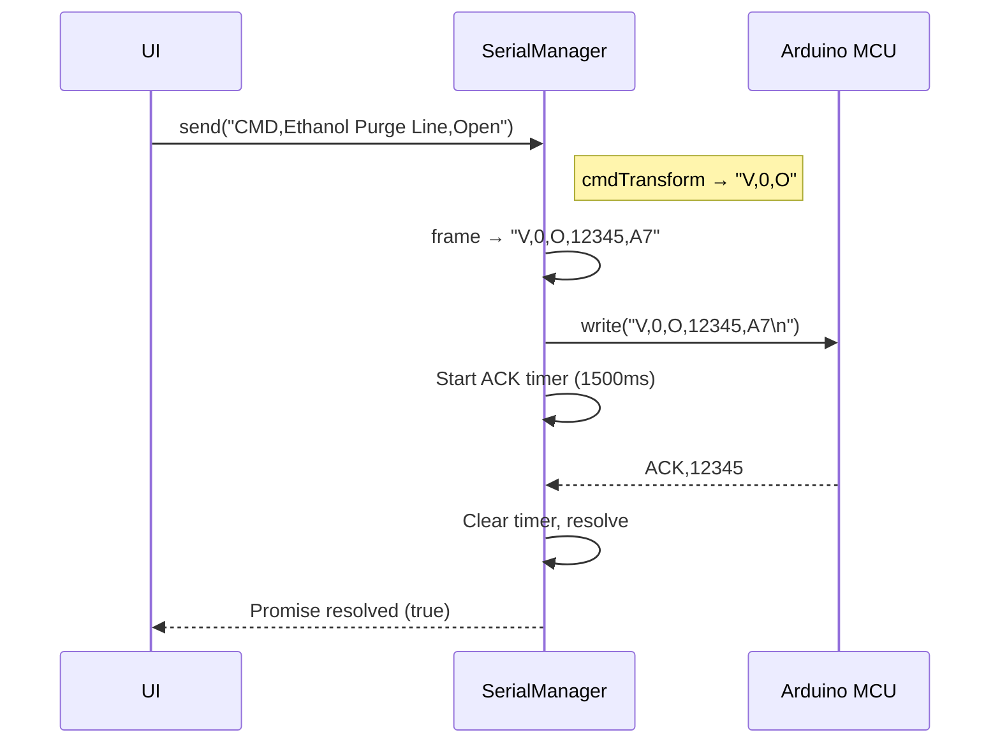
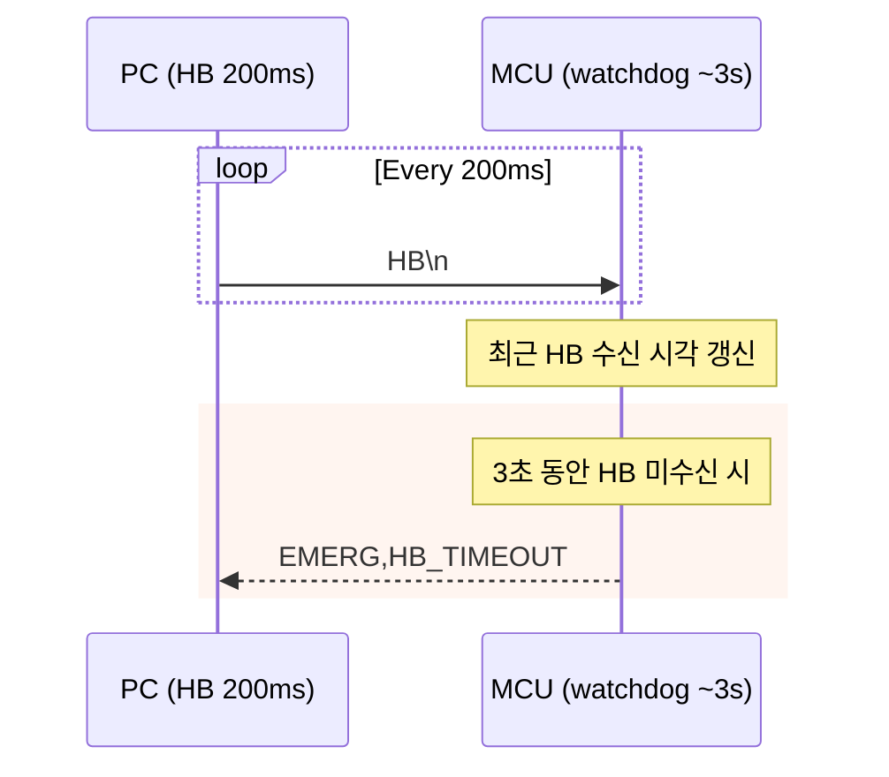
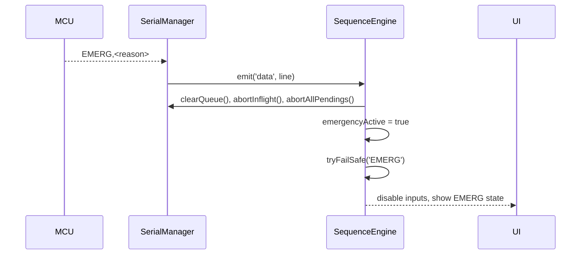
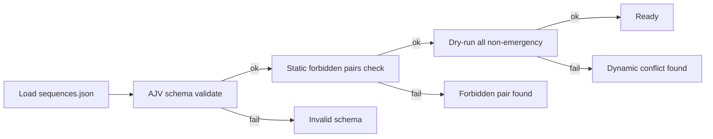

# GoRocket 지상 제어·모니터링 GUI

로켓 지상 시험(액체 로켓 엔진)용 제어·모니터링 애플리케이션입니다. Electron + Next.js + TypeScript로 구현되었으며, 안전을 최우선으로 한 통신/시퀀스/페일세이프 설계를 갖습니다.

[](https://github.com/jungho1902/Gorocket-Control-System-GUI)
[](https://typescriptlang.org/)
[](https://nextjs.org/)
[](https://electronjs.org/)

---

## 릴리스 검증 상태

- 테스트: Jest 12/12 스위트, 130/130 테스트 통과
- 타입체크: `tsc --noEmit` 통과
- 빌드: `npm run build` 성공 (Electron main → `dist/`, Next.js → `.next/`, `out/`)
- 안전 경로: EMERG/FAILSAFE 경로, 큐 비우기/인플라이트 중단/펜딩 취소, CRC-8 무결성 검증, 핸드셰이크/하트비트 로직 검증됨

빠른 재현(Windows PowerShell):

```
npm ci
npm run typecheck
npm test
npm run build
# (선택) 설치본 패키징
npm run package
```

지상시험 전 필수 프리플라이트:

- `config.json` 밸브 매핑/인덱스/개폐 방향/리밋스위치 의미가 실제 배관과 일치하는지 저압·무부하 점검
- UI 또는 하드웨어 E‑Stop으로 EMERG 유도 시: 메인 CLOSE, 벤트/퍼지 OPEN, 재‑ARM 필요 상태 유지 확인
- 통신 워치독: 컨트롤러/케이블 분리(또는 PONG 차단)로 ACK 타임아웃 → FAILSAFE 진입 확인
- 시퀀스 검증: `npm run validate:seq` 후 드라이런으로 금지 조합/딜레이/인터럽트 동작 확인
- 로깅 권한 및 단일 인스턴스 동작 확인(`logs/` 생성 확인)

---

## 목차

1. 개요
2. 아키텍처
3. 안전 모델(EMERG/FAILSAFE)
4. 시리얼 프로토콜(프레이밍/CRC/시스템 메시지)
5. 코어 모듈과 로직
6. 텔레메트리 파싱(sensorParser)
7. 명령 변환(cmdTransform)
8. 시퀀스(SequenceDataManager/Engine)
9. 설정(config.json)
10. UI/로깅/운용
11. 개발/테스트/빌드
12. 문제 해결(FAQ)

---

## 1) 개요

- 목적: 지상 시험 중 센서 모니터링과 밸브 제어, 자동/수동 시퀀스 실행, 이상 상황 즉시 안전화.
- 기술 스택: Electron(메인 프로세스) + Next.js(렌더러) + TypeScript + Jest.
- 안전 원칙: 통신 무결성(CRC-8), ACK/NACK 기반 명령 보증, EMERG/FAILSAFE 경로 최우선, 로깅과 재현성.

---

## 2) 아키텍처

- Electron 메인: 하드웨어/시리얼/시퀀스/로깅의 핵심 로직
  - `main/SerialManager.ts`: 큐/ACK/NACK/재시도/재연결/핸드셰이크
  - `main/SequenceEngine.ts`: 시퀀스 실행, FAILSAFE, EMERG 연동
  - `main/SequenceDataManager.ts`: 시퀀스 JSON 로딩/스키마 검증/금지 조합 검사/드라이런
  - `main/HeartbeatDaemon.ts`: 주기적 하트비트(HB) 송신
  - `main/ConfigManager.ts`: 설정 로딩 및 안전 한계 검증
  - `main/LogManager.ts`: 세션 로그 폴더/CSV/메타 작성, 주기 플러시
  - `main/cmdTransform.ts`: 시퀀스/수동명령을 하드웨어 형식으로 변환

- Preload: `preload.ts` — IPC bridge, 최소 권한 원칙.
- Renderer(Next.js): UI, 차트, 제어 패널, 상태 표시.
- Shared: `shared/types`, `shared/utils` — 타입/공용 유틸(sensorParser 등).

---

## 3) 안전 모델(EMERG/FAILSAFE)

- 소프트웨어 알람(예: 850 PSI) → FAILSAFE: 메인 CLOSE → 벤트/퍼지 OPEN 순으로 안전화.
- 하드웨어 트립(예: 1000 PSI) → MCU 강제 비상 상태. PC 측도 EMERG 수신 시 즉시 안전화.
- 상승률 제한(예: 50 PSI/s), 통신 워치독(하트비트 타임아웃)으로 2차 방어.
- EMERG 수신 시 즉시 수행
  - `SerialManager.clearQueue()` / `abortInflight()` / `abortAllPendings()`
  - `SequenceEngine.emergencyActive = true`, FAILSAFE 호출, 재‑ARM 필요 래치 유지
- FAILSAFE 재진입 가드: `lastFailsafeAt` 기반 쿨다운(기본 400ms), 중복 실행 억제.

---

## 4) 시리얼 프로토콜(프레이밍/CRC/시스템 메시지)

- 프레이밍: `PAYLOAD,MSG_ID,CRC`
  - CRC‑8(poly=0x07, init=0x00, xorout=0x00), 테이블/비트 시프트 구현
  - PC→MCU: 모든 제어 명령은 프레임 + CRC. MCU→PC: ACK/NACK, READY 등 시스템 메시지는 CRC 없이 전송
- 예시
  - PC→MCU: `V,0,O,12345,A7` (SV0 Open, msgId=12345, CRC=A7)
  - MCU→PC: `ACK,12345` 또는 `NACK,12345,REASON` / `READY` / `EMERG,...`
- 시스템 메시지(무CRC): `VACK`, `VERR`, `PONG`, `BOOT`, `READY`, `EMERG`, `EMERG_CLEARED`, `ACK`, `NACK`

초심자를 위한 개념 설명

- 프레이밍(Framing): 데이터를 구분하기 위해 시작/끝, 식별자(여기선 `MSG_ID`)와 체크섬(CRC)을 붙여 한 덩어리(프레임)로 만드는 절차입니다. 이렇게 하면 수신자가 “이 메시지가 어디서부터 어디까지인지, 중간에 깨지지 않았는지”를 알 수 있습니다.
- CRC(Cyclic Redundancy Check): 데이터가 전송 중 손상됐는지 판별하는 짧은 숫자(체크섬)입니다. 동일한 규칙으로 송신/수신 측이 계산했을 때 값이 다르면 데이터가 변형되었다고 판단합니다.
- ACK/NACK: 수신 측이 “잘 받았다(ACK)” 또는 “문제가 있었다(NACK)”라고 응답하는 확인 프로토콜입니다. NACK에는 사유 코드를 함께 담아 원인 분석을 돕습니다.

---

## 5) 코어 모듈과 로직

### SerialManager

- 전송 파이프라인
  1) `send(input)` → `buildPayload`로 프레임 여부 판단 → 미프레임이면 `frame()`으로 `msgId+CRC` 부여
  2) 큐에 적재(최대 200개). 큐가 가득 차면 일반 명령을 오래된 순으로 드롭(우선순위 명령 제외)
  3) `processQueue()`가 인플라이트 없음 확인 후 `write()` → ACK 타이머 시작(기본 1500ms)
  4) 수신 라인에서 `parseAckNack()`로 ACK/NACK 매칭 → 인플라이트 해제/재시도/resolve

- 우선순위 명령: `EMERG*`, `FAILSAFE*`, `HB`, `SAFE_CLEAR` — 큐 드롭 대상에서 제외
- 재시도/백오프
  - 기본 재시도 횟수 5(초기 1 + 재시도 4), NACK/타임아웃 시 `NACK_RETRY_DELAY=80ms` 후 재큐잉
  - 포트 에러/닫힘 → 지수 백오프(최대 5s)로 재연결, 성공 시 자동으로 큐 처리 재개
- 핸드셰이크: `HELLO` 송신 후 `READY` 또는 해당 `ACK` 수신 시 연결 성공으로 간주
- 유틸: `clearQueue()`, `abortInflight()`, `abortAllPendings()`, `writeNow(line)`

시퀀스/명령 전송 타임라인(예시)



<details>
<summary>ASCII Fallback</summary>

```
UI            SerialManager                 MCU
 |  send("CMD,Ethanol Purge Line,Open")      |
 |------------------------------------------>|
 |            transform → "V,0,O"            |
 |            frame → "V,0,O,12345,A7"       |
 | send "V,0,O,12345,A7\n" ---------------->|
 |                                           |  ACK,12345
 |<------------------------------------------|
 |  resolve(true)                            |
```

</details>

- 평상시 왕복 지연(RTT): 수~수십 ms(환경에 따라 상이). ACK 타임아웃은 1500ms로 여유 있게 설정되어 재시도/복구가 가능합니다.
- 타임아웃/재시도: 1500ms 경과 시 재큐잉(80ms 지연)하여 재전송, 기본 5회 시도 후 실패 처리.

### HeartbeatDaemon

- 기본 200ms 간격으로 `HB` 전송(`serial.send({ raw: 'HB' })`). ACK 없는 시스템 메시지.
- `sendOnce()`로 즉시 전송 가능(ARM 시 빠른 동기화 용도).

하트비트/워치독 타임라인(개념)



<details>
<summary>ASCII Fallback</summary>

```
PC (HB every 200ms)                MCU (watchdog ~3s)
     |  HB                         |
     |---------------------------->|
     |  HB                         |
     |---------------------------->|
     |  ...                        |
                                   | if no HB for ~3s → EMERG,HB_TIMEOUT
                                   |-------------------------------> PC
```

</details>

### SequenceEngine

- 역할: 시퀀스 실행, WAIT 처리(time/cond), FAILSAFE 진입, EMERG 수신 처리.
- 핵심 로직
  - `tryFailSafe(tag)`: 메인 CLOSE → 벤트/퍼지 OPEN(역할 중복 제거), 재진입 쿨다운/래치 관리
  - `onSerialData(line)`: `EMERG` 수신 시 SerialManager 큐/인플라이트/펜딩 즉시 정리, 래치 활성
  - `buildFramed(payload, msgId?)` + `writeLine(line)`: SerialManager를 통해 실제 전송
- WAIT: 시간 기반/조건 기반(`op: gte|lte`, `timeoutMs`) 모두 지원, EMERG로 인터럽트 가능

FAILSAFE 동작(역할 기반)

```mermaid
flowchart TD
  A[Failsafe Trigger] --> B[Close mains (dedup roles)]
  B --> C[Open vents]
  C --> D[Open purges]
  D --> E{Emergency latched?}
  E -- Yes --> F[Keep in failsafe]
  E -- No --> G[Exit failsafe]
```

<details>
<summary>ASCII Fallback</summary>

```
Failsafe Trigger
  ├─ Close mains (deduplicated)
  ├─ Open vents
  └─ Open purges
      └─ Emergency latched?
           ├─ Yes → Stay in failsafe
           └─ No  → Exit failsafe
```

</details>

EMERG 수신 경로



<details>
<summary>ASCII Fallback</summary>

```
MCU → EMERG,<reason>
SerialManager: emit('data') → SequenceEngine
SequenceEngine: clearQueue(), abortInflight(), abortAllPendings()
SequenceEngine: emergencyActive = true → tryFailSafe('EMERG')
UI: disable controls, show EMERG status
```

</details>

### SequenceDataManager

- 로딩/검증: Ajv(JSON Schema)로 `sequences.json` → 스키마 검증 + 커스텀 정적 금지 조합 검증
- 동적 드라이런: 각 시퀀스를 가상 실행하며 금지 조합이 시점상 동시에 OPEN 되는지 추가 점검
- 필수 시퀀스: `Emergency Shutdown` 존재 필수

시퀀스 검증 흐름



<details>
<summary>ASCII Fallback</summary>

```
Load → AJV schema → Static forbidden-pairs → Dry-run → Ready
  │         │fail → Invalid schema
  │
  └→ ok → Static check
              │fail → Forbidden pair
              └→ ok → Dry-run
                          │fail → Dynamic conflict
                          └→ ok → Ready
```

</details>

### ConfigManager

- `config.json`을 Zod로 파싱/검증하고, 압력 한계 값 검증(`validatePressureConfig`) 수행
- 유효하지만 위험할 수 있는 설정은 경고 로그로 남김

주의: `valveMappings`의 인덱스(0‑based)와 `initialValves`의 `id`(1‑based)가 혼용됩니다. 내부 파서(sensorParser)는 하드웨어 0‑index를 UI 1‑index로 보정합니다.

### LogManager

- 세션 폴더: 문서 폴더(`rocket-logs/`) 하위 `session-YYYYMMDD-HHMMSS`
- 스냅샷: `config.json`, `sequences.json` 복제 + `session-meta.json`(환경/안전 한계/해시)
- CSV: `data.csv` 생성, 텔레메트리 필드 + 밸브 상태 집계. ACK/NACK 라인은 필터링, 상태 이벤트는 `#` 접두어로 기록
- 플러시: 주기적 `fsync`(기본 2000ms, `setFlushIntervalMs()`로 단축 가능)

로그 예시

```
2025-08-17T10:33:44.120Z # READY
2025-08-17T10:33:45.003Z,845,812,768,740,12.4,9.8,25.3,29.9,V1:CLOSED V2:OPEN
2025-08-17T10:33:45.205Z # EMERG,HB_TIMEOUT
```

---

## 6) 텔레메트리 파싱(sensorParser)

- 파일: `shared/utils/sensorParser.ts`
- 흐름
  1) 라인 트림 후 시스템 메시지면 즉시 무시(무CRC)
  2) `...,CRCHEX` 형식의 CRC 존재 여부 확인 → 미존재 시 오류 기록 후 폐기
  3) CRC‑8 테이블로 계산하여 일치하면 파싱 진행(센서/밸브 순서 무관)
- 지원 키
  - 압력: `pt1..pt4`
  - 온도: `tc1`, `tc2`(문자 오류 문자열도 허용)
  - 유량: `fm1_Lh`, `fm2_Lh` → `flow1`, `flow2`
  - 밸브 리밋 스위치: `V{idx}_LS_OPEN`, `V{idx}_LS_CLOSED`(하드웨어 0-index → UI 1-index 보정)
- 오류 처리: 일부 세그먼트가 오류여도 나머지는 계속 파싱(안정성 우선)
- 유틸: `exceedsPressureLimit(data, limit)` — 임계 초과 감지

CRC‑8 자세히 보기(초심자용)

- 왜 필요한가: 시리얼 데이터는 노이즈로 비트가 바뀔 수 있습니다. 단순 합계 체크섬보다 CRC는 충돌 확률이 낮아 오류를 더 잘 잡아냅니다.
- 동작: 각 바이트를 테이블과 XOR/시프트 규칙으로 누적해 1바이트 결과를 얻습니다. 송신 시 데이터 끝에 이 값을 붙이고, 수신 시 동일 계산으로 비교합니다.
- 이 프로젝트에선 0x07 다항식, 초기값 0x00, xorout 0x00(표준 CRC‑8)이며, MCU와 동일한 방식으로 계산합니다.

---

## 7) 명령 변환(cmdTransform)

- 파일: `main/cmdTransform.ts`
- 규칙
  - `CMD,<ValveName>,Open|Close` → `V,<servoIndex>,O|C`
  - 변환 시 피드백 기대값 반환: `{ feedback: { index, expect: 'open'|'closed' } }`
  - `SLEEP,<ms>`/`S,<ms>`/기타 원시 명령은 원본 유지
- 매핑: `config.json`의 `valveMappings`를 사용(이름→서보 인덱스)

예시

```
입력:  CMD,Ethanol Main Supply,Close
출력:  V,4,C
피드백 기대: index=4, expect='closed' → 이후 LS 피드백과 대조 가능
```

---

## 8) 시퀀스(SequenceDataManager/Engine)

- 스키마: `sequences.schema.json`
  - 스텝: `{ message, delay, commands[], condition? }`
  - `commands[]`: `V,idx,O|C` 또는 `CMD,Name,Open|Close`
  - 금지 조합(정적): 같은 스텝에서 특정 밸브 조합을 동시에 Open 금지(예: 메인 + 벤트)
- 실행: `SequenceEngine`
  - 시간 대기(`delay`), 조건 대기(`sensor/op/min/max/timeoutMs`), EMERG로 인터럽트 가능
  - 실패/에러 경로에서 FAILSAFE 진입(옵션)
  - 역할 기반 FAILSAFE: `mains/vents/purges` 중복 제거 후 일괄 Close/Open
- 드라이런: `SequenceDataManager.dryRunAll()` — 동적 금지 조합(시간상 동시 OPEN) 검출

대기(Wait) 메커니즘 설명

- 시간 대기: `delay`가 0 이하이면 스킵, 그 외에는 해당 ms만큼 대기합니다. EMERG 입력 시 즉시 인터럽트됩니다.
- 조건 대기: `sensor/op/min/max/timeoutMs`를 통해 “pt1 ≥ 600” 같은 조건을 일정 시간 내 만족할 때까지 폴링합니다. 타임아웃 시 에러로 간주될 수 있으며 필요 시 FAILSAFE로 진입합니다.

---

## 9) 설정(config.json)

예시(`config.json`):

```
{
  "serial": { "baudRate": 115200 },
  "maxChartDataPoints": 100,
  "pressureLimitPsi": 850,
  "pressureLimitAlarmPsi": 850,
  "pressureLimitTripPsi": 1000,
  "pressureRateLimitPsiPerSec": 50,
  "valveFeedbackTimeout": 2000,
  "initialValves": [ { "id": 1, "name": "Ethanol Purge Line", "state": "CLOSED" }, ... ],
  "valveMappings": {
    "Ethanol Purge Line": { "servoIndex": 0 },
    "Main Pressurization": { "servoIndex": 1 },
    "Ethanol Fill Line": { "servoIndex": 2 },
    "N2O Main Supply": { "servoIndex": 3 },
    "Ethanol Main Supply": { "servoIndex": 4 },
    "System Vent 1": { "servoIndex": 5 },
    "System Vent 2": { "servoIndex": 6 }
  }
}
```

- 안전 한계 값은 `ConfigManager`와 `validatePressureConfig`로 검증됩니다.
- 실제 배관과 매핑/방향(OPEN/CLOSE)/리밋스위치 의미를 반드시 현장 점검하세요.

성능/타이밍 참고 값(기본)

- 연결 대기: 포트 open 최대 5s, 핸드셰이크(HELLO↔READY/ACK) 최대 3s
- 하트비트: 200ms 주기(PC→MCU), MCU 워치독 ~3s (펌웨어 설정)
- ACK 타임아웃: 1500ms, 재시도 간격 80ms, 최대 재시도 5회
- 재연결 백오프: 300ms에서 시작, 최대 5s까지 지수 증가
- 로그 플러시: 2000ms(세션 중 100~500ms로 단축 가능)

---

## 10) UI/로깅/운용

- UI(렌더러)
  - 밸브/시퀀스 컨트롤 패널, 센서 차트, 상태 인디케이터
  - EMERG 시 입력 비활성/상태 라벨링, 차트 Y축은 급격한 변화에 스무스 확장
  - 단일 인스턴스 보장, 로그 생성 실패 시 사용자에게 경고
- 로깅(LogManager)
  - `rocket-logs/session-*/` 하위에 `data.csv`, `session-meta.json`, 설정 스냅샷 저장
  - ACK/NACK 라인은 CSV에 기록하지 않음, 상태 이벤트는 `#`로 태깅하여 후처리 용이
- 운용 체크리스트
  - `DAY-OF-TEST-CHECKLIST.md`, `HIL-Preflight-Checklist-Results.md` 참고

UI 개요(화면)

```mermaid
flowchart LR
  A[상단 헤더] --> B[포트 선택/연결 상태/ARM/EMERG]
  A --> C[세션 로그 토글]
  D[밸브 패널] -->|수동 Open/Close| D2[리밋스위치 실시간 반영]
  E[시퀀스 패널] -->|실행/중지| E2[진행상황 표시]
  F[센서 차트] -->|PT/TC/Flow| F2[알람/트립 라인]
  G[터미널 패널] -->|원시 수신/발신|
```

<details>
<summary>ASCII Fallback</summary>

```
[헤더] 포트선택/연결상태/ARM/EMERG/로그
[밸브 패널] 수동 Open/Close ←→ 리밋스위치 피드백
[시퀀스 패널] 실행/중지, 진행상황
[센서 차트] PT/TC/Flow + 알람/트립 라인
[터미널] 원시 수신/발신
```

</details>

스크린샷(추가 예정)

- `docs/screenshots/dashboard.png` — 전체 대시보드
- `docs/screenshots/valves.png` — 밸브 제어/피드백
- `docs/screenshots/charts.png` — 센서 차트/알람 라인

참고: 스크린샷을 추가하려면 `docs/screenshots/` 폴더를 만들고 이미지를 저장한 뒤 README 경로를 맞춰 주세요.

---

## 11) 개발/테스트/빌드

- 개발
  - `npm run dev` — Next(9002) + Electron 동시 실행
  - `npm run rebuild` — 네이티브 모듈(예: serialport) 재빌드
- 테스트/타입체크
  - `npm test` — Jest(ts-jest), `jest.config.js` 참고
  - `npm run typecheck` — TypeScript 검사
- 빌드/패키징
  - `npm run build` — Electron(`dist/`), Next.js(`.next/`, `out/`)
  - `npm run package` — OS별 배포물 생성(AppImage/nsis/dmg)

엔드투엔드(HIL) 드릴 스크립트 아이디어

- 시리얼 시뮬레이터(노드/파이썬)로 READY/ACK/EMERG/텔레메트리 스트림을 발생시키고 UI 반응을 기록
- 실패 주입: ACK 지연, NACK 주기적 삽입, HB 스톨로 EMERG 유도, CRC 에러 프레임 삽입
- 목표: FAILSAFE 재진입 가드, 큐/ACK 타이밍, 로깅/상태 표시 일치성 검증

---

## 12) 문제 해결(FAQ)

- 연결은 되었는데 명령이 먹지 않음
  - 포트 속도/케이블 확인, `HELLO` 핸드셰이크 수락 여부(READY 수신) 확인
  - 로그(`logs/`)에서 NACK 사유/CRC 불일치 여부 확인
- EMERG 후 복귀가 안 됨
  - EMERG 래치가 의도적으로 유지됩니다. `SAFE_CLEAR`/재‑ARM 절차로 복귀하세요.
- 밸브 지도/동작이 실제와 다름
  - `config.json`의 `valveMappings`와 `initialValves`를 실제 배관과 다시 매칭하세요.
- 테스트가 느리거나 플래키함
  - 장시간 타이머/이벤트 의존 테스트는 `--runInBand`로 직렬 실행 권장

추가 개념 설명(초심자용)

- 이벤트 루프: 자바스크립트 런타임이 비동기 작업(타이머, IO 콜백)을 순차적으로 처리하는 메커니즘입니다. SerialManager의 ACK 타이머/재시도도 이벤트 루프에서 스케줄링됩니다.
- 백오프: 실패 시 재시도 간격을 점차 늘려 시스템 과부하를 피하는 전략입니다. 본 프로젝트는 300ms→600ms→...→최대 5s로 증가합니다.
- 리밋 스위치(LS): 밸브가 끝 위치(OPEN/CLOSED)에 도달했음을 알려주는 물리 스위치입니다. 소프트웨어는 LS 피드백으로 밸브 상태를 확정합니다.

---

## 라이선스

이 저장소의 LICENSE 파일을 참고하십시오.
