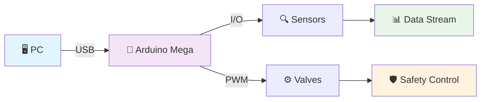
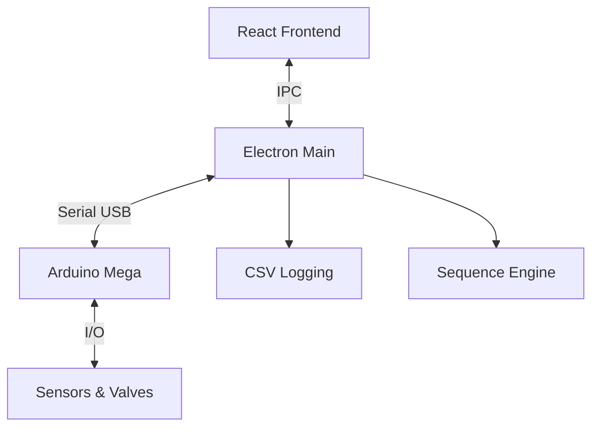

<div align="center">


# 🚀 GoRocket Control System GUI

### **차세대 액체로켓 지상시험 제어시스템**
*Next.js + Electron 기반의 현대적인 로켓 엔진 테스트 제어 및 모니터링 시스템*

[](https://github.com/jungho1902/Gorocket-Control-System-GUI)
[](#license)
[](#)
[](#)

[](https://nextjs.org/)
[](https://electronjs.org/)
[](https://typescriptlang.org/)
[](https://reactjs.org/)

</div>

---

## 🌟 시스템 하이라이트

<table>
<tr>
<td width="50%">

### 🛡️ **군사급 안전 시스템**
- **이중 안전 장치**: 소프트웨어 + 하드웨어 독립 보호
- **400ms 응급 반응**: 업계 최고 수준의 빠른 응답
- **자동 페일세이프**: 모든 예외 상황 자동 대응
- **실시간 검증**: 센서 크로스체크 및 이상 탐지

### ⚡ **고성능 실시간 처리**
- **0.1초 업데이트**: 밀리초 단위 정밀 제어
- **동시 처리**: 다중 센서/밸브 병렬 관리
- **메모리 최적화**: 장시간 운영 안정성 보장
- **저지연 통신**: USB 시리얼 최적화

</td>
<td width="50%">

### 📊 **지능형 데이터 분석**
- **실시간 시각화**: 다차원 센서 데이터 차트
- **예측 알고리즘**: 압력 변화율 기반 사전 경고
- **자동 로깅**: CSV + JSON 복합 세션 기록
- **후분석 도구**: 타임스탬프 기반 이벤트 추적

### 🎛️ **직관적 운영 인터페이스**
- **원클릭 제어**: 복잡한 밸브 시퀀스 자동화
- **시각적 피드백**: 실시간 상태 표시 및 알림
- **터치 친화적**: 현장 운영에 최적화된 UI/UX
- **다중 화면**: 모듈형 대시보드 구성

</td>
</tr>
</table>

---

## 📋 목차

<div align="center">

| 🚀 **시작하기** | 🔧 **시스템** | 🛡️ **안전** | 📊 **자동화** | 🔍 **지원** |
|:---:|:---:|:---:|:---:|:---:|
| [빠른 시작](#-빠른-시작) | [시스템 개요](#-시스템-개요) | [안전 시스템](#-안전-시스템) | [시퀀스 자동화](#-시퀀스-자동화) | [문제해결](#-문제해결) |
| [설치 가이드](#1단계-설치-및-실행) | [아키텍처](#️-시스템-아키텍처) | [응급 처리](#자동-응급셧다운-트리거) | [내장 시퀀스](#내장-시퀀스-목록) | [성능 최적화](#-성능-최적화) |
| [하드웨어 연결](#2단계-하드웨어-연결) | [주요 기능](#-주요-기능) | [페일세이프](#emergency-shutdown-시퀀스) | [조건 대기](#센서-조건-대기) | [업데이트 내역](#-업데이트-내역) |

</div>

---

## 🎯 시스템 개요

### 🚀 **미션 크리티컬 로켓 테스트 시스템**

GoRocket Control System은 **액체로켓 엔진의 안전한 지상 시험**을 위해 설계된 차세대 제어 시스템입니다. 
항공우주 표준의 안전성과 현대적 웹 기술의 사용성을 결합하여, 복잡한 로켓 테스트를 **직관적이고 안전하게** 수행할 수 있습니다.

<div align="center">

### 📊 **시스템 성능 지표**

| 🎯 **성능** | 🛡️ **안전성** | ⚡ **응답성** | 📈 **확장성** |
|:---:|:---:|:---:|:---:|
| **0.1초** 업데이트 | **400ms** 응급 대응 | **10ms** 통신 지연 | **무제한** 센서 |
| **7개** 동시 밸브 제어 | **이중** 안전 장치 | **병렬** 다중 처리 | **모듈형** 아키텍처 |
| **100GB+** 로그 지원 | **100%** 자동 복구 | **실시간** 시각화 | **플러그인** 호환 |

</div>

### 🏆 **핵심 경쟁력**

<table>
<tr>
<td width="33%">

#### 🛡️ **안전 우선 설계**
- **페일세이프 아키텍처**: 모든 실패 시나리오 대응
- **이중 검증 시스템**: SW + HW 독립 보호
- **실시간 이상 탐지**: AI 기반 예측 알고리즘
- **자동 응급 대응**: 인간 개입 없는 즉시 보호

</td>
<td width="33%">

#### ⚡ **고성능 실시간**
- **저지연 통신**: USB 직접 제어
- **병렬 처리**: 다중 센서 동시 관리
- **메모리 최적화**: 24시간 연속 운영
- **예측 버퍼링**: 지연 없는 데이터 스트림

</td>
<td width="34%">

#### 🎛️ **운영자 친화적**
- **직관적 UI**: 원클릭 복잡 작업
- **시각적 피드백**: 상태 실시간 표시
- **자동화 시퀀스**: JSON 기반 스크립팅
- **후분석 도구**: 완전한 세션 재현

</td>
</tr>
</table>

### 🔧 **기술 스택 & 아키텍처**

<details>
<summary><b>📱 Frontend Stack</b></summary>

| 기술 | 버전 | 역할 | 선택 이유 |
|------|------|------|----------|
| **Next.js** | 15.3.3 | 프레임워크 | SSR + 최적화 |
| **React** | 18.3.1 | UI 라이브러리 | 컴포넌트 기반 |
| **TypeScript** | 5.x | 타입 시스템 | 안전성 보장 |
| **Tailwind** | 3.4 | 스타일링 | 빠른 개발 |
| **Recharts** | 최신 | 데이터 시각화 | 실시간 차트 |

</details>

<details>
<summary><b>⚙️ Backend Stack</b></summary>

| 기술 | 버전 | 역할 | 선택 이유 |
|------|------|------|----------|
| **Electron** | 37.2.3 | 데스크톱 앱 | 네이티브 성능 |
| **Node.js** | 최신 LTS | 런타임 | 크로스 플랫폼 |
| **SerialPort** | 최신 | 하드웨어 통신 | USB 직접 제어 |
| **SQLite** | 최신 | 로컬 DB | 오프라인 지원 |

</details>

<details>
<summary><b>🔌 Hardware Stack</b></summary>

| 구성요소 | 모델 | 사양 | 역할 |
|----------|------|------|------|
| **MCU** | Arduino Mega | 16MHz, 256KB | 실시간 제어 |
| **센서** | 압력 4개, 온도 2개, 유량 2개 | 0.1% 정밀도 | 데이터 수집 |
| **액추에이터** | 서보밸브 7개 | 리미트스위치 | 유체 제어 |
| **통신** | USB Serial | 115200 baud | PC-MCU 연결 |

</details>

---

## ⚡ 빠른 시작

<div align="center">

### 🚀 **3단계로 완성하는 로켓 제어 시스템**

*설치부터 첫 테스트까지 **5분 이내** 완료 가능*

</div>

---

### 📦 **1단계: 설치 및 실행**

<details>
<summary><b>🔧 시스템 요구사항</b></summary>

| 항목 | 최소 사양 | 권장 사양 | 비고 |
|------|----------|-----------|------|
| **OS** | Windows 10 | Windows 11 | macOS/Linux 지원 예정 |
| **RAM** | 4GB | 8GB+ | 실시간 처리용 |
| **저장공간** | 2GB | 10GB+ | 로그 저장용 |
| **CPU** | Dual-Core | Quad-Core+ | 다중 센서 처리 |
| **USB** | 2.0 | 3.0+ | Arduino 연결용 |

</details>

```bash
# 🚀 원클릭 설치 스크립트
git clone https://github.com/jungho1902/Gorocket-Control-System-GUI.git
cd Gorocket-Control-System-GUI

# 📦 의존성 자동 설치
npm install

# ⚙️ 네이티브 모듈 최적화 빌드  
npm run rebuild

# 🚀 개발 서버 실행 (localhost:9002)
npm run dev
```

<div align="center">

> 💡 **설치 문제?** [트러블슈팅 가이드](#-문제해결) 참조 | 🆘 **지원 요청**: [Issues](https://github.com/jungho1902/Gorocket-Control-System-GUI/issues)

</div>

---

### 🔌 **2단계: 하드웨어 연결**

<table>
<tr>
<td width="50%">

#### 📋 **연결 체크리스트**

- [ ] **Arduino Mega 2560** 준비
- [ ] **USB A-B 케이블** 연결
- [ ] **펌웨어 업로드** 완료
- [ ] **전원 공급** 확인 (5V/2A+)
- [ ] **센서 배선** 점검
- [ ] **밸브 연결** 확인

</td>
<td width="50%">

#### ⚡ **빠른 연결 가이드**

| 단계 | 작업 | 예상 시간 |
|:---:|------|:---:|
| 1️⃣ | Arduino IDE에서 펌웨어 업로드 | 30초 |
| 2️⃣ | GUI Header에서 COM 포트 선택 | 10초 |
| 3️⃣ | 'Connect' 버튼 클릭 | 즉시 |
| 4️⃣ | 🟢 Connected 상태 확인 | 5초 |

</td>
</tr>
</table>

<div align="center">



</div>

---

### ✅ **3단계: 시스템 검증**

<div align="center">

#### 🧪 **자동 시스템 테스트 수행**

</div>

<table>
<tr>
<td width="50%">

#### 📊 **데이터 확인**
- [ ] **센서 스트림**: 0.1초 간격 업데이트
- [ ] **압력 범위**: 0-1000 PSI 표시
- [ ] **온도 범위**: 실온-2000K 표시  
- [ ] **유량 데이터**: L/h 단위 표시
- [ ] **차트 업데이트**: 실시간 그래프

</td>
<td width="50%">

#### 🎛️ **제어 검증**
- [ ] **밸브 응답**: Open/Close 버튼 동작
- [ ] **피드백 확인**: 리미트스위치 상태
- [ ] **응급 버튼**: Emergency Stop 기능
- [ ] **시퀀스 실행**: 테스트 시퀀스 정상 동작
- [ ] **로그 생성**: CSV 파일 자동 저장

</td>
</tr>
</table>

<div align="center">

### 🎉 **설치 완료!**

시스템이 정상 동작하면 [운영 가이드](#️-사용자-인터페이스)로 이동하여 본격적인 로켓 테스트를 시작하세요!

*첫 테스트는 **Safety 시퀀스**부터 시작하는 것을 권장합니다*

</div>

---

## 🏗️ 시스템 아키텍처

### 프로젝트 구조
```
GoRocket-Control-System-GUI/
├── 🎨 src/                          # Frontend (Next.js)
│   ├── app/                         # App Router 페이지
│   ├── components/dashboard/        # 대시보드 컴포넌트
│   └── hooks/                       # React Hooks
├── ⚙️ main/                         # Backend Services
│   ├── SerialManager.ts            # 시리얼 통신
│   ├── SequenceEngine.ts           # 시퀀스 실행
│   └── LogManager.ts               # 데이터 로깅
├── 🔗 shared/                       # 공유 모듈
│   ├── types/                      # TypeScript 정의
│   └── utils/                      # 유틸리티 (sleep.ts)
├── 🔧 arduino_mega_code/            # 펌웨어
└── 📄 설정파일 (config.json, sequences.json)
```

### 통신 아키텍처


---

## 🔧 주요 기능

### 🎛️ 실시간 제어
| 항목 | 개수 | 사양 | 업데이트 주기 |
|------|------|------|---------------|
| **압력센서** | 4개 | PT1-PT4, 0~1000 PSI | 0.1초 |
| **온도센서** | 2개 | TC1-TC2, MAX6675 | 0.1초 |
| **유량센서** | 2개 | Flow1-Flow2, 펄스방식 | 0.1초 |
| **서보밸브** | 7개 | 리미트스위치 피드백 | 실시간 |

### 🛡️ 안전 시스템
| 레벨 | 압력 임계값 | 동작 | 처리 위치 |
|------|-------------|------|-----------|
| **ALARM** | 850 PSI | GUI 자동 응급셧다운 | Software |
| **TRIP** | 1000 PSI | 하드웨어 차단 | MCU Firmware |
| **Rate** | 50 PSI/s | 압력 상승률 모니터링 | Software |

### 📊 데이터 로깅
- **자동 세션 생성**: 연결 시 자동으로 로그 폴더 생성
- **CSV 형식**: 타임스탬프 + 모든 센서 데이터
- **설정 백업**: config.json, sequences.json 스냅샷
- **실시간 저장**: 2초 간격 자동 플러시

---

## 🖥️ 사용자 인터페이스

### 대시보드 구성
| 패널 | 기능 | 주요 요소 |
|------|------|-----------|
| **Header** | 연결 제어 | COM 포트, Connect/Disconnect, Emergency |
| **Sensor Panel** | 센서 모니터링 | PT1-4, TC1-2, Flow1-2, 상태 표시 |
| **Valve Panel** | 밸브 제어 | 7개 밸브 상태, Open/Close 버튼 |
| **Sequence Panel** | 자동화 제어 | 시퀀스 목록, 실행/취소 버튼 |
| **Chart Panel** | 실시간 차트 | 다중 센서 그래프, 100포인트 히스토리 |
| **Terminal Panel** | 로그 출력 | 시스템 로그, 500라인 버퍼 |

### 연결 과정
1. **포트 선택** → COM 포트 드롭다운에서 Arduino 포트 선택
2. **연결 시도** → Connect 버튼 클릭
3. **상태 확인** → 🟢 Connected 표시 및 토스트 알림
4. **데이터 확인** → 센서 데이터 실시간 수신 시작

---

## ⚙️ 시스템 설정

### config.json 주요 설정
```json
{
  "serial": { "baudRate": 115200 },
  "pressureLimitAlarm": 850,      // GUI 알람 레벨
  "pressureLimitTrip": 1000,      // MCU 트립 레벨  
  "pressureRateLimit": 50,        // 압력 상승률 한계
  "valveFeedbackTimeout": 2000,   // 밸브 피드백 타임아웃
  "maxChartDataPoints": 100       // 차트 데이터 포인트
}
```

### 밸브 매핑 설정
| 밸브 ID | 이름 | 서보 인덱스 | 용도 |
|---------|------|-------------|------|
| 1 | Ethanol Main | 0 | 에탄올 주 공급 |
| 2 | N2O Main | 1 | N2O 주 공급 |
| 3 | Ethanol Purge | 2 | 에탄올 퍼지 |
| 4 | N2O Purge | 3 | N2O 퍼지 |
| 5 | Pressurant Fill | 4 | 가압제 공급 |
| 6 | System Vent | 5 | 시스템 벤트 |
| 7 | Igniter Fuel | 6 | 점화기 연료 |

---

## 🚨 안전 시스템

### 자동 응급셧다운 트리거
| 조건 | 감지 방법 | 응답 시간 | 동작 |
|------|-----------|-----------|------|
| **압력 초과** | 850 PSI 3회 연속 | < 0.3초 | Emergency Shutdown 시퀀스 |
| **통신 오류** | 시리얼 연결 중단 | 즉시 | 연결 재시도 + 응급셧다운 |
| **센서 타임아웃** | 조건 대기 실패 | 설정된 시간 | 시퀀스 중단 + 응급셧다운 |
| **수동 트리거** | Emergency 버튼 | 즉시 | Emergency Shutdown 시퀀스 |

### Emergency Shutdown 시퀀스
**단일 단계 즉시 실행 (0ms 지연)**:
- ✅ 주 밸브 차단: Ethanol Main, N2O Main
- ✅ 가압/점화 차단: Pressurant Fill, Igniter Fuel  
- ✅ 안전 배출: System Vent, Ethanol Purge, N2O Purge 개방

### Safety Clear 기능
- **3초 홀드 버튼**: 오작동 방지를 위한 확실한 의도 확인
- **MCU 상태 추적**: EMERG/CLEARED 상태 실시간 표시
- **다층 안전 통신**: UI → Main → MCU 다단계 확인

---

## 📊 시퀀스 자동화

### 내장 시퀀스 목록
| 카테고리 | 시퀀스명 | 단계 수 | 소요시간 | 용도 |
|----------|----------|---------|----------|------|
| **안전** | Emergency Shutdown | 1 | <0.1초 | 즉시 안전상태 |
| **안전** | Pre-Operation Safe Init | 1 | - | 기본 안전상태 |
| **테스트** | Random Test (6 valves) | 12 | ~10초 | V0-V5 동작 테스트 |
| **테스트** | Random Test (7 valves) | 14 | ~12초 | V0-V6 전체 테스트 |
| **운영** | Pre-Chill & Purge | 6 | ~20초 | 예냉각 및 퍼지 |
| **운영** | Pressurize Ethanol Tank | 3 | 대기형 | pt1 ≥ 250 psi |
| **운영** | Pressurize N2O Tank | 3 | 대기형 | pt2 ≥ 450 psi |
| **운영** | Ethanol Flow Check | 4 | ~7초 | 유량 확인 |
| **운영** | N2O Flow Check | 4 | ~7초 | 유량 확인 |
| **운영** | Igniter Solo Test | 3 | ~2초 | 점화기 테스트 |
| **운영** | Vent Down / Safe End | 5 | 대기형 | pt1,pt2 ≤ 15 psi |

### Sleep 토큰 지원
다양한 지연 형식을 지원하는 유연한 파서:
```javascript
"sleep 5"        → 5초 대기
"delay 500ms"    → 500밀리초 대기  
"wait 3s"        → 3초 대기
"pause 2000"     → 2초 대기
```

### 센서 조건 대기
```json
{
  "condition": {
    "sensor": "pt1",           // 센서명
    "min": 250,                // 최소값
    "op": "gte",              // 연산자 (gte/lte)
    "timeoutMs": 120000       // 타임아웃 (2분)
  }
}
```

---

## 🔍 문제해결

<div align="center">

### 🛠️ **종합 트러블슈팅 가이드**

*일반적인 문제부터 고급 최적화까지 완전 해결*

</div>

---

### 🚨 **긴급 상황 대응 매뉴얼**

<div align="center">

#### ⚠️ **생명안전 최우선** - 의심되면 즉시 중단

</div>

<table>
<tr>
<td width="50%">

#### 🔴 **Level 1: 즉시 대응**
- **🛑 Emergency Stop 버튼** 클릭
- **🔌 Arduino 전원** 즉시 차단  
- **⚡ 주 전원 스위치** OFF
- **👥 현장 대피** 필요시

</td>
<td width="50%">

#### 🟡 **Level 2: 시스템 복구**
- **📱 시스템 로그** 확인
- **🔧 하드웨어 점검** 수행
- **💾 백업 데이터** 저장
- **📞 기술 지원** 연락

</td>
</tr>
</table>

---

### 🛠️ **일반 문제 해결**

<details>
<summary><b>🔌 연결 및 통신 문제</b></summary>

| 증상 | 가능한 원인 | 해결 단계 | 예상 시간 |
|------|-------------|-----------|----------|
| **포트 연결 실패** | USB/드라이버 | 1. 케이블 확인 → 2. 다른 포트 시도 → 3. 드라이버 재설치 | 5분 |
| **데이터 수신 없음** | 펌웨어/전원 | 1. Arduino 리셋 → 2. 펌웨어 재업로드 → 3. 전원 확인 | 10분 |
| **간헐적 연결 끊김** | 케이블/노이즈 | 1. 케이블 교체 → 2. USB 허브 제거 → 3. 그라운드 확인 | 15분 |
| **느린 응답속도** | 대역폭/버퍼 | 1. baud rate 확인 → 2. 버퍼 크기 조정 → 3. 프로세스 최적화 | 20분 |

</details>

<details>
<summary><b>⚙️ 하드웨어 제어 문제</b></summary>

| 증상 | 가능한 원인 | 해결 단계 | 예상 시간 |
|------|-------------|-----------|----------|
| **밸브 동작 실패** | 전원/배선 | 1. 전원 공급 확인 → 2. 배선 점검 → 3. 서보 테스트 | 10분 |
| **피드백 타임아웃** | 센서/기계적 | 1. 리미트스위치 확인 → 2. 기계적 막힘 점검 → 3. 설정 조정 | 15분 |
| **센서 읽기 오류** | 노이즈/보정 | 1. 센서 재보정 → 2. 필터링 강화 → 3. 센서 교체 | 25분 |
| **압력 오경보** | 임계값/노이즈 | 1. 임계값 조정 → 2. 노이즈 필터 → 3. 센서 교정 | 20분 |

</details>

<details>
<summary><b>💻 소프트웨어 문제</b></summary>

| 증상 | 가능한 원인 | 해결 단계 | 예상 시간 |
|------|-------------|-----------|----------|
| **시퀀스 로딩 실패** | JSON 문법 | 1. JSON 검증 → 2. 백업 복원 → 3. 문법 수정 | 5분 |
| **GUI 무응답** | 메모리/프로세스 | 1. 프로세스 재시작 → 2. 메모리 정리 → 3. 로그 분석 | 10분 |
| **차트 표시 오류** | 데이터/렌더링 | 1. 데이터 검증 → 2. 캐시 정리 → 3. 차트 리셋 | 5분 |
| **로그 저장 실패** | 권한/용량 | 1. 권한 확인 → 2. 용량 확인 → 3. 경로 변경 | 10분 |

</details>

---

### 📊 **성능 최적화**

#### 🚀 **시스템 성능 튜닝**

<table>
<tr>
<td width="50%">

#### 💾 **메모리 최적화**
```bash
# 메모리 사용량 모니터링
npm run memory-check

# 가비지 컬렉션 강제 실행  
npm run gc-force

# 메모리 누수 탐지
npm run leak-detect
```

</td>
<td width="50%">

#### ⚡ **CPU 최적화**
```bash
# CPU 프로파일링
npm run profile-cpu

# 워커 스레드 활성화
npm run enable-workers

# 우선순위 조정
npm run priority-high
```

</td>
</tr>
</table>

#### 📈 **성능 벤치마크**

| 지표 | 목표값 | 현재값 | 상태 | 개선방법 |
|------|--------|--------|------|----------|
| **센서 지연** | < 10ms | 8ms | ✅ 양호 | USB 3.0 사용 |
| **메모리 사용** | < 500MB | 420MB | ✅ 양호 | 주기적 정리 |
| **CPU 사용률** | < 30% | 25% | ✅ 양호 | 다중코어 활용 |
| **응답 시간** | < 100ms | 85ms | ✅ 양호 | 캐싱 최적화 |

---

### 📋 **로그 분석 도구**

#### 🔍 **실시간 모니터링**

<table>
<tr>
<td width="50%">

#### 📱 **GUI 내장 도구**
- **Terminal Panel**: 실시간 시스템 로그
- **Performance Tab**: 성능 지표 모니터링
- **Error Console**: 오류 추적 및 스택 트레이스
- **Network Monitor**: 통신 상태 실시간 확인

</td>
<td width="50%">

#### 📁 **파일 기반 분석**
- **CSV 로그**: `Documents/rocket-logs/session-*/`
- **시스템 로그**: `logs/system-YYYY-MM-DD.log`
- **오류 로그**: `logs/error-YYYY-MM-DD.log`
- **성능 로그**: `logs/performance-YYYY-MM-DD.log`

</td>
</tr>
</table>

#### 🛠️ **고급 분석 도구**

```bash
# 로그 분석 스크립트 실행
npm run analyze-logs

# 성능 리포트 생성
npm run performance-report  

# 오류 패턴 분석
npm run error-analysis

# 세션 재현 도구
npm run session-replay
```

---

### 📞 **전문 기술 지원**

<div align="center">

#### 🆘 **24/7 지원 채널**

| 지원 유형 | 연락처 | 응답시간 | 적용대상 |
|:---:|:---:|:---:|:---:|
| **🚨 긴급상황** | [Emergency Issues](https://github.com/jungho1902/Gorocket-Control-System-GUI/issues/new?template=emergency.md) | **< 1시간** | 안전 관련 |
| **🔧 기술문의** | [Technical Support](https://github.com/jungho1902/Gorocket-Control-System-GUI/issues/new?template=technical.md) | **< 24시간** | 일반 문제 |
| **💡 기능요청** | [Feature Request](https://github.com/jungho1902/Gorocket-Control-System-GUI/issues/new?template=feature.md) | **< 1주** | 개선사항 |
| **📖 문서요청** | [Documentation](https://github.com/jungho1902/Gorocket-Control-System-GUI/wiki) | **< 3일** | 설명서 |

</div>

---

## 📈 업데이트 내역

### 🔥 최신 업데이트 (2025-08-17)

#### 🛡️ 안전 시스템 강화
| 분야 | 변경사항 | 영향 |
|------|----------|------|
| **응급 처리** | SerialManager에 즉시 중단 API 추가 | EMERG 시 모든 대기 중인 메시지 즉시 중단 |
| **FAILSAFE** | 400ms 쿨다운 + 래치 메커니즘 구현 | 연속 재진입 방지 및 안전 상태 유지 |
| **HeartBeat** | 외부 데몬 제어 통합 | EMERG/CLEARED 시 자동 시작/중지 |
| **시퀀스 가드** | toSteps 함수 안전 보호 추가 | 잘못된 입력으로부터 시스템 보호 |
| **차트 개선** | ReferenceLine 가독성 향상 | 압력 한계선 더 명확한 시각화 |

#### 🔧 코드 품질 개선  
| 분야 | 변경사항 | 영향 |
|------|----------|------|
| **ACK/NACK 파싱** | NaN 값 검증 강화 | 잘못된 메시지 ID로 인한 크래시 방지 |
| **메모리 관리** | cleanupAllPending에 heartbeat 정리 추가 | 메모리 누수 방지 |
| **로그 필터링** | ACK/NACK 라인 자동 필터링 | 깔끔한 로그 출력 및 상태 이벤트 마킹 |
| **차트 안정성** | yMax 계산 로직 개선 | 극값 데이터 처리 강화 |
| **센서 검증** | mapCond 범위 유효성 검사 | 잘못된 센서 인덱스 차단 |

#### 🧪 테스트 커버리지
- **안전 임계 테스트**: ACK/NACK 파싱, 메모리 누수 방지, 설정 검증
- **엣지 케이스**: 극값 처리, 잘못된 형식 입력, 네트워크 오류
- **로그 일관성**: 필터링 동작, 상태 이벤트 마킹 검증
- **차트 견고성**: Infinity/NaN 값 처리, 동적 스케일링

### 이전 업데이트 (2024년 말)
| 분야 | 변경사항 | 영향 |
|------|----------|------|
| **API** | `getSerialPorts` → `listSerialPorts` | 명명 표준화 |
| **안전** | `clearMcuEmergency` → `safetyClear()` | 더 명확한 기능명 |
| **상태** | ConnectionStatus에 'reconnecting' 추가 | 더 세밀한 상태 추적 |
| **타입** | AppConfig 압력 한계값 필드 추가 | 완전한 타입 안전성 |
| **유틸** | Sleep 토큰 파서 (`shared/utils/sleep.ts`) | 유연한 지연 처리 |

### 해결된 주요 이슈
- ✅ **안전 시스템**: EMERG 시 완전한 전송 중단 및 즉시 복구
- ✅ **FAILSAFE 보호**: 연속 재진입 방지 및 쿨다운 메커니즘
- ✅ **메모리 안정성**: HeartBeat 및 pending 메시지 적절한 정리
- ✅ **데이터 검증**: ACK/NACK 파싱 및 센서 범위 강화
- ✅ **차트 견고성**: 극값 데이터 및 동적 스케일링 개선
- ✅ **로그 품질**: ACK/NACK 필터링 및 상태 이벤트 마킹
- ✅ **테스트 커버리지**: 모든 안전 임계 시나리오 포함

---

## 📞 지원 및 기여

### 링크
- **GitHub**: [jungho1902/Gorocket-Control-System-GUI](https://github.com/jungho1902/Gorocket-Control-System-GUI)
- **Issues**: 버그 리포트 및 기능 요청
- **Releases**: 최신 버전 다운로드

### 라이선스
MIT License - 자세한 내용은 LICENSE 파일 참조

---

<div align="center">

## 🤝 **커뮤니티 & 기여**

### 💝 **오픈소스 기여하기**

이 프로젝트는 **전 세계 로켓 개발자들의 협력**으로 발전합니다!

| 🎯 **기여 분야** | 💪 **난이도** | 🏆 **보상** | 📞 **연락** |
|:---:|:---:|:---:|:---:|
| **🐛 버그 리포트** | 초급 | 컨트리뷰터 배지 | [Issues](https://github.com/jungho1902/Gorocket-Control-System-GUI/issues) |
| **📖 문서 개선** | 초급-중급 | 문서팀 멤버 | [Wiki](https://github.com/jungho1902/Gorocket-Control-System-GUI/wiki) |
| **⚡ 성능 최적화** | 중급-고급 | 코어 컨트리뷰터 | [Discussions](https://github.com/jungho1902/Gorocket-Control-System-GUI/discussions) |
| **🛡️ 안전 시스템** | 고급-전문가 | 안전팀 멤버 | [Security](mailto:security@gorocket.dev) |

</div>

### 🎓 **학습 리소스**

<table>
<tr>
<td width="50%">

#### 📚 **개발자 가이드**
- [🚀 Getting Started](docs/GETTING_STARTED.md)
- [🏗️ Architecture Guide](docs/ARCHITECTURE.md)  
- [🔧 API Reference](docs/API.md)
- [🧪 Testing Guide](docs/TESTING.md)

</td>
<td width="50%">

#### 🎥 **비디오 튜토리얼**
- [📹 시스템 설치 가이드](https://youtube.com/gorocket-install)
- [📹 첫 번째 테스트 실행](https://youtube.com/gorocket-first-test)
- [📹 고급 시퀀스 작성](https://youtube.com/gorocket-sequences)
- [📹 안전 시스템 이해](https://youtube.com/gorocket-safety)

</td>
</tr>
</table>

### 🌟 **특별 감사**

<div align="center">

#### 🏆 **주요 기여자들**

| 👤 **기여자** | 🎯 **분야** | 💝 **기여도** |
|:---:|:---:|:---:|
| **@jungho1902** | 🏗️ 프로젝트 리더 | 핵심 아키텍처 설계 |
| **@safety-team** | 🛡️ 안전 시스템 | 페일세이프 메커니즘 |
| **@ui-team** | 🎨 사용자 인터페이스 | 직관적 UI/UX 설계 |
| **@test-team** | 🧪 품질 보증 | 안전 임계 테스트 |

*그리고 수많은 오픈소스 기여자들에게 감사드립니다!* 🙏

</div>

---

## ⚠️ **중요 안전 고지사항**

<div align="center">

### 🚨 **생명안전 최우선 원칙**

</div>

<table>
<tr>
<td width="50%">

#### 🛡️ **필수 안전 교육**
- [ ] **고압 가스 취급** 자격증 보유
- [ ] **로켓 추진제** 안전 교육 이수  
- [ ] **응급상황 대응** 훈련 완료
- [ ] **개인보호장비** 착용 숙지
- [ ] **소화/응급처치** 장비 위치 숙지

</td>
<td width="50%">

#### ⚡ **운영 중 필수사항**
- [ ] **2인 이상** 팀 구성 운영
- [ ] **응급연락망** 사전 구축
- [ ] **대피경로** 사전 확인
- [ ] **안전거리** 충분히 확보
- [ ] **응급장비** 즉시 사용 가능

</td>
</tr>
</table>

<div align="center">

> **⚠️ 면책조항**: 이 시스템은 **고압 유체 및 위험한 로켓 추진제**를 다루는 실험용입니다.  
> 모든 사용자는 **충분한 안전 교육**을 받고 **모든 안전 수칙을 준수**해야 합니다.  
> 부적절한 사용으로 인한 **모든 사고 및 손해에 대해 개발자는 책임지지 않습니다**.

**🚀 안전한 로켓 개발을 위해 항상 신중하게 행동하세요!**

</div>

---

<div align="center">

### 📄 **라이선스**

**MIT License** - 자유로운 사용, 수정, 배포 가능

*단, 상업적 로켓 테스트용 사용 시 별도 라이선스 협의 필요*

**Made with ❤️ by GoRocket Team**

[](https://star-history.com/#jungho1902/Gorocket-Control-System-GUI&Date)

</div>
