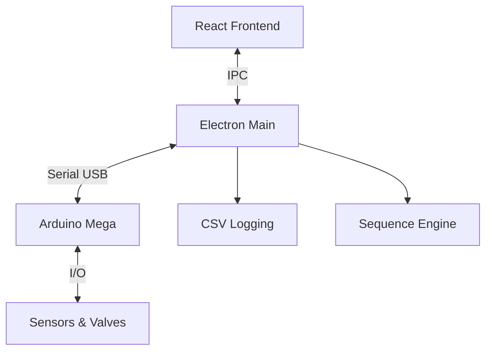

# 🚀 GoRocket Control System GUI

> **액체로켓 지상시험 제어시스템**  
> Next.js + Electron 기반의 현대적인 로켓 엔진 테스트 제어 및 모니터링 시스템

[](https://github.com/jungho1902/Gorocket-Control-System-GUI)
[](#)
[](#)
[](#)

---

## 📋 목차

- [🚀 GoRocket Control System GUI](#-gorocket-control-system-gui)
  - [📋 목차](#-목차)
  - [🎯 시스템 개요](#-시스템-개요)
  - [⚡ 빠른 시작](#-빠른-시작)
  - [🏗️ 시스템 아키텍처](#️-시스템-아키텍처)
  - [🔧 주요 기능](#-주요-기능)
  - [🖥️ 사용자 인터페이스](#️-사용자-인터페이스)
  - [⚙️ 시스템 설정](#️-시스템-설정)
  - [🚨 안전 시스템](#-안전-시스템)
  - [📊 시퀀스 자동화](#-시퀀스-자동화)
  - [🔍 문제해결](#-문제해결)
  - [📈 업데이트 내역](#-업데이트-내역)

---

## 🎯 시스템 개요

### 핵심 기능
| 기능 | 설명 |
|------|------|
| **실시간 모니터링** | 압력/온도/유량 센서 0.1초 간격 실시간 데이터 |
| **밸브 제어** | 7개 서보밸브 정밀 제어 + 리미트스위치 피드백 |
| **시퀀스 자동화** | JSON 기반 복잡한 테스트 시나리오 자동 실행 |
| **안전 시스템** | 이중 압력 한계 + 자동 응급셧다운 |
| **데이터 로깅** | CSV 형태 자동 세션 로깅 |

### 기술 스택
| 분야 | 기술 | 버전 |
|------|------|------|
| **Frontend** | Next.js + React | 15.3.3 + 18.3.1 |
| **Desktop** | Electron | 37.2.3 |
| **언어** | TypeScript | 5.x |
| **스타일링** | Tailwind CSS | 3.4 |
| **차트** | Recharts | - |
| **하드웨어** | Arduino Mega | - |

---

## ⚡ 빠른 시작

### 1단계: 설치 및 실행
```bash
# 저장소 클론
git clone https://github.com/jungho1902/Gorocket-Control-System-GUI.git
cd Gorocket-Control-System-GUI

# 의존성 설치
npm install

# 네이티브 모듈 빌드
npm run rebuild

# 개발 서버 실행 (포트 9002)
npm run dev
```

### 2단계: 하드웨어 연결
| 순서 | 작업 | 확인사항 |
|------|------|----------|
| 1 | Arduino Mega USB 연결 | 장치관리자에서 COM 포트 확인 |
| 2 | 펌웨어 업로드 | `arduino_mega_code.ino` 업로드 |
| 3 | GUI에서 포트 선택 | Header에서 COM 포트 선택 |
| 4 | 연결 버튼 클릭 | 🟢 Connected 상태 확인 |

### 3단계: 시스템 검증
- [ ] 센서 데이터 실시간 수신 확인
- [ ] 밸브 개별 동작 테스트
- [ ] Emergency Shutdown 테스트
- [ ] 로그 시스템 동작 확인

---

## 🏗️ 시스템 아키텍처

### 프로젝트 구조
```
GoRocket-Control-System-GUI/
├── 🎨 src/                          # Frontend (Next.js)
│   ├── app/                         # App Router 페이지
│   ├── components/dashboard/        # 대시보드 컴포넌트
│   └── hooks/                       # React Hooks
├── ⚙️ main/                         # Backend Services
│   ├── SerialManager.ts            # 시리얼 통신
│   ├── SequenceEngine.ts           # 시퀀스 실행
│   └── LogManager.ts               # 데이터 로깅
├── 🔗 shared/                       # 공유 모듈
│   ├── types/                      # TypeScript 정의
│   └── utils/                      # 유틸리티 (sleep.ts)
├── 🔧 arduino_mega_code/            # 펌웨어
└── 📄 설정파일 (config.json, sequences.json)
```

### 통신 아키텍처


---

## 🔧 주요 기능

### 🎛️ 실시간 제어
| 항목 | 개수 | 사양 | 업데이트 주기 |
|------|------|------|---------------|
| **압력센서** | 4개 | PT1-PT4, 0~1000 PSI | 0.1초 |
| **온도센서** | 2개 | TC1-TC2, MAX6675 | 0.1초 |
| **유량센서** | 2개 | Flow1-Flow2, 펄스방식 | 0.1초 |
| **서보밸브** | 7개 | 리미트스위치 피드백 | 실시간 |

### 🛡️ 안전 시스템
| 레벨 | 압력 임계값 | 동작 | 처리 위치 |
|------|-------------|------|-----------|
| **ALARM** | 850 PSI | GUI 자동 응급셧다운 | Software |
| **TRIP** | 1000 PSI | 하드웨어 차단 | MCU Firmware |
| **Rate** | 50 PSI/s | 압력 상승률 모니터링 | Software |

### 📊 데이터 로깅
- **자동 세션 생성**: 연결 시 자동으로 로그 폴더 생성
- **CSV 형식**: 타임스탬프 + 모든 센서 데이터
- **설정 백업**: config.json, sequences.json 스냅샷
- **실시간 저장**: 2초 간격 자동 플러시

---

## 🖥️ 사용자 인터페이스

### 대시보드 구성
| 패널 | 기능 | 주요 요소 |
|------|------|-----------|
| **Header** | 연결 제어 | COM 포트, Connect/Disconnect, Emergency |
| **Sensor Panel** | 센서 모니터링 | PT1-4, TC1-2, Flow1-2, 상태 표시 |
| **Valve Panel** | 밸브 제어 | 7개 밸브 상태, Open/Close 버튼 |
| **Sequence Panel** | 자동화 제어 | 시퀀스 목록, 실행/취소 버튼 |
| **Chart Panel** | 실시간 차트 | 다중 센서 그래프, 100포인트 히스토리 |
| **Terminal Panel** | 로그 출력 | 시스템 로그, 500라인 버퍼 |

### 연결 과정
1. **포트 선택** → COM 포트 드롭다운에서 Arduino 포트 선택
2. **연결 시도** → Connect 버튼 클릭
3. **상태 확인** → 🟢 Connected 표시 및 토스트 알림
4. **데이터 확인** → 센서 데이터 실시간 수신 시작

---

## ⚙️ 시스템 설정

### config.json 주요 설정
```json
{
  "serial": { "baudRate": 115200 },
  "pressureLimitAlarm": 850,      // GUI 알람 레벨
  "pressureLimitTrip": 1000,      // MCU 트립 레벨  
  "pressureRateLimit": 50,        // 압력 상승률 한계
  "valveFeedbackTimeout": 2000,   // 밸브 피드백 타임아웃
  "maxChartDataPoints": 100       // 차트 데이터 포인트
}
```

### 밸브 매핑 설정
| 밸브 ID | 이름 | 서보 인덱스 | 용도 |
|---------|------|-------------|------|
| 1 | Ethanol Main | 0 | 에탄올 주 공급 |
| 2 | N2O Main | 1 | N2O 주 공급 |
| 3 | Ethanol Purge | 2 | 에탄올 퍼지 |
| 4 | N2O Purge | 3 | N2O 퍼지 |
| 5 | Pressurant Fill | 4 | 가압제 공급 |
| 6 | System Vent | 5 | 시스템 벤트 |
| 7 | Igniter Fuel | 6 | 점화기 연료 |

---

## 🚨 안전 시스템

### 자동 응급셧다운 트리거
| 조건 | 감지 방법 | 응답 시간 | 동작 |
|------|-----------|-----------|------|
| **압력 초과** | 850 PSI 3회 연속 | < 0.3초 | Emergency Shutdown 시퀀스 |
| **통신 오류** | 시리얼 연결 중단 | 즉시 | 연결 재시도 + 응급셧다운 |
| **센서 타임아웃** | 조건 대기 실패 | 설정된 시간 | 시퀀스 중단 + 응급셧다운 |
| **수동 트리거** | Emergency 버튼 | 즉시 | Emergency Shutdown 시퀀스 |

### Emergency Shutdown 시퀀스
**단일 단계 즉시 실행 (0ms 지연)**:
- ✅ 주 밸브 차단: Ethanol Main, N2O Main
- ✅ 가압/점화 차단: Pressurant Fill, Igniter Fuel  
- ✅ 안전 배출: System Vent, Ethanol Purge, N2O Purge 개방

### Safety Clear 기능
- **3초 홀드 버튼**: 오작동 방지를 위한 확실한 의도 확인
- **MCU 상태 추적**: EMERG/CLEARED 상태 실시간 표시
- **다층 안전 통신**: UI → Main → MCU 다단계 확인

---

## 📊 시퀀스 자동화

### 내장 시퀀스 목록
| 카테고리 | 시퀀스명 | 단계 수 | 소요시간 | 용도 |
|----------|----------|---------|----------|------|
| **안전** | Emergency Shutdown | 1 | <0.1초 | 즉시 안전상태 |
| **안전** | Pre-Operation Safe Init | 1 | - | 기본 안전상태 |
| **테스트** | Random Test (6 valves) | 12 | ~10초 | V0-V5 동작 테스트 |
| **테스트** | Random Test (7 valves) | 14 | ~12초 | V0-V6 전체 테스트 |
| **운영** | Pre-Chill & Purge | 6 | ~20초 | 예냉각 및 퍼지 |
| **운영** | Pressurize Ethanol Tank | 3 | 대기형 | pt1 ≥ 250 psi |
| **운영** | Pressurize N2O Tank | 3 | 대기형 | pt2 ≥ 450 psi |
| **운영** | Ethanol Flow Check | 4 | ~7초 | 유량 확인 |
| **운영** | N2O Flow Check | 4 | ~7초 | 유량 확인 |
| **운영** | Igniter Solo Test | 3 | ~2초 | 점화기 테스트 |
| **운영** | Vent Down / Safe End | 5 | 대기형 | pt1,pt2 ≤ 15 psi |

### Sleep 토큰 지원
다양한 지연 형식을 지원하는 유연한 파서:
```javascript
"sleep 5"        → 5초 대기
"delay 500ms"    → 500밀리초 대기  
"wait 3s"        → 3초 대기
"pause 2000"     → 2초 대기
```

### 센서 조건 대기
```json
{
  "condition": {
    "sensor": "pt1",           // 센서명
    "min": 250,                // 최소값
    "op": "gte",              // 연산자 (gte/lte)
    "timeoutMs": 120000       // 타임아웃 (2분)
  }
}
```

---

## 🔍 문제해결

### 일반적인 문제와 해결책
| 문제 | 원인 | 해결방법 |
|------|------|----------|
| **포트 연결 실패** | USB 케이블, 드라이버 | 케이블 재연결, 다른 포트 시도 |
| **센서 데이터 없음** | 펌웨어, 전원 | Arduino 리셋, 펌웨어 재업로드 |
| **밸브 피드백 타임아웃** | 기계적 문제 | 수동 밸브 확인, 배선 점검 |
| **시퀀스 로딩 실패** | JSON 오류 | sequences.json 문법 확인 |
| **압력 한계 오경보** | 센서 노이즈 | 센서 재보정, 임계값 조정 |

### 로그 분석
- **Terminal Panel**: 실시간 시스템 로그 확인
- **CSV 파일**: `Documents/rocket-logs/session-YYYYMMDD-HHMMSS/`
- **오류 추적**: 타임스탬프 기반 이벤트 순서 확인

### 응급상황 대응
1. **GUI 무응답**: Arduino 리셋 → 주 전원 차단
2. **통신 중단**: 수동 밸브 조작 → 물리적 안전 확보
3. **센서 오류**: 실제 값 육안 확인 → 필요시 센서 우회

---

## 📈 업데이트 내역

### 🔥 최신 업데이트 (2025-01-17)
| 분야 | 변경사항 | 영향 |
|------|----------|------|
| **API** | `getSerialPorts` → `listSerialPorts` | 명명 표준화 |
| **안전** | `clearMcuEmergency` → `safetyClear()` | 더 명확한 기능명 |
| **상태** | ConnectionStatus에 'reconnecting' 추가 | 더 세밀한 상태 추적 |
| **타입** | AppConfig 압력 한계값 필드 추가 | 완전한 타입 안전성 |
| **유틸** | Sleep 토큰 파서 (`shared/utils/sleep.ts`) | 유연한 지연 처리 |
| **설정** | config.json pressureLimit 필드 추가 | 설정 오류 해결 |
| **시퀀스** | useSequenceManager 로딩 로직 수정 | "대기 중..." 문제 해결 |

### 해결된 주요 이슈
- ✅ **Configuration Error**: 누락된 pressureLimit 필드 추가
- ✅ **시퀀스 로딩**: "Awaiting sequence data..." 무한 대기 해결
- ✅ **TypeScript 오류**: 모든 타입 불일치 수정
- ✅ **문법 오류**: header.tsx 여분 괄호 제거
- ✅ **빌드 최적화**: test 폴더 컴파일 제외

---

## 📞 지원 및 기여

### 링크
- **GitHub**: [jungho1902/Gorocket-Control-System-GUI](https://github.com/jungho1902/Gorocket-Control-System-GUI)
- **Issues**: 버그 리포트 및 기능 요청
- **Releases**: 최신 버전 다운로드

### 라이선스
MIT License - 자세한 내용은 LICENSE 파일 참조

---

**⚠️ 중요**: 이 시스템은 고압 유체를 다루는 위험한 로켓 테스트용입니다. 사용 전 안전 교육을 필수로 받으시고, 모든 안전 수칙을 준수하여 주시기 바랍니다.