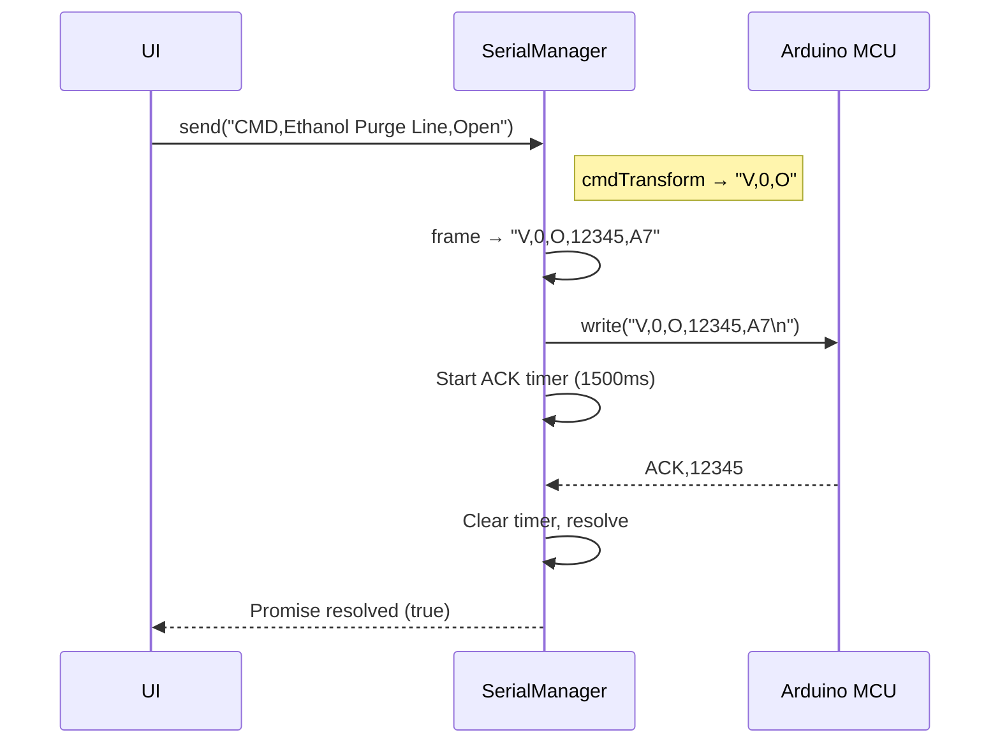
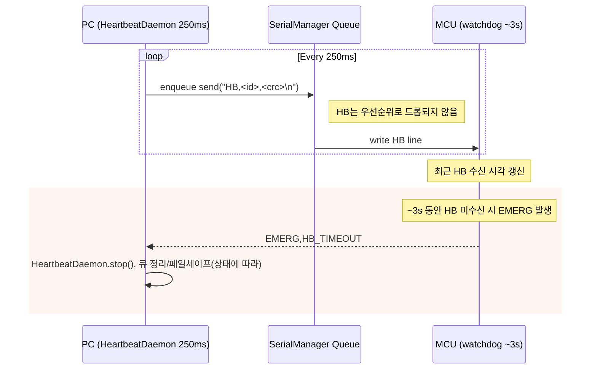
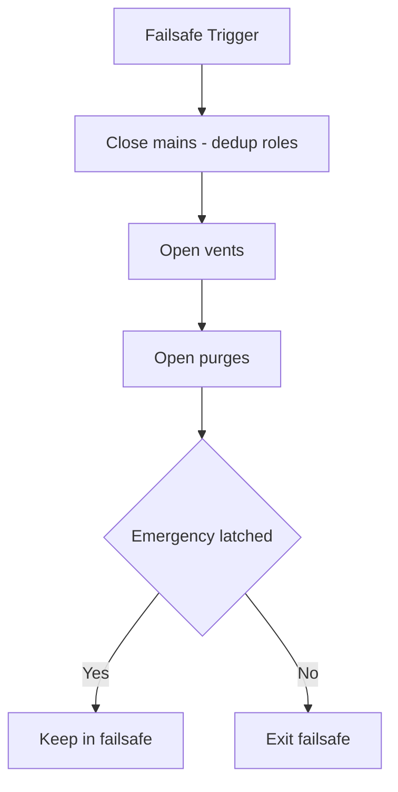
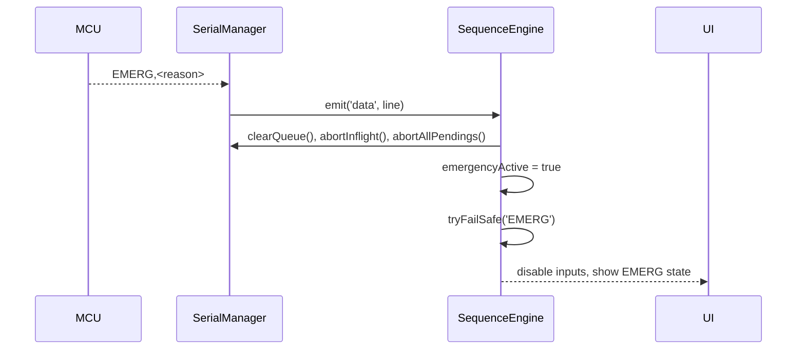
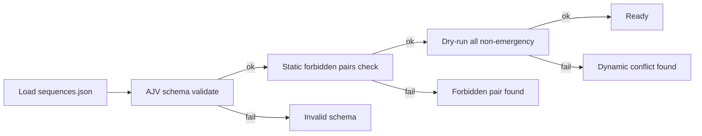
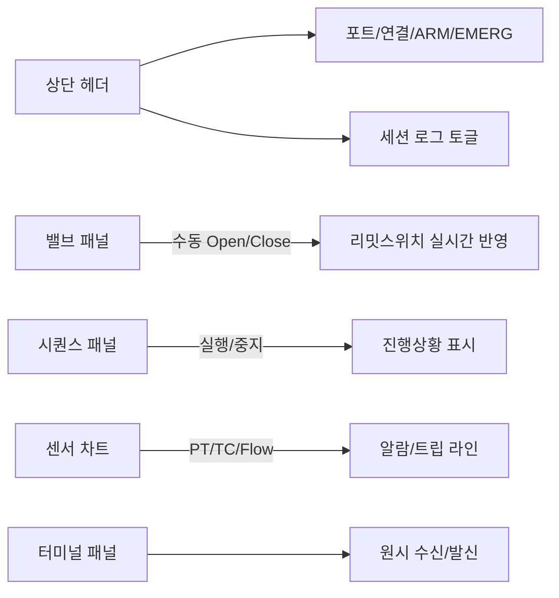

# GoRocket 지상 제어·모니터링 GUI

이 프로그램은 지상에서 액체로켓 엔진을 안전하게 테스트하기 위해 개발된 제어 및 모니터링 시스템입니다. 아두이노 메가 마이크로컨트롤러와 유선으로 연결하여 밸브 제어, 센서 모니터링, 자동화된 시퀀스 실행을 수행하며, 무엇보다 안전을 최우선으로 설계되었습니다.

[](https://github.com/jungho1902/Gorocket-Control-System-GUI)
[](https://typescriptlang.org/)
[](https://nextjs.org/)
[](https://electronjs.org/)

---

## 시작하기 전에

이 시스템을 처음 사용하시는 분들을 위해 설명드리겠습니다. 이 GUI 프로그램은 위험한 액체로켓 연료와 산화제를 다루는 테스트를 도와주는 도구입니다. 따라서 모든 기능이 안전을 염두에 두고 설계되었으며, 비상 상황에서는 즉시 시스템을 안전한 상태로 만들 수 있습니다.

### 빠른 설치 및 실행

Windows 환경에서 다음과 같이 실행하실 수 있습니다:

```powershell
# 1. 먼저 Node.js가 설치되어 있는지 확인하세요
# 2. 이 프로젝트 폴더에서 PowerShell을 열고 아래 명령어들을 순서대로 실행하세요

# 필요한 라이브러리들을 설치합니다
npm ci

# 코드에 문제가 없는지 확인합니다
npm run typecheck
npm test

# 프로그램을 빌드합니다
npm run build

# 개발 모드로 실행해봅니다
npm run dev
```

### 테스트 전 반드시 확인해야 할 사항들

실제 로켓 테스트를 하기 전에 반드시 다음 사항들을 점검해주세요. 이는 사고를 방지하고 안전한 테스트를 위해 매우 중요합니다.

**하드웨어 연결 확인**
- config.json 파일에 설정된 밸브 번호와 실제 배관의 밸브가 정확히 일치하는지 꼼꼼히 확인하세요
- 각 밸브가 열리고 닫히는 방향이 설정과 맞는지 저압 상태에서 안전하게 테스트해보세요
- 아두이노 메가와 컴퓨터가 USB 케이블로 안정적으로 연결되어 있는지 확인하세요 (통신 속도: 115200 baud)

**안전 시스템 동작 확인**
- 화면의 Emergency Shutdown 버튼을 눌렀을 때 메인 밸브들이 즉시 닫히고 벤트/퍼지 밸브들이 열리는지 확인하세요
- 하드웨어 비상정지 버튼을 눌렀을 때 시스템이 완전히 잠기고 안전 상태가 되는지 확인하세요
- USB 케이블을 뽑았을 때 3초 후 자동으로 비상정지 상태가 되는지 확인하세요 (통신 끊김 감지)
- 비상정지 후 다시 시스템을 사용하려면 재무장(ARM) 절차가 필요한지 확인하세요

**소프트웨어 기능 확인**
- 터미널에서 `npm run validate:seq` 명령어를 실행하여 시퀀스 설정이 올바른지 확인하세요
- 각 자동화 시퀀스를 실제 테스트 전에 드라이런(가상 실행)으로 검증해보세요
- 로그 파일이 정상적으로 생성되는지 확인하고 프로그램이 중복 실행되지 않는지 확인하세요

---

## 이 문서의 구성

이 설명서는 다음과 같이 구성되어 있습니다:

1. **시스템 소개** - 이 프로그램이 무엇을 하는지 알아봅시다
2. **시스템 구조** - 프로그램이 어떻게 구성되어 있는지 설명합니다
3. **안전 시스템** - 비상 상황에서 어떻게 안전을 보장하는지 알아봅시다
4. **통신 방식** - 컴퓨터와 아두이노가 어떻게 대화하는지 설명합니다
5. **핵심 기능들** - 주요 기능들이 어떻게 작동하는지 자세히 알아봅시다
6. **센서 데이터 처리** - 압력, 온도, 유량 데이터를 어떻게 읽어오는지 설명합니다
7. **명령어 변환** - 사용자 명령이 하드웨어 명령으로 어떻게 바뀌는지 알아봅시다
8. **자동화 시퀀스** - 복잡한 테스트 절차를 자동으로 실행하는 방법을 설명합니다
9. **설정 파일** - config.json 파일을 어떻게 설정하는지 알아봅시다
10. **사용자 인터페이스** - 화면 구성과 로그 기능을 설명합니다
11. **개발과 테스트** - 프로그램을 수정하거나 테스트하는 방법을 알아봅시다
12. **문제 해결** - 자주 발생하는 문제들과 해결 방법을 정리했습니다

---

## 1) 시스템 소개

### 이 프로그램이 하는 일

이 프로그램은 액체로켓 엔진을 지상에서 안전하게 테스트할 수 있도록 도와주는 제어 시스템입니다. 마치 항공기의 조종석처럼, 복잡한 하드웨어들을 한 곳에서 쉽게 조작하고 모니터링할 수 있게 해줍니다.

**주요 기능들:**
- **실시간 모니터링**: 압력, 온도, 유량 센서의 데이터를 실시간으로 확인할 수 있습니다
- **밸브 제어**: 7개의 밸브를 개별적으로 또는 자동 시퀀스로 제어할 수 있습니다
- **자동화 시퀀스**: 복잡한 테스트 절차를 미리 정의해두고 자동으로 실행할 수 있습니다
- **안전 시스템**: 비상 상황에서 즉시 모든 시스템을 안전한 상태로 만들어줍니다
- **데이터 기록**: 모든 센서 데이터와 조작 기록을 파일로 저장해 나중에 분석할 수 있습니다

### 사용하는 기술들

이 프로그램은 다음과 같은 기술들로 만들어졌습니다:

- **Electron**: 웹 기술로 만든 데스크톱 프로그램입니다. 크롬 브라우저 같은 환경에서 실행되어 안정적이고 사용하기 쉽습니다
- **Next.js와 React**: 사용자가 보는 화면(인터페이스)를 만드는 기술입니다. 반응이 빠르고 직관적인 화면을 제공합니다
- **TypeScript**: 일반 JavaScript보다 더 안전한 코드를 작성할 수 있게 해주는 언어입니다
- **Arduino Mega**: 실제 하드웨어(밸브, 센서)를 제어하는 마이크로컨트롤러입니다

### 안전을 위한 설계

로켓 테스트는 매우 위험할 수 있기 때문에, 이 시스템은 여러 겹의 안전장치를 가지고 있습니다:

1. **데이터 검증**: 컴퓨터와 아두이노 사이에 주고받는 모든 데이터에 체크섬을 붙여서 손상된 데이터를 걸러냅니다
2. **명령 확인**: 모든 명령에 대해 아두이노가 "잘 받았다" 또는 "문제가 있었다"고 응답하여 확실히 전달되었는지 확인합니다
3. **여러 겹 안전망**: 소프트웨어, 하드웨어, 통신 각각에 독립적인 안전장치가 있어서 하나가 실패해도 다른 것이 보호해줍니다
4. **즉시 대응**: 비상 상황이 감지되면 100ms(0.1초) 이내에 모든 시스템을 안전 상태로 만듭니다
5. **완전한 기록**: 모든 동작과 센서 데이터를 빠짐없이 기록해서 나중에 문제가 생겼을 때 원인을 분석할 수 있습니다

---

## 2) 시스템 구조

### 프로그램이 어떻게 구성되어 있는지 알아봅시다

이 프로그램은 마치 건물처럼 여러 층으로 나뉘어 있습니다. 각 층은 서로 다른 역할을 맡고 있어서 전체 시스템이 안정적으로 작동할 수 있습니다.

### 핵심 부분 (Electron 메인 프로세스)

이 부분은 프로그램의 심장과 같습니다. 실제로 하드웨어와 소통하고 중요한 결정을 내리는 곳입니다.

**주요 구성 요소들:**

- **SerialManager.ts**: 아두이노와의 대화를 담당합니다
  - 명령을 순서대로 보내고 응답을 기다립니다
  - 연결이 끊어지면 자동으로 다시 연결을 시도합니다
  - 중요한 명령이 제대로 전달되었는지 확인합니다

- **SequenceEngine.ts**: 자동화 시퀀스를 실행합니다
  - 미리 정해진 순서대로 밸브들을 조작합니다
  - 비상 상황이 발생하면 즉시 안전 절차를 실행합니다
  - 각 단계가 완료될 때까지 기다렸다가 다음 단계로 넘어갑니다

- **SequenceDataManager.ts**: 시퀀스 설정을 관리합니다
  - sequences.json 파일을 읽어서 올바른지 검사합니다
  - 위험한 밸브 조합이 있는지 미리 확인합니다
  - 실제 실행 전에 가상으로 테스트해볼 수 있습니다

- **HeartbeatDaemon.ts**: 아두이노와의 연결 상태를 확인합니다
  - 0.25초마다 "살아있냐?"는 신호를 보냅니다
  - 아두이노가 응답하지 않으면 연결 문제가 있다고 판단합니다

- **ConfigManager.ts**: 설정 파일을 관리합니다
  - config.json 파일의 내용이 안전한지 검사합니다
  - 압력 한계값 같은 중요한 설정들을 확인합니다

- **LogManager.ts**: 모든 기록을 저장합니다
  - 센서 데이터와 조작 기록을 CSV 파일로 저장합니다
  - 나중에 분석할 수 있도록 체계적으로 정리합니다

### 화면 부분 (Next.js 렌더러)

사용자가 보고 조작하는 화면을 담당합니다. 마치 자동차의 계기판과 조작 버튼들 같은 역할을 합니다.

- 실시간으로 센서 데이터를 그래프로 보여줍니다
- 밸브를 수동으로 조작할 수 있는 버튼들을 제공합니다
- 자동 시퀀스를 시작하고 진행 상황을 보여줍니다
- 비상 상황을 알려주고 안전 조치를 취할 수 있게 합니다

### 연결 부분 (Preload)

화면 부분과 핵심 부분 사이의 다리 역할을 합니다. 보안을 위해 필요한 기능들만 안전하게 연결해줍니다.

### 공용 부분 (Shared)

여러 부분에서 함께 사용하는 도구들과 규칙들을 모아둔 곳입니다. 마치 공용 창고 같은 역할을 합니다.

---

## 3) 안전 시스템

### 비상 상황에서 어떻게 안전을 보장하는지 알아봅시다

로켓 테스트에서 가장 중요한 것은 안전입니다. 이 시스템은 여러 단계의 안전장치가 있어서, 문제가 생겼을 때 즉시 위험을 막을 수 있습니다.

### 1단계: 소프트웨어 알람 (FAILSAFE)

**언제 작동하나요?**
- 압력이 850 PSI에 도달했을 때 (설정에서 변경 가능)
- 압력이 너무 빠르게 올라갈 때 (초당 50 PSI 이상)
- 사용자가 Emergency Shutdown 버튼을 눌렀을 때

**어떻게 작동하나요?**
1. 먼저 메인 밸브들(연료, 산화제)을 즉시 닫습니다
2. 그다음 벤트 밸브들을 열어서 압력을 빼냅니다
3. 퍼지 밸브들을 열어서 남은 연료를 안전하게 제거합니다

이 과정은 자동으로 이루어지며, 전체 과정이 완료되는 데 약 1초 정도 걸립니다.

### 2단계: 하드웨어 비상정지 (EMERG)

**언제 작동하나요?**
- 압력이 1000 PSI에 도달했을 때 (하드웨어 한계)
- 하드웨어 비상정지 버튼을 눌렀을 때
- 아두이노에서 직접 위험을 감지했을 때

**어떻게 작동하나요?**
1. 아두이노가 즉시 모든 안전 절차를 실행합니다
2. 컴퓨터 프로그램도 "EMERG" 신호를 받으면 즉시 대응합니다
3. 진행 중인 모든 명령을 취소하고 시스템을 잠급니다
4. 다시 사용하려면 반드시 재무장(ARM) 절차를 거쳐야 합니다

### 3단계: 통신 감시 (워치독)

**무엇을 감시하나요?**
- 컴퓨터와 아두이노 사이의 연결 상태를 계속 확인합니다
- 0.25초마다 "하트비트" 신호를 보내서 연결이 살아있는지 확인합니다

**연결이 끊어지면?**
- 3초 동안 하트비트가 없으면 아두이노가 자동으로 비상정지 상태가 됩니다
- USB 케이블이 빠지거나 프로그램이 멈춰도 안전하게 보호됩니다

### 중복 실행 방지

같은 안전 절차가 여러 번 실행되는 것을 방지하기 위해, 한 번 안전 절차가 시작되면 0.4초 동안은 다시 실행되지 않습니다. 이렇게 해서 시스템이 혼란스럽게 동작하는 것을 막습니다.

### 안전 상태에서 복귀하기

비상정지 상태가 되면 시스템이 완전히 잠깁니다. 다시 사용하려면:

1. 문제의 원인을 찾아서 해결합니다
2. "SAFE_CLEAR" 버튼을 눌러서 비상정지를 해제합니다
3. "ARM" 버튼을 눌러서 시스템을 다시 사용할 수 있게 만듭니다

이런 절차를 통해 실수로 위험한 상황이 되는 것을 방지합니다.

---

## 4) 통신 방식

### 컴퓨터와 아두이노가 어떻게 대화하는지 설명합니다

컴퓨터와 아두이노가 USB 케이블을 통해 대화할 때, 서로 오해하지 않도록 정해진 규칙을 따릅니다. 마치 전화 통화에서 "여보세요"로 시작하고 "안녕히 계세요"로 끝내는 것처럼 말이죠.

### 메시지 형식

**컴퓨터에서 아두이노로 보낼 때:**
모든 명령은 다음과 같은 형식으로 보냅니다:
```
명령내용,메시지번호,체크섬
```

예를 들어, 0번 밸브를 열라는 명령은 이렇게 보냅니다:
```
V,0,O,12345,A7
```
- `V,0,O`: "0번 밸브를 열어라"
- `12345`: 이 메시지의 고유 번호
- `A7`: 데이터가 손상되지 않았는지 확인하는 체크섬

### 응답 확인

**아두이노에서 컴퓨터로 보낼 때:**
아두이노는 명령을 받으면 반드시 응답합니다:

- **성공했을 때**: `ACK,12345` ("메시지 12345번 잘 받았습니다")
- **실패했을 때**: `NACK,12345,BUSY` ("메시지 12345번 받았지만 바빠서 처리할 수 없습니다")

### 체크섬이 뭔가요?

체크섬은 데이터가 전송 중에 손상되었는지 알아내는 방법입니다. 

**쉬운 예시로 설명하면:**
- 편지를 보낼 때 글자 수를 세어서 맨 끝에 써놓는다고 생각해보세요
- 받는 사람도 글자 수를 세어봐서 맞지 않으면 편지가 손상되었다는 걸 알 수 있습니다
- 실제로는 더 복잡한 계산을 하지만 원리는 같습니다

**왜 필요한가요?**
- USB 케이블에 노이즈가 끼거나 연결이 불안정하면 데이터가 깨질 수 있습니다
- 잘못된 명령이 전달되면 밸브가 엉뚱하게 동작할 수 있어서 매우 위험합니다
- 체크섬으로 이런 문제를 미리 잡아낼 수 있습니다

### 시스템 메시지

일부 중요한 메시지들은 체크섬 없이 바로 전송됩니다:

- `READY`: "아두이노가 준비되었습니다"
- `BOOT`: "아두이노가 시작되었습니다"
- `EMERG`: "비상 상황이 발생했습니다"
- `EMERG_CLEARED`: "비상 상황이 해제되었습니다"

이런 메시지들은 너무 중요해서 복잡한 절차 없이 즉시 전달되어야 하기 때문입니다.

### 통신 안전성

이런 방식으로 통신하면:
1. 모든 명령이 확실히 전달되었는지 확인할 수 있습니다
2. 데이터가 손상된 경우 즉시 알아낼 수 있습니다
3. 문제가 생기면 자동으로 다시 시도합니다
4. 중요한 안전 메시지는 지연 없이 즉시 전달됩니다

---

## 5) 핵심 기능들

### 주요 기능들이 어떻게 작동하는지 자세히 알아봅시다

### SerialManager - 통신 관리자

이 기능은 컴퓨터와 아두이노 사이의 모든 대화를 관리합니다. 마치 우체국에서 편지를 분류하고 배달하는 것과 비슷합니다.

**명령 전송 과정:**

1. **명령 준비**: 사용자가 버튼을 누르면 명령을 받아서 올바른 형식으로 만듭니다
2. **대기열에 추가**: 명령을 대기열(큐)에 넣습니다. 최대 200개까지 저장할 수 있습니다
3. **순서대로 전송**: 앞의 명령이 완료되면 다음 명령을 보냅니다
4. **응답 기다리기**: 아두이노의 응답을 1.5초간 기다립니다
5. **결과 처리**: ACK(성공) 또는 NACK(실패)에 따라 다음 동작을 결정합니다

**우선순위 시스템:**
대기열이 가득 차면 오래된 일반 명령들을 삭제하지만, 다음과 같은 중요한 명령들은 절대 삭제하지 않습니다:
- 비상정지 명령 (EMERG)
- 안전 절차 명령 (FAILSAFE)
- 연결 확인 신호 (HB)
- 안전 해제 명령 (SAFE_CLEAR)

**실패했을 때:**
- 응답이 없거나 실패하면 최대 5번까지 다시 시도합니다
- 연결이 끊어지면 자동으로 다시 연결을 시도합니다
- 재시도 간격을 점점 늘려서 시스템에 무리가 가지 않게 합니다

**연결 확인:**
- 프로그램이 시작될 때 "HELLO" 메시지를 보내서 아두이노와 인사합니다
- 아두이노가 "READY"라고 응답하면 연결이 성공한 것으로 판단합니다

시퀀스/명령 전송 타임라인(예시)



<details>
<summary>ASCII Fallback</summary>

```
UI            SerialManager                 MCU
 |  send("CMD,Ethanol Purge Line,Open")      |
 |------------------------------------------>|
 |            transform → "V,0,O"            |
 |            frame → "V,0,O,12345,A7"       |
 | send "V,0,O,12345,A7\n" ---------------->|
 |                                           |  ACK,12345
 |<------------------------------------------|
 |  resolve(true)                            |
```

</details>

- 평상시 왕복 지연(RTT): 수~수십 ms(환경에 따라 상이). ACK 타임아웃은 1500ms로 여유 있게 설정되어 재시도/복구가 가능합니다.
- 타임아웃/재시도: 1500ms 경과 시 재큐잉(80ms 지연)하여 재전송, 기본 5회 시도 후 실패 처리.

### HeartbeatDaemon

- 실제 동작: `main.ts`에서 `HeartbeatDaemon`을 250ms 간격으로 시작하고, `sendOnce()`로 즉시 1회 송신합니다. `SequenceEngine`의 자체 하트비트는 비활성화(`hbIntervalMs: 0`)되어 중복 송신을 방지합니다.
- 전송 형식: `serial.send({ raw: 'HB' })` 호출 시 `SerialManager`가 자동으로 프레이밍하여 `HB,<msgId>,<crc>` 형태로 전송합니다. 즉, HB도 CRC가 포함되지만 ACK를 기대하지 않는 “무응답(system-like)” 메시지입니다.
- 우선순위: `SerialManager.isPriorityCommand('HB')`가 true여서 큐 초과 시 드롭되지 않습니다. 다만 인플라이트 메시지를 선점하진 않으므로, 드물게 1회 HB가 지연될 수 있습니다.
- 오류 처리: 포트 미오픈/쓰기 오류는 내부 재연결/재시도 로직으로 흡수되며, `HeartbeatDaemon`은 에러를 억제하여(캐치) 연속 동작을 유지합니다. EMERG 수신 시 하트비트는 즉시 중지됩니다(`main.ts` 참조).
- MCU 워치독: MCU는 최근 HB 수신 시각을 기준으로 약 3초간 HB 미수신 시 `EMERG,HB_TIMEOUT`을 발생합니다(하드웨어 펌웨어 설정).

하트비트/워치독 타임라인(상세)



<details>
<summary>ASCII Fallback</summary>

```
PC (every 250ms)        SerialManager(Queue)        MCU (~3s watchdog)
      |  HB,<id>,<crc>  |                              |
      |----------------->|  write --------------------->|
      |  HB,<id>,<crc>  |                              |
      |----------------->|  write --------------------->|
      |  ...            |                              |
                                                         if no HB ~3s → EMERG,HB_TIMEOUT
                                                         -------------------------------> PC
PC: stop heartbeat, flush logs, clear queue (per EMERG flow)
```

</details>

### SequenceEngine

- 역할: 시퀀스 실행, WAIT 처리(time/cond), FAILSAFE 진입, EMERG 수신 처리.
- 핵심 로직
  - `tryFailSafe(tag)`: 메인 CLOSE → 벤트/퍼지 OPEN(역할 중복 제거), 재진입 쿨다운/래치 관리
  - `onSerialData(line)`: `EMERG` 수신 시 SerialManager 큐/인플라이트/펜딩 즉시 정리, 래치 활성
  - `buildFramed(payload, msgId?)` + `writeLine(line)`: SerialManager를 통해 실제 전송
- WAIT: 시간 기반/조건 기반(`op: gte|lte`, `timeoutMs`) 모두 지원, EMERG로 인터럽트 가능

FAILSAFE 동작(역할 기반)



<details>
<summary>ASCII Fallback</summary>

```
Failsafe Trigger
  ├─ Close mains (deduplicated)
  ├─ Open vents
  └─ Open purges
      └─ Emergency latched?
           ├─ Yes → Stay in failsafe
           └─ No  → Exit failsafe
```

</details>

EMERG 수신 경로



<details>
<summary>ASCII Fallback</summary>

```
MCU → EMERG,<reason>
SerialManager: emit('data') → SequenceEngine
SequenceEngine: clearQueue(), abortInflight(), abortAllPendings()
SequenceEngine: emergencyActive = true → tryFailSafe('EMERG')
UI: disable controls, show EMERG status
```

</details>

### SequenceDataManager

- 로딩/검증: Ajv(JSON Schema)로 `sequences.json` → 스키마 검증 + 커스텀 정적 금지 조합 검증
- 동적 드라이런: 각 시퀀스를 가상 실행하며 금지 조합이 시점상 동시에 OPEN 되는지 추가 점검
- 필수 시퀀스: `Emergency Shutdown` 존재 필수

시퀀스 검증 흐름



<details>
<summary>ASCII Fallback</summary>

```
Load → AJV schema → Static forbidden-pairs → Dry-run → Ready
  │         │fail → Invalid schema
  │
  └→ ok → Static check
              │fail → Forbidden pair
              └→ ok → Dry-run
                          │fail → Dynamic conflict
                          └→ ok → Ready
```

</details>

### ConfigManager

- `config.json`을 Zod로 파싱/검증하고, 압력 한계 값 검증(`validatePressureConfig`) 수행
- 유효하지만 위험할 수 있는 설정은 경고 로그로 남김

주의: `valveMappings`의 인덱스(0‑based)와 `initialValves`의 `id`(1‑based)가 혼용됩니다. 내부 파서(sensorParser)는 하드웨어 0‑index를 UI 1‑index로 보정합니다.

### LogManager

- 세션 폴더: 문서 폴더(`rocket-logs/`) 하위 `session-YYYYMMDD-HHMMSS`
- 스냅샷: `config.json`, `sequences.json` 복제 + `session-meta.json`(환경/안전 한계/해시)
- CSV: `data.csv` 생성, 텔레메트리 필드 + 밸브 상태 집계. ACK/NACK 라인은 필터링, 상태 이벤트는 `#` 접두어로 기록
- 플러시: 주기적 `fsync`(기본 2000ms, `setFlushIntervalMs()`로 단축 가능)

로그 예시

```
2025-08-17T10:33:44.120Z # READY
2025-08-17T10:33:45.003Z,845,812,768,740,12.4,9.8,25.3,29.9,V1:CLOSED V2:OPEN
2025-08-17T10:33:45.205Z # EMERG,HB_TIMEOUT
```

---

## 6) 텔레메트리 파싱(sensorParser)

- 파일: `shared/utils/sensorParser.ts`
- 흐름
  1) 라인 트림 후 시스템 메시지면 즉시 무시(무CRC)
  2) `...,CRCHEX` 형식의 CRC 존재 여부 확인 → 미존재 시 오류 기록 후 폐기
  3) CRC‑8 테이블로 계산하여 일치하면 파싱 진행(센서/밸브 순서 무관)
- 지원 키
  - 압력: `pt1..pt4`
  - 온도: `tc1`, `tc2`(문자 오류 문자열도 허용)
  - 유량: `fm1_Lh`, `fm2_Lh` → `flow1`, `flow2`
  - 밸브 리밋 스위치: `V{idx}_LS_OPEN`, `V{idx}_LS_CLOSED`(하드웨어 0-index → UI 1-index 보정)
- 오류 처리: 일부 세그먼트가 오류여도 나머지는 계속 파싱(안정성 우선)
- 유틸: `exceedsPressureLimit(data, limit)` — 임계 초과 감지

CRC‑8 자세히 보기(초심자용)

- 왜 필요한가: 시리얼 데이터는 노이즈로 비트가 바뀔 수 있습니다. 단순 합계 체크섬보다 CRC는 충돌 확률이 낮아 오류를 더 잘 잡아냅니다.
- 동작: 각 바이트를 테이블과 XOR/시프트 규칙으로 누적해 1바이트 결과를 얻습니다. 송신 시 데이터 끝에 이 값을 붙이고, 수신 시 동일 계산으로 비교합니다.
- 이 프로젝트에선 0x07 다항식, 초기값 0x00, xorout 0x00(표준 CRC‑8)이며, MCU와 동일한 방식으로 계산합니다.

---

## 7) 명령 변환(cmdTransform)

- 파일: `main/cmdTransform.ts`
- 규칙
  - `CMD,<ValveName>,Open|Close` → `V,<servoIndex>,O|C`
  - 변환 시 피드백 기대값 반환: `{ feedback: { index, expect: 'open'|'closed' } }`
  - `SLEEP,<ms>`/`S,<ms>`/기타 원시 명령은 원본 유지
- 매핑: `config.json`의 `valveMappings`를 사용(이름→서보 인덱스)

예시

```
입력:  CMD,Ethanol Main Supply,Close
출력:  V,4,C
피드백 기대: index=4, expect='closed' → 이후 LS 피드백과 대조 가능
```

---

## 8) 시퀀스(SequenceDataManager/Engine)

- 스키마: `sequences.schema.json`
  - 스텝: `{ message, delay, commands[], condition? }`
  - `commands[]`: `V,idx,O|C` 또는 `CMD,Name,Open|Close`
  - 금지 조합(정적): 같은 스텝에서 특정 밸브 조합을 동시에 Open 금지(예: 메인 + 벤트)
- 실행: `SequenceEngine`
  - 시간 대기(`delay`), 조건 대기(`sensor/op/min/max/timeoutMs`), EMERG로 인터럽트 가능
  - 실패/에러 경로에서 FAILSAFE 진입(옵션)
  - 역할 기반 FAILSAFE: `mains/vents/purges` 중복 제거 후 일괄 Close/Open
- 드라이런: `SequenceDataManager.dryRunAll()` — 동적 금지 조합(시간상 동시 OPEN) 검출

대기(Wait) 메커니즘 설명

- 시간 대기: `delay`가 0 이하이면 스킵, 그 외에는 해당 ms만큼 대기합니다. EMERG 입력 시 즉시 인터럽트됩니다.
- 조건 대기: `sensor/op/min/max/timeoutMs`를 통해 “pt1 ≥ 600” 같은 조건을 일정 시간 내 만족할 때까지 폴링합니다. 타임아웃 시 에러로 간주될 수 있으며 필요 시 FAILSAFE로 진입합니다.

---

## 9) 설정(config.json)

예시(`config.json`):

```
{
  "serial": { "baudRate": 115200 },
  "maxChartDataPoints": 100,
  "pressureLimitPsi": 850,
  "pressureLimitAlarmPsi": 850,
  "pressureLimitTripPsi": 1000,
  "pressureRateLimitPsiPerSec": 50,
  "valveFeedbackTimeout": 2000,
  "initialValves": [ { "id": 1, "name": "Ethanol Purge Line", "state": "CLOSED" }, ... ],
  "valveMappings": {
    "Ethanol Purge Line": { "servoIndex": 0 },
    "Main Pressurization": { "servoIndex": 1 },
    "Ethanol Fill Line": { "servoIndex": 2 },
    "N2O Main Supply": { "servoIndex": 3 },
    "Ethanol Main Supply": { "servoIndex": 4 },
    "System Vent 1": { "servoIndex": 5 },
    "System Vent 2": { "servoIndex": 6 }
  }
}
```

- 안전 한계 값은 `ConfigManager`와 `validatePressureConfig`로 검증됩니다.
- 실제 배관과 매핑/방향(OPEN/CLOSE)/리밋스위치 의미를 반드시 현장 점검하세요.

성능/타이밍 참고 값(기본)

- 연결 대기: 포트 open 최대 5s, 핸드셰이크(HELLO↔READY/ACK) 최대 3s
- 하트비트: 200ms 주기(PC→MCU), MCU 워치독 ~3s (펌웨어 설정)
- ACK 타임아웃: 1500ms, 재시도 간격 80ms, 최대 재시도 5회
- 재연결 백오프: 300ms에서 시작, 최대 5s까지 지수 증가
- 로그 플러시: 2000ms(세션 중 100~500ms로 단축 가능)

---

## 10) UI/로깅/운용

- UI(렌더러)
  - 밸브/시퀀스 컨트롤 패널, 센서 차트, 상태 인디케이터
  - EMERG 시 입력 비활성/상태 라벨링, 차트 Y축은 급격한 변화에 스무스 확장
  - 단일 인스턴스 보장, 로그 생성 실패 시 사용자에게 경고
- 로깅(LogManager)
  - `rocket-logs/session-*/` 하위에 `data.csv`, `session-meta.json`, 설정 스냅샷 저장
  - ACK/NACK 라인은 CSV에 기록하지 않음, 상태 이벤트는 `#`로 태깅하여 후처리 용이
- 운용 체크리스트
  - `DAY-OF-TEST-CHECKLIST.md`, `HIL-Preflight-Checklist-Results.md` 참고

UI 개요(화면)



<details>
<summary>ASCII Fallback</summary>

```
[헤더] 포트선택/연결상태/ARM/EMERG/로그
[밸브 패널] 수동 Open/Close ←→ 리밋스위치 피드백
[시퀀스 패널] 실행/중지, 진행상황
[센서 차트] PT/TC/Flow + 알람/트립 라인
[터미널] 원시 수신/발신
```

</details>

스크린샷(추가 예정)

- `docs/screenshots/dashboard.png` — 전체 대시보드
- `docs/screenshots/valves.png` — 밸브 제어/피드백
- `docs/screenshots/charts.png` — 센서 차트/알람 라인

참고: 스크린샷을 추가하려면 `docs/screenshots/` 폴더를 만들고 이미지를 저장한 뒤 README 경로를 맞춰 주세요.

---

## 11) 개발/테스트/빌드

- 개발
  - `npm run dev` — Next(9002) + Electron 동시 실행
  - `npm run rebuild` — 네이티브 모듈(예: serialport) 재빌드
- 테스트/타입체크
  - `npm test` — Jest(ts-jest), `jest.config.js` 참고
  - `npm run typecheck` — TypeScript 검사
- 빌드/패키징
  - `npm run build` — Electron(`dist/`), Next.js(`.next/`, `out/`)
  - `npm run package` — OS별 배포물 생성(AppImage/nsis/dmg)

엔드투엔드(HIL) 드릴 스크립트 아이디어

- 시리얼 시뮬레이터(노드/파이썬)로 READY/ACK/EMERG/텔레메트리 스트림을 발생시키고 UI 반응을 기록
- 실패 주입: ACK 지연, NACK 주기적 삽입, HB 스톨로 EMERG 유도, CRC 에러 프레임 삽입
- 목표: FAILSAFE 재진입 가드, 큐/ACK 타이밍, 로깅/상태 표시 일치성 검증

---

## 12) 문제 해결

### 자주 발생하는 문제들과 해결 방법을 정리했습니다

### 연결은 되었는데 명령이 작동하지 않아요

**가능한 원인들:**
- USB 케이블이나 포트에 문제가 있을 수 있습니다
- 통신 속도(115200 baud)가 맞지 않을 수 있습니다
- 아두이노가 준비되지 않았을 수 있습니다

**해결 방법:**
1. USB 케이블을 다른 것으로 바꿔보세요
2. 다른 USB 포트에 연결해보세요
3. 화면에서 "READY" 메시지가 나타나는지 확인하세요
4. logs 폴더의 로그 파일을 확인해서 NACK 메시지가 있는지 보세요

### 비상정지 후에 다시 사용할 수 없어요

**이것은 정상입니다!** 
비상정지 상태는 안전을 위해 의도적으로 시스템을 잠그는 기능입니다.

**복귀 방법:**
1. 먼저 비상정지가 발생한 원인을 찾아서 해결하세요
2. "SAFE_CLEAR" 버튼을 눌러서 비상정지를 해제하세요
3. "ARM" 버튼을 눌러서 시스템을 다시 활성화하세요
4. 이제 정상적으로 사용할 수 있습니다

### 밸브가 엉뚱하게 움직여요

**매우 위험한 상황입니다!** 즉시 비상정지 버튼을 누르세요.

**원인:**
- config.json 파일의 밸브 설정이 실제 하드웨어와 맞지 않습니다

**해결 방법:**
1. 비상정지 상태에서 config.json 파일을 다시 확인하세요
2. valveMappings의 서보 인덱스가 실제 밸브와 일치하는지 확인하세요
3. 각 밸브의 OPEN/CLOSE 방향이 올바른지 확인하세요
4. 저압 상태에서 하나씩 천천히 테스트해보세요

### 프로그램 테스트가 너무 느려요

**원인:**
- 일부 테스트가 실제 시간을 기다리거나 하드웨어 응답을 기다립니다

**해결 방법:**
터미널에서 다음과 같이 실행해보세요:
```powershell
npm test -- --runInBand
```
이렇게 하면 테스트들이 하나씩 순서대로 실행되어 더 안정적입니다.

### 주요 용어 설명

**이벤트 루프**: 
자바스크립트가 여러 일을 동시에 처리하는 방식입니다. 마치 요리할 때 여러 팬을 동시에 보면서 하나씩 처리하는 것과 비슷합니다.

**백오프**: 
실패했을 때 바로 다시 시도하지 않고 점점 더 오래 기다리는 방식입니다. 마치 문이 안 열릴 때 계속 세게 밀지 말고 잠깐씩 기다려보는 것과 같습니다.

**리밋 스위치**: 
밸브가 완전히 열렸거나 닫혔을 때 알려주는 작은 스위치입니다. 마치 문이 완전히 닫혔을 때 "딸깍" 소리가 나는 것과 비슷합니다.

### 도움이 더 필요하시면

1. 먼저 logs 폴더의 로그 파일을 확인해보세요
2. 에러 메시지를 정확히 기록해두세요
3. 문제가 발생하기 전에 무엇을 했는지 생각해보세요
4. 안전과 관련된 문제라면 즉시 시스템을 정지하고 전문가의 도움을 받으세요

---

## 라이선스

이 저장소의 LICENSE 파일을 참고하십시오.

---

## 다이어그램 PNG(자동 생성)

- 아래 이미지는 `docs/diagrams/*.mmd`로부터 GitHub Actions가 자동으로 생성합니다. Mermaid 미지원 뷰어에서도 PNG로 확인할 수 있습니다. 원본 Mermaid 다이어그램과 ASCII 대체본은 본문 섹션에 함께 있습니다.


---

## UI 스크린샷

- 스크린샷 파일을 `docs/screenshots/` 폴더에 추가하면 이 섹션에서 자동으로 보입니다. 먼저 아래 권장 파일명으로 캡처해 주세요.
- 캡처 방법: 앱 실행 후 대시보드/밸브/차트/터미널 화면에서 OS 스크린샷(Win+Shift+S/Mac Cmd+Shift+4) 저장 → 해당 폴더에 파일명대로 배치.

권장 파일명(예시)
- `docs/screenshots/dashboard.png` — 전체 대시보드
- `docs/screenshots/valves.png` — 밸브 제어/피드백
- `docs/screenshots/charts.png` — 센서 차트/알람 라인

이미지(존재 시 표시)


